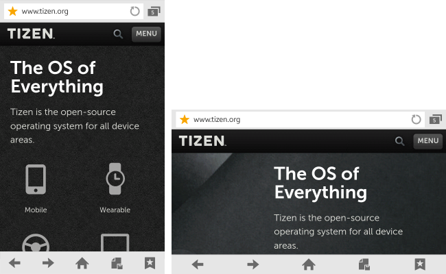
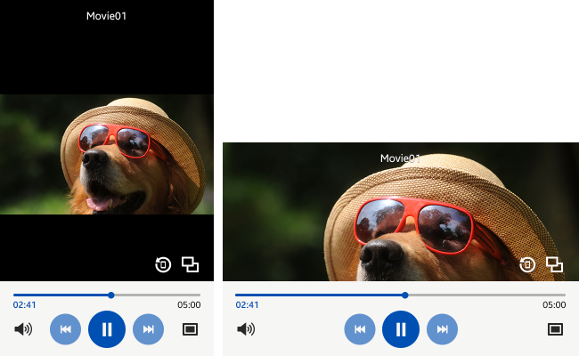
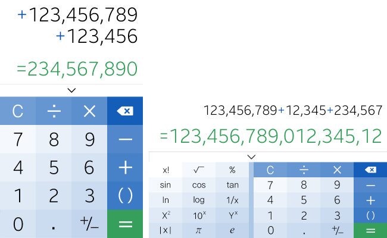
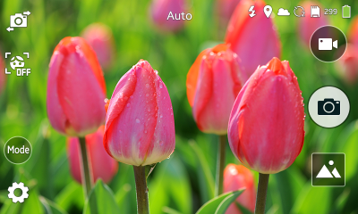

# View Modes

In Tizen applications, you can use portrait, landscape, and reversed landscape view modes.

> **NOTE**  
In Tizen applications, the reversed landscape view mode is available, however, avoid using it.

The portrait view is the default screen orientation for most application designs. For special purposes, such as games or a camera, you can specify the landscape view as the default. However, we recommend supporting both views with your application and optimizing the screen design layout for both.

The landscape view can be an efficient way to take advantage of the screen proportion when presenting content to the user. However, before providing the landscape view for an application, validate that it serves an actual user need. For example, the fact that an application uses a camera or presents pictures or video is not a reason to make the full application available in the landscape mode, if those functions are rarely used.

The straightforward adoption to landscape is typically a rescaled version of the portrait. Relative layout and UI component placements are the same as in the portrait mode, but the controls are adjusted to take advantage of the full screen space.

Consider using the landscape view when:

-   The primary content created in the application depends on the device or screen orientation (for example, the sensors in the Camera app).
-   The primary content viewed in the application depends on the device or screen orientation (for example, images and videos in the Gallery and Video apps).
-   The application is normally used in a docked state, like in a stand or in the car (for example, Maps).
-   Typing is primary the use of the applications. The landscape mode accommodates users that prefer a larger keyboard (for example, Messaging).

The landscape mode provides an additional viewing mode with a purpose and functionality of its own. Changing the mode in landscape orientation is useful when you want to avoid clutter and keep the primary portrait view simple and with functionality that most users need (for example, the scientific mode in the Calculator app).

## Portrait and Landscape Views

Switching seamlessly from portrait to landscape view is a standard practice in today's mobile devices. Ensure that all functions you offer in the portrait view are also available in landscape view.

 

**Figure: Portrait and landscape views**

****

In the following figure, the Video app shows the same information in portrait and landscape, but the screen dimension allows for displaying more contents to be shown.

 

**Figure: Portrait and landscape views in the Video app**

****

  

In the following figure, the Calculator app switches between modes depending on orientation, showing a more advanced calculator in the landscape view.

 

**Figure: Portrait and landscape views in the Calculator app**

****

 

## Full Landscape View

Use the full landscape view for special purposes, such as games, video player, or camera.

 

**Figure: Full landscape view**

****

 

Consider the following when designing an application using the landscape view:

-   Do not place lists, buttons, or layout on one side of the screen.
-   Do not break images.
