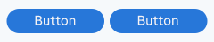
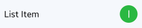
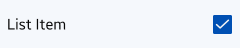
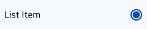

# Button

Button is an UI element that provides the user a simple way to trigger an event.

A button can have image or text on it, or it can have label under the image. A button can be in one of multiple states, such as normal (activated), dimmed (deactivated), or pressed (selected).

Buttons can contain text, image, or both. The button appearance should clearly communicate the action it is related to.

Buttons can have a shape around them. You can present a button as only text without a shape but make sure that the action is clearly communicated with the right wording.

**Button**: Executes a specific function.

**On/off button**: Enables or disables a function.

**Check box**: Selects multiple items.

**Radio button**: Selects a single item.

Keep the following guidelines in mind when designing application controls:

-   Use buttons in the, body, pop-ups, and lists.
-   Reserve check boxes, radio buttons, and on/off buttons for the application body or pop-up. Never use these types of controls in the header.

 
