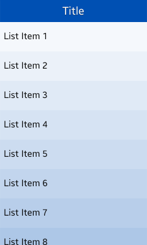
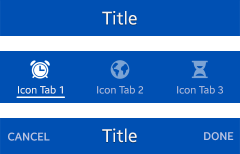
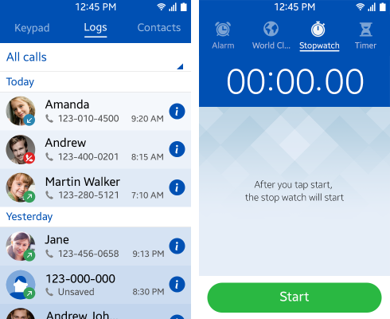
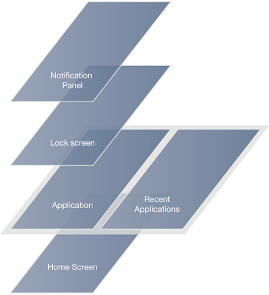
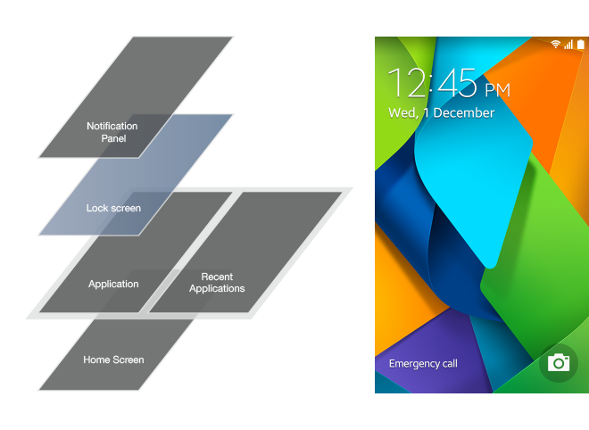
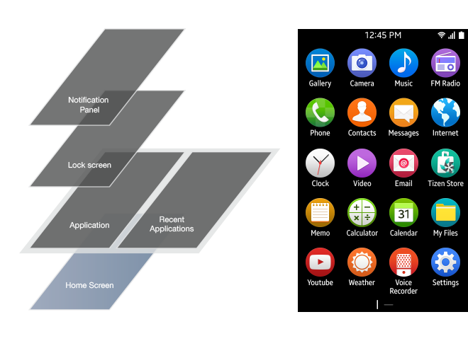
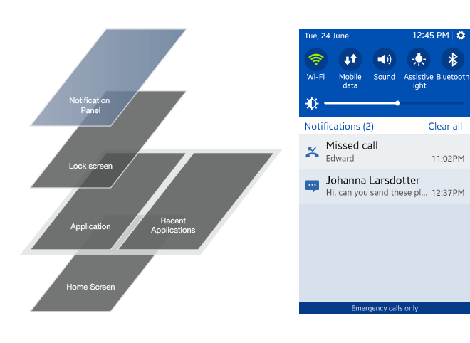
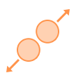
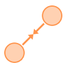

# UI Overview

The Tizen platform gives you optimum flexibility when developing your applications. Using Tizen native and Web frameworks, you are able to build applications in the HTML5 environment that deliver a consistent user experience on all devices.

Before you get started, take a moment to familiarize yourself with the fundamental aspects of the Tizen user interface:

-   [Screen structure ](#structure)
-   [Core UI components](#core)
-   [Orientation](#orientation)
-   [Touch gestures](#touch)

## Screen Structure

In Tizen, each view supports one or more primary user goals. For this reason, the number of fixed elements in the layout structure is few, and primarily includes the header area and the content area.

 

**Figure: Screen areas**

****

 

The header area contains a title that describes the content of the screen. It also includes tabs that support navigation within the application, and, in some cases, it can contain icons or buttons.

 

**Figure: Header area examples**

****

 

The content area displays the application content, such as options and lists, to the user.

 

**Figure: Content area**

 

A variety of different information and controls can be placed in the content area.

The **More** menu contains functions related to the application. Because of the small screen and simplicity, most functions of applications should be placed in the **More** menu.

For an in-depth description of all Tizen screen elements you can use in your application, see [Design Library](./design-library.md).

## Core UI Components

Besides the header and content areas of the application screen, the Lock screen, Home screen, Indicator, and Notification panel are significant components of the Tizen user interface (UI).

For more information about additional UI components, see [Basic Interactions](./basic-interactions.md).

 

**Figure: Application screen structure**

****

 

### Lock Screen

The **Lock** screen is the first screen the user sees when waking up the device. The **Lock** screen should be simple and offer a sophisticated look through wallpaper imagery.

Besides presenting information, such as time and date, the Tizen **Lock** screen lets the user take action on incoming events such as getting back on messages, emails, or missed calls.

 

**Figure: Lock screen**

****

 

------------------------------------------------------------------------

### Home Screen

The **Home** screen is a customizable space that displays applications currently active on the device.

 

**Figure: Home screen**

****

 

------------------------------------------------------------------------

### Indicator and Notification Panel

The indicator appears at the top of every screen. It can contain icons for battery status, reception, or notifications. Pulling the indicator down reveals the Notification panel, which can display information about current downloads, new messages, or missed calls.

 he Notification panel provides the user with an overview of communications and enables setting up the device in different modes through the quick settings.

The quick setting is a flexible shortcut area to toggle modes or settings on and off. The quick settings can be modified to ensure better efficiency for the user.

 

**Figure: Notification panel**

****

 

------------------------------------------------------------------------

### Navigation with Header and Back Behavior

In mobile applications, the most important navigation elements are the header and **Back** key.

The header contains a title that describes the content of the screen. It also includes tabs that support navigation within the application.

The **Back** key is located at the front of the device for overall navigation. For more information, see [Navigation](./basic-interactions/navigation.md).

## Orientation

The Tizen platform supports changes to the device orientation from [portrait to landscape view mode](./basic-interactions/view-modes.md). The user can set the screen orientation manually, or select it to be changed automatically. In either case, ensure you optimize your application UI so that the application displays correctly in both portrait and landscape modes.

## Touch Gestures

The Tizen platform supports a wide variety of gestures that let users directly manipulate content on their touch screen devices.

For example, the user can tap the screen to select an element, swipe it to scroll the content on the screen, or drag and drop an element to move it.

However, make sure you align the gestures in your application with those of the Tizen platform. This gives users a consistent interaction, even if they have multiple applications open at once. Also make sure you provide appropriate [touch feedback](./visual-style/touch-feedback.md) for any gesture interactions.

The following table lists the Tizen gestures you can use to offer intuitive touch interaction to users.

**Table: Touch gestures**

| TYPE                     | MARK                     | DESCRIPTION              |
|--------------------------|--------------------------|--------------------------|
| Tap                      |  | Selects an item or executes functions if the area has no other touch interaction applied.    |
| Double tap               |  | Returns to default view level in zooming. |
| Long tap                 | | Opens a context-specific screen, enters editing mode. |
| Swipe                    |  | Scrolls a list of items or, if used horizontally and applied to an individual list item, executes the primary function. |
| Flick                    |  | Swipes or pans quickly.  |
| Drag and drop            |   | Touching and holding then dragging an object moves it to the desired location when the user releases his or her finger. |
| Pinch zoom in            |  | Pinching open zooms in.  |
| Pinch zoom out           |  | Pinching close zooms out.  |

> **NOTE**  
> The flick gesture is supported in the Native framework.
