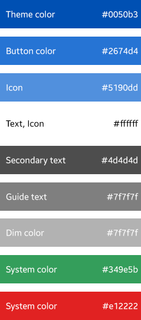

# Colors

The color theme for Tizen 2.3 is light. The point color is blue, and alpha values are used for components, such as icon or scroll. You can adjust saturation and brightness values for components, such as a button.

Several vivid colors can be used for specific functions, such as green for the **Start** function, and red for **Delete** functions.

 

**Figure: Color theme**

 

The figure below illustrates the relevant RGB values.

 

**Figure: Color set**

