# App Structure

The Tizen platform provides you with a wide range of UI components to help you design your apps. You can select and use the UI components depending on the purpose and main features of your app.

This section aims to explain basic app structures designed with some of the most common UI components as examples.

> For apps that require special layouts (such as cameras, video players, and games), the following guidelines may not be applicable.

 

Apps in general have a structure of more than two layers, and they can contain normal and edit modes while being used.

  |                       |  Normal mode           |   Edit mode|
  |------------------------| ------------------------ |------------------------|
  |Top level          |      Main view         |       Main view Edit mode|
  |Lower level         |     Detail view         |     Detail view Edit mode|

*Levels and modes of app screens*

Design app screens as simple as possible. The simpler the structure, the easier it is for users to navigate. Multiple views are not necessary in some cases; just one view may be enough. When you design a screen with multiple items on it, display them as a list and show details when an item is selected.

-   [Main view](#main_v)
-   [Detail view](#detail)
-   [Main view Edit mode](#main_edit)
-   [Detail view Edit mode](#detail_edit)

 

## Main View

This section provides guidelines for designing the main view of your app. Read the following guidelines before designing your app.

 

##### Start with an Overview

The Main view is the first screen on your app. It provides key information to help users recognize your app’s essential features and allows them to understand the app structure. If you need to divide the information into different categories, use tabs in the header.

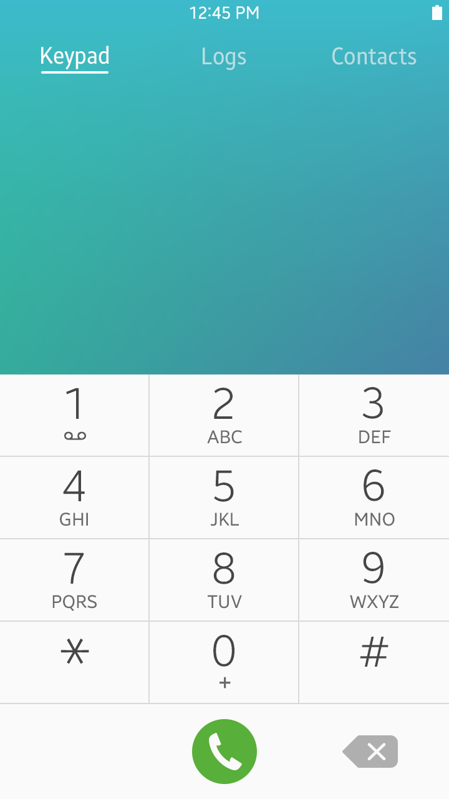  
*Main view example of a call app*

 

##### Enable Easy Content Management

Besides consuming information from the given content, users often need to manage content items themselves. Basic actions for content management are as follows:

-   Create : Used to create or compose an item.
-   Search: Used to find an item or entry.
-   Share: Used to share items with others.
-   Edit: Used to provide functions to make changes to the selected items or entries. A set of action buttons, such as 'Delete', 'Copy', or 'Move', may be provided on the More menu screen.

You can place floating action buttons on the top level view of your app for app-specific, primary actions. Floating action buttons stay at a fixed position on the screen when users scroll through the content, thus allow for fast and easy user access to primary app features.

For example, you can provide a 'Create' floating action button for a calendar app, or a 'Compose' floating action button for a messaging app, and then provide other less important action buttons in the 'More' menu screen. Refer to [Floating Action Button](../ui-components/assist-views.md#floating_) for details.

 

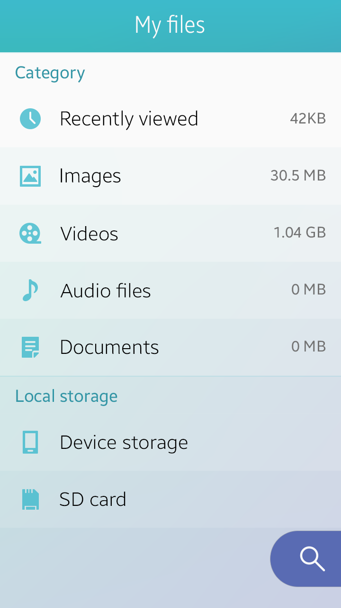 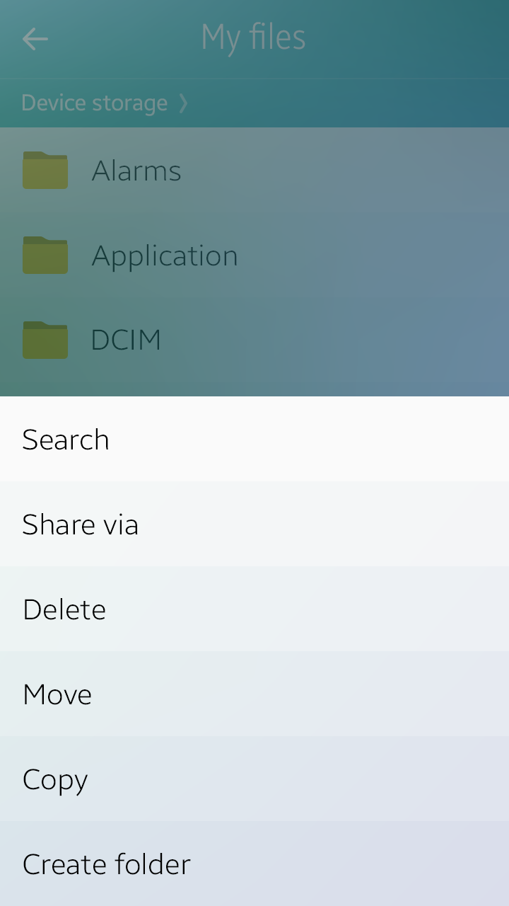  
*The main action is provided as a floating action button on the main view page.*

 

## Detail View

This section provides guidelines for designing your app’s detail view. Read and understand the following guidelines before designing your app.

 

##### Focus on Content

In the detail view, display content elements, such as images or text, so that users can recognize the information immediately.

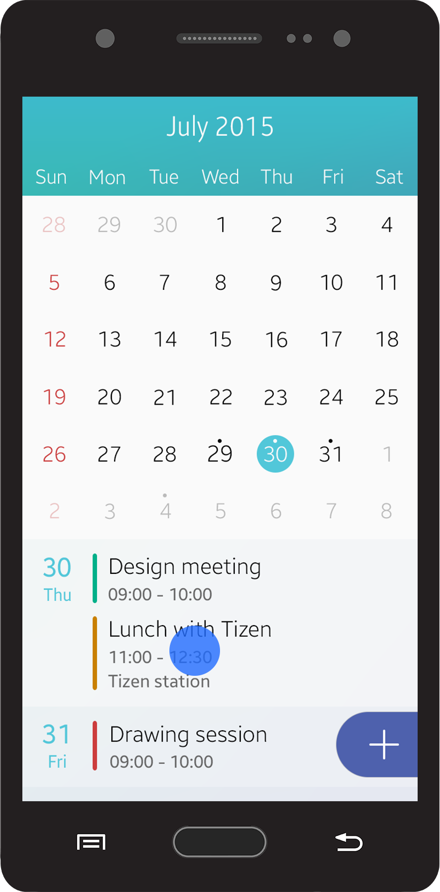 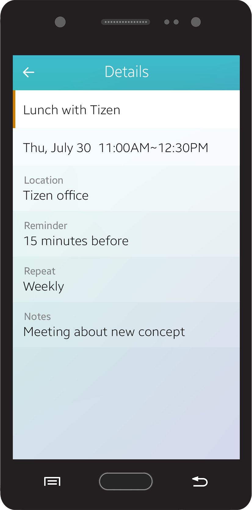  
*Displaying content in the detail view*

 

##### Design Easy Actions

A detail view generally includes various actions that users can run on the page. You can place the action buttons either directly on your app screen or on the 'More' menu screen. Do not display too many action buttons on the screen because they may distract users. Place only the main actions on the screen and add others on the 'More' menu screen.

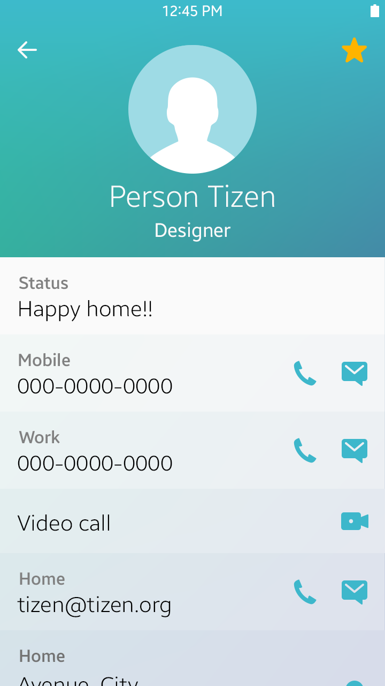 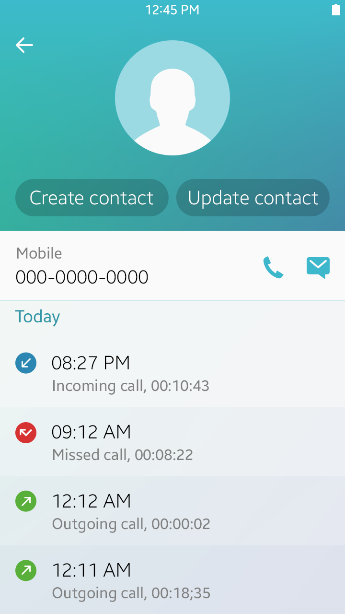  
*Action buttons in the detail view*

 

##### Provide Easy Navigation between Screens

In the detail view, 'Back' key on the device always takes the user to the previous screen. Place a 'Cancel' button on the screen to allow users to quit a current task. A 'Cancel' button may be provided with action buttons that require confirmation, such as 'Save', 'Done', or 'Send'.

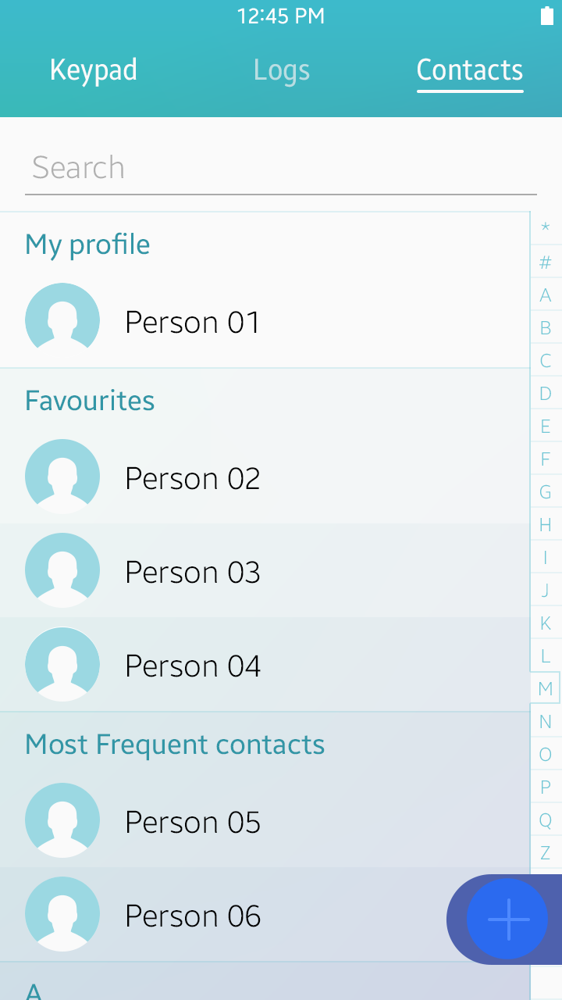 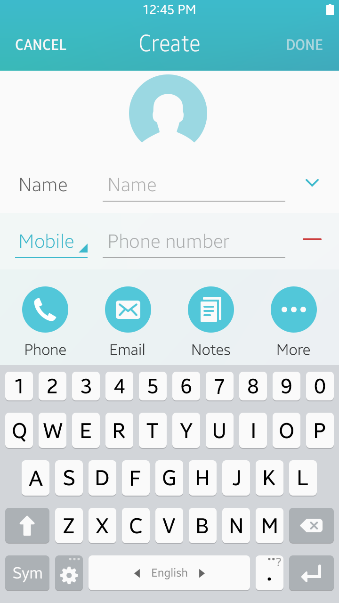  
*Screen navigation*

 

 

## Main View Edit Mode

This section provides guidelines for designing the main view edit mode of your app. Read the following guidelines before designing your app.

 

##### Allow Users to Manage Multiple Items

You can provide check boxes in the main view edit mode to allow users to manage multiple selected items. Also, allow users to tap the 'Cancel' button or the 'Back' key to cancel a task.

The screen automatically switches back from the edit mode to the normal mode when users complete or cancel the task.

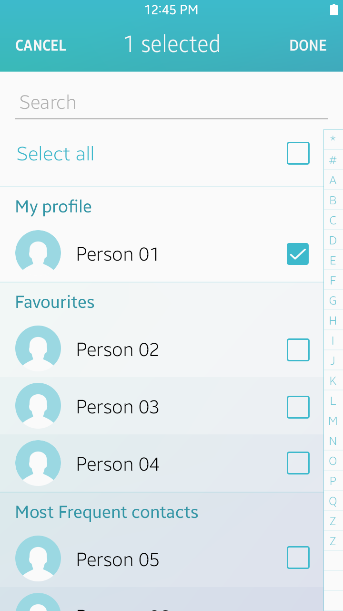  
*Managing multiple items with check boxes*

 

## Detail View Edit Mode

This section provides guidelines for designing the detail view edit mode of your app. Read the following guidelines before designing your app.

 

##### Allow Users to Create and Edit Content

In the edit mode, users can create, delete, or edit the content in the detail view. Provide a means for users to input and edit text, such as an on-screen keypad, and action buttons for completing or canceling the task.

 

##### Provide Setting Options

In the edit mode, provide standard UI components, such as radio buttons, checkboxes, and sliders, to allow users to adjust setting values. Also, provide action buttons for completing or canceling the task after users have adjusted the settings.

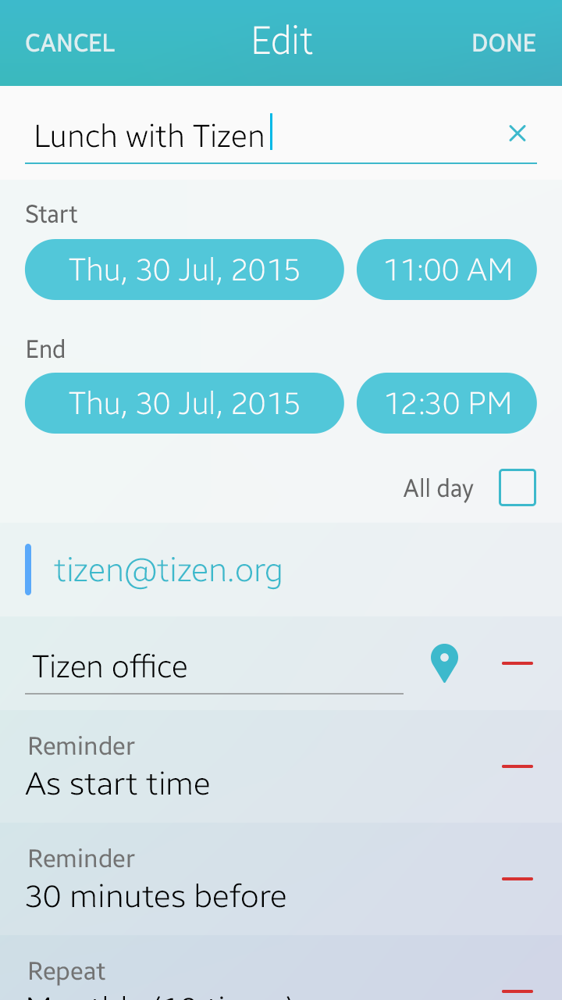  
*Editing settings*
