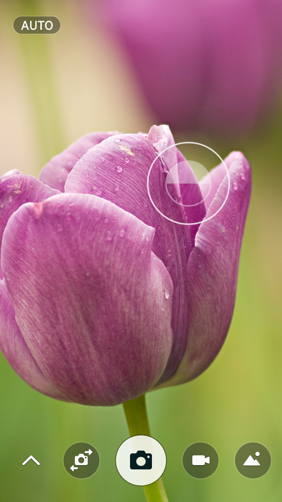
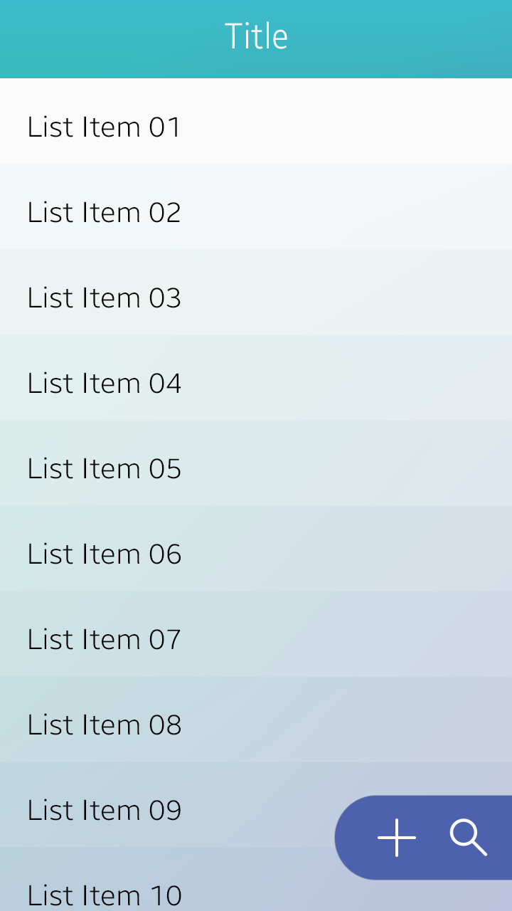
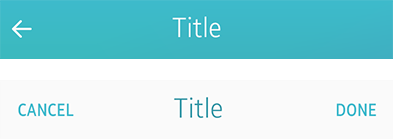
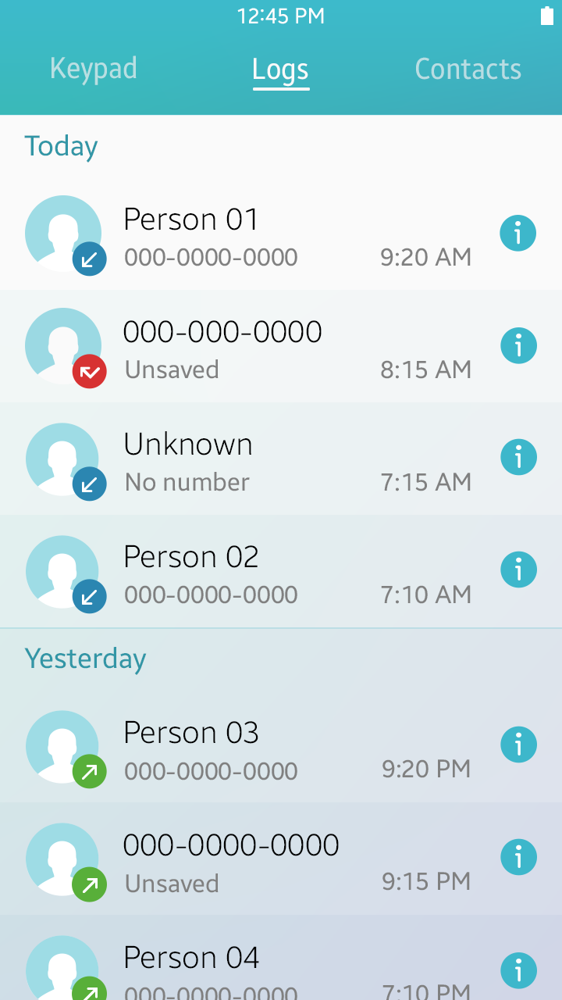
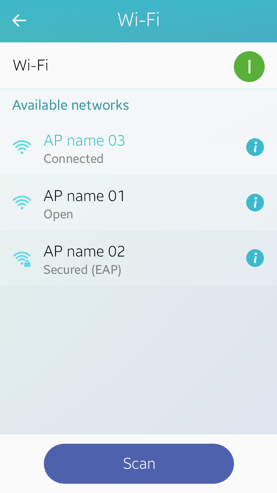

# Screen Layout

Each view in a Tizen app contains one or more primary goals. Select screen layouts that can be easily implemented to achieve the desired goals. To provide as much flexibility as possible in the design, each view used for Tizen apps comes with only three fixed layout elements–a header, content area, and footer.

You can also design your own layout if you design an app to serve specific needs. The following are examples of custom layouts for specific needs.

 

  
*A full view layout dedicated for a camera app*

 

##### Header

The header is the top portion of a view. The following lists the role of a header on a view:

-   The header carries the title and indicates the current location in an app (refer to [Title Bar](../ui-components/navigation-elements.md#title_) for details).
-   The header in a Create/Edit view can include Cancel and Confirm buttons (refer to [Cancel and Done](navigation-design.md#cancelAndDone) for details).
-   The header can include an on-screen Back button (refer to [On-screen Back Button](navigation-design.md) for details).

 

  
*Header*

  
*Header with buttons*

##### Content Area

The content area is where the information and interactive interfaces for your app are located. You can design the main content and place UI elements on it.

The following lists the guidelines for designing the content in a view:

-   Display important information at the top so that users can see it without scrolling.
-   Keep the design it as simple as possible to avoid distraction.
-   Use a consistent layout throughout the app.
-   Use clear visual effects to provide feedback for user inputs.
-   Use the UI elements (Tizen UI components) consistently throughout the app.
-   In case you design your own UI elements (controls), ensure that they are large enough for user interaction (40 px x 40 px minimum in WVGA screen resolution).

 

  
*Header*

##### Footer

The footer contains user interfaces for extended user actions. On this part of the screen, you can place app-specific user interfaces in the form of [Bottom Buttons](../ui-components/user-input-components.md#bottom_) or [Floating Action Buttons](../ui-components/assist-views.md#floating_). Use the footer interfaces to present only the essential user actions in your apps.

In the following example, the Scan button is provided in the footer to provide essential functionality for the Wi-Fi feature.

  
*Footer*
