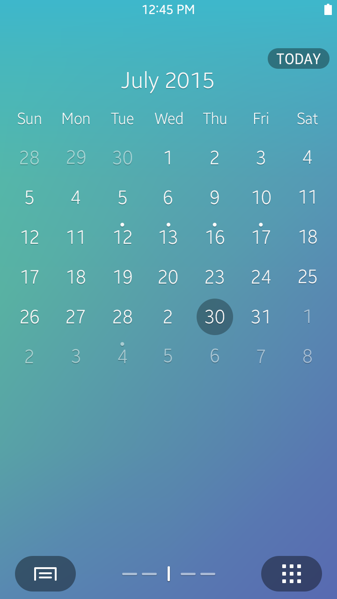
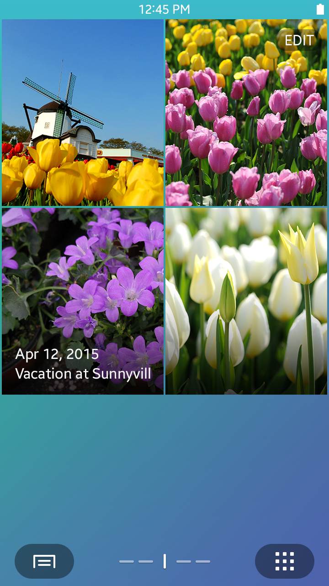
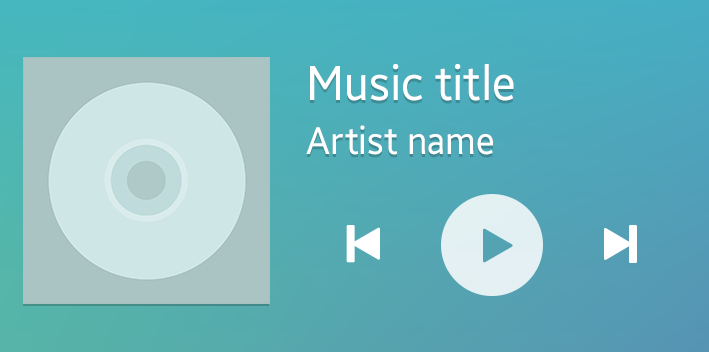
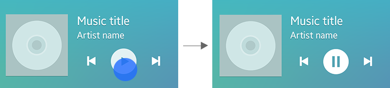
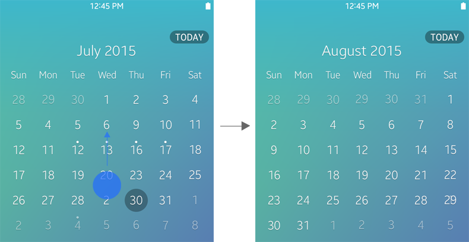
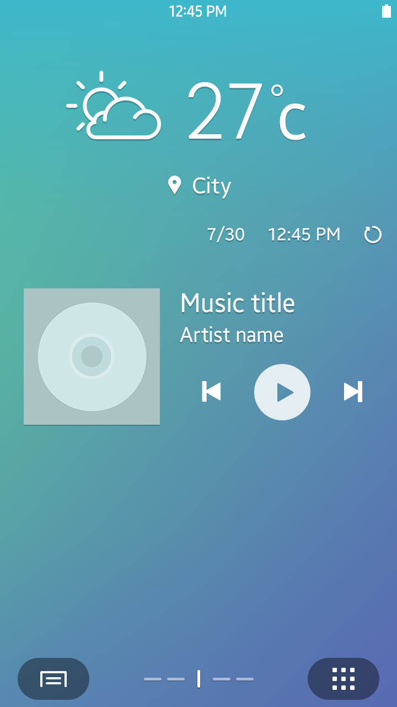
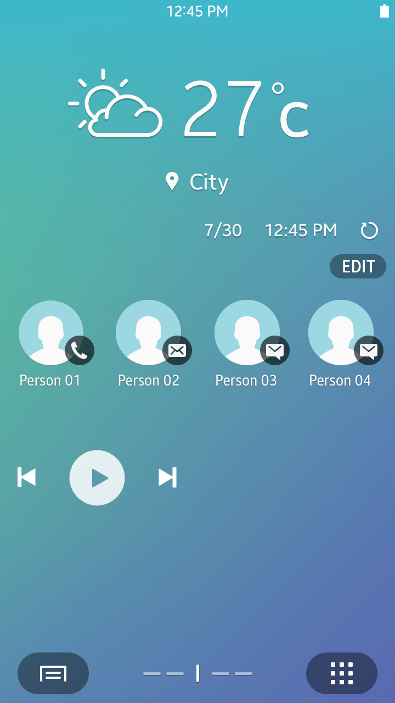
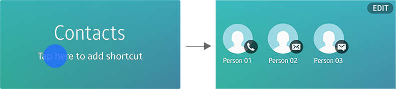

# Widgets

Widgets are essential components for Home screen customization. Working together with the host apps, widgets notify users of important information at a glance. Using widgets, users may gain access to certain app features without opening the app.

You may include a variety of features in your widgets to increase usability of your app. Depending on the content and features they provide, widgets may be divided into the following categories.

## Information Widgets

Information widgets are designed to present informative, timely content that users may be interested in.

   
*Calendar and Gallery widgets*

## Interactive Widgets

Interactive widgets allow users to access the main features of certain apps without launching them. Interactive widgets may allow users to change an app’s settings, and then the changes will be reflected immediately to the app and the widget itself.

  
*Interactive widget – Contacts*

 

## Hybrid Widgets

While most widgets can be classified into one of the two types listed above, there are widgets that utilize a variety of content. Such widgets are called “hybrid widgets.” For example, a music widget may be considered a hybrid widget if it provides playlist information and playback controls at the same time.

  
*Example of a hybrid widget – Music widget*

 

## Design Guidelines for Widgets
 

##### Content

When you design widgets, what matters most is the quality of the content provided in your widgets. Concise information, provided in a timely manner, adds value to your widgets and apps and convinces users to access your app to obtain more information.

 

##### Gestures

Because widgets run on the Home screen, they must be designed with limited gestures to avoid conflict with other Home screen gestures. The tap and vertical swipe gestures can be used with widgets.

-   Tap : Used for controlling widget functions or selecting a specific item in the content
-   Vertical swipe : Used for scrolling through the content or switching between the widget’s screens

  
*Taps are used to control widgets.*

  
*Vertical swipe*

 

##### Access to Apps

In addition to displaying content, widgets provide direct paths to the host applications. You can include UI elements in your widgets to provide shortcuts to the apps, or to certain features. Users can tap the shortcuts on the widget to:

-   open the initial app screen.
-   open the app with a detailed view of the selected content.
-   open a specific function screen, such as settings, in an app.

 

##### Widget Size

Widget size is important, because it determines the amount of information that can be presented in the widget. In general, widgets are designed in 4x2 and 4x4 grids to ensure enough space for displaying essential information. Tizen 2.4 allows only for fixed-size widgets. Fixed-sized widgets make it easier for users to arrange the widgets on the Home screen in a more consistent and orderly manner.

   *Do*  
  *Don't*  
 

##### Configuration

In order to allow users to effectively use a widget, configuration options may be provided. Users may configure the widget before or after adding the widget to the Home screen.

For example, if you are designing a weather widget, you can make it display a configuration pop-up for GPS access before it is placed on the Home screen. Alternatively, you can design your widget to notify users on the initial screen, that a GPS configuration is required.

You may also place an action button for configuration at the upper-right corner of the widget. Users can change the settings at any time using this button.

  
*Contacts widget – Initial screen*
