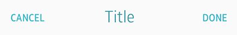
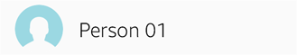
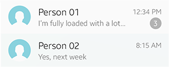
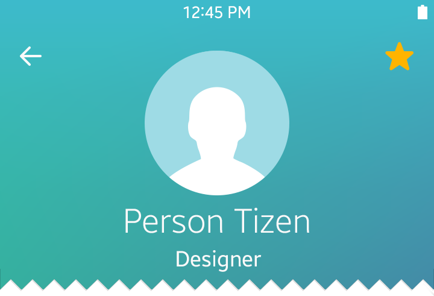
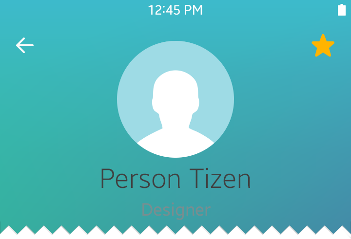
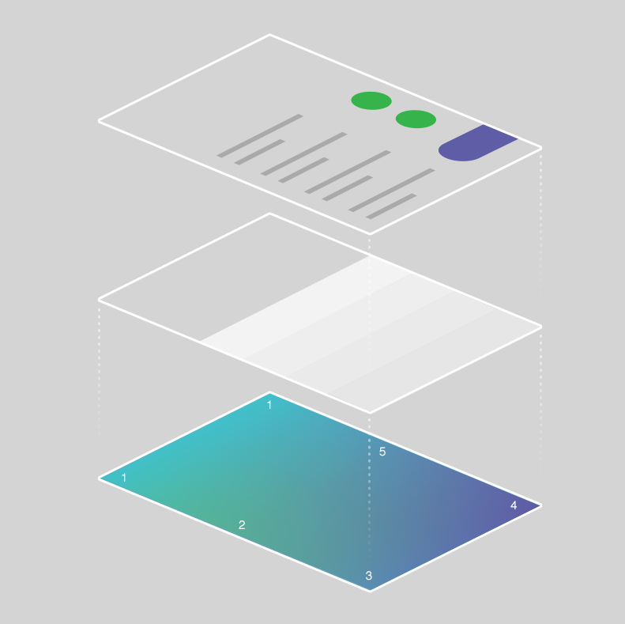
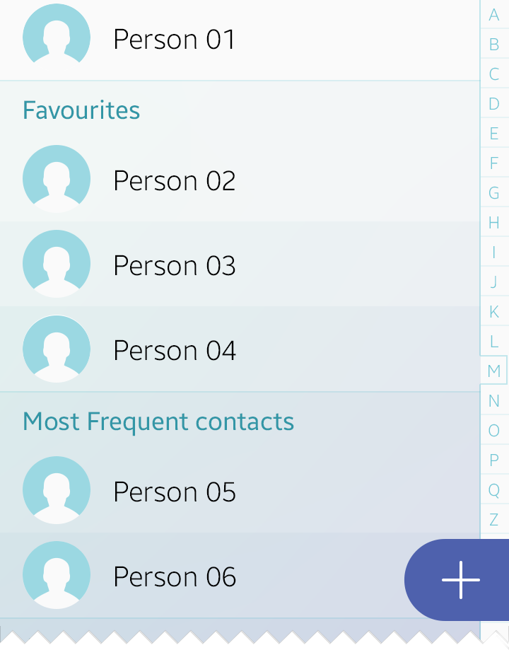
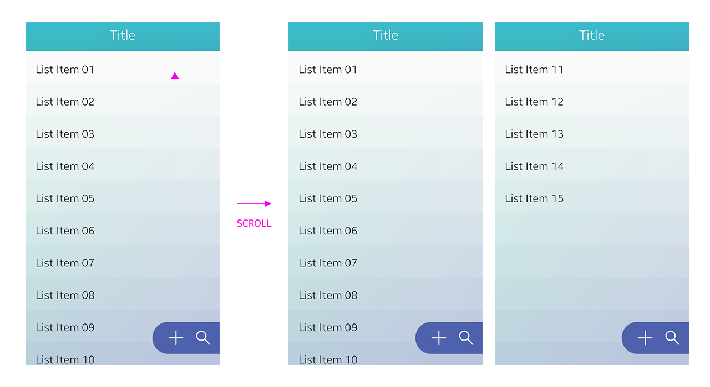

# Styles

##### Theme Colors

The Tizen offers a single background gradient called “Midday” as the default Home screen background since Tizen SDK 2.4. It captures colors and natural gradients of the sky.

  
*Midday, the new theme color for the Tizen mobile since Tizen SDK 2.4.*

 

##### Color Swatch

For basic action buttons, such as 'Go' and 'Stop', Tizen 2.4 uses clear and distinct colors for focus and emphasis. Transparency may be applied to text colors to add subtle nuances.

| No.            | Color          | HSB code       | Swatch         | Component      |
|----------------|----------------|----------------|----------------|----------------|
| 1              | White          | \#FFFFFF       | 

         | Primary text / Primary color|
| 2              | Gray           | \#666666       |  

        | Secondary text |
| 3              | Black          | \#000000       | 

         | Primary text / Primary color |
| 4              | Green          | \#2AB842       | 

        | Start          |
| 5              | Red            | \#E12222       | 

          | Stop           |
| 6              | Yellow         | \#FFB400       | 

          | Snooze, Favorite(star) |

 

##### Font Styles

Different text colors may be used depending on the level of text information and background colors. The following are examples of the primary and secondary text colors in the Tizen Mobile SDK 2.4.

 

  
*White text against a dark background (theme color)*

  
*Colored text against a white background*

   
*Black primary text against a white background*

   
*Gray secondary text against a light blue background*

The following examples show how different text colors appear on the call log screen. White primary text displays well over the header area (dark theme color). Primary text in black and secondary text in gray also look fine over the lightly colored list area.

Once again, the text colors should be decided based on the color of the background. Black or gray text usually fails to stand out against darker backgrounds, resulting in decreased visibility.

 | |  |
| :--: | :--: |
| *Do* | *Don't* |

Text with vivid colors, such as red, yellow, blue, and green is not recommended. Such color choice may cause the usability of your design to suffer, because they may impose excessive stress to a user’s vision and distract them.

### List Principles

Tizen mobile devices use multilayered page structure, with the main theme background (gradient) in the bottom layer position. By separating the layers based on their roles, sophisticated effects may be applied on the pages with a minimal set of rules to follow.

The list view is one example that can help you understand how superimposed layers with gradient and text items appear against the background. Semi-transparent stripes of gradient on top of the main background create subtle dividers for each list item, above which list item text layer is placed.

  
*Multilayered screen structurecreated by layers of different opacities over the background gradient.*

Different opacity levels on a list create an interesting gradient. On the item list layer, the opacity level of the first list item is 100 percent, and it decreases by 4 percent for each item after it until the twentieth item. After the twentieth item, the opacity level begins to increase by 4 percent until it reaches 100 percent again.

  
*Scrolling a list*
