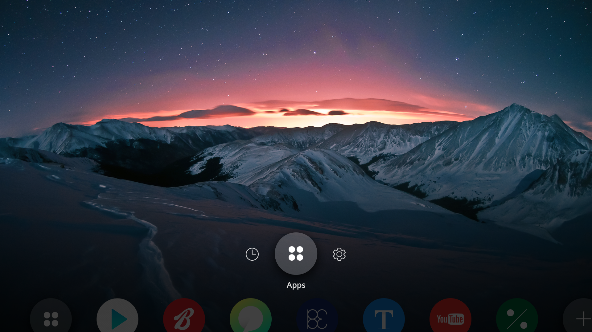

# Hidden Inactive Icons

An inactive icon partly hides itself to take up even less space on the screen. This approach also allows the user to recognize active icons without visual interruption from inactive icons.

  
*Inactive icons are hidden.*
