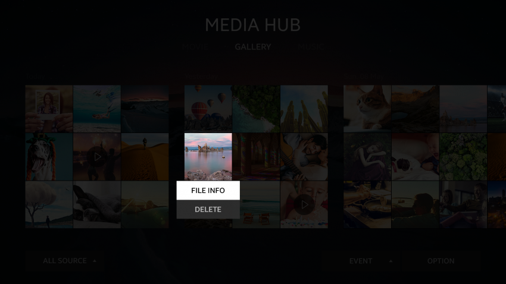

# Delete

The purpose of a delete action is to eliminate content entirely.

The user can delete the selected content. To delete 2 or more content items, the user must multi-select the items or press the **Select All** button.

After all content is deleted, the **No contents** text is shown on the screen.

  
*Delete*
