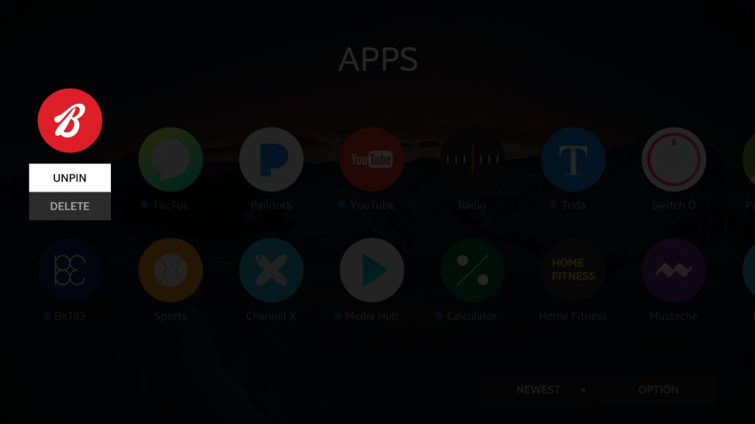

# Pin or Unpin

The user can edit the favorite app list by pinning and unpinning to make the favorite apps easily accessible:

-   A pin action is used to make a bookmark to the user's favorite application.
-   An unpin action is used to remove the pinned application from the favorite app list.

 
*Pin and unpin*
