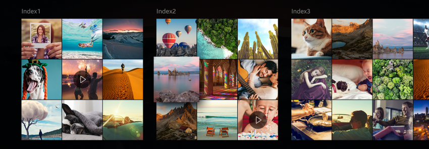

# Content Area

A content area provides the main information and content of the view.

The following guidelines apply to the content area:

-   The content area can be scrolled when the length of all content exceeds the size of the screen.
-   A focus at the screen edge is set in a fixed position when the length of all content exceeds the size of the screen.
-   The focus does not circulate between items in the content area.
-   A guide text appears when there is no content to display.

  
*Content area on the screen*

  
*Content area with Index*
