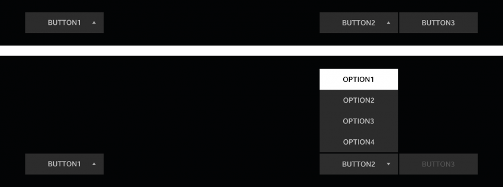

# Footer Area

A footer area generally has buttons and drop-down menus. They help the user to extend actions and control content easily.

 
*Footer area on the screen*

 
*Footer with drop-down menus*
