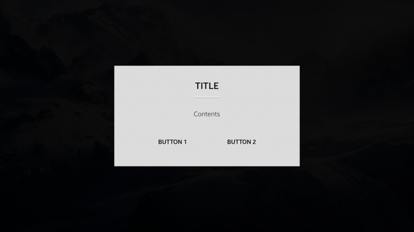

# Action Popup

Action popups consist of content, action buttons, and an optional title. An action popup appears at the center of the screen.

The following guidelines apply to action popups:

-   When the action popup appears, the background screen is dimmed.
-   The title is limited to 1 line of text.
-   Content can include text, an icon, and additional items.
-   The action popup has 2 action buttons, by default.

 
*Action popup*
