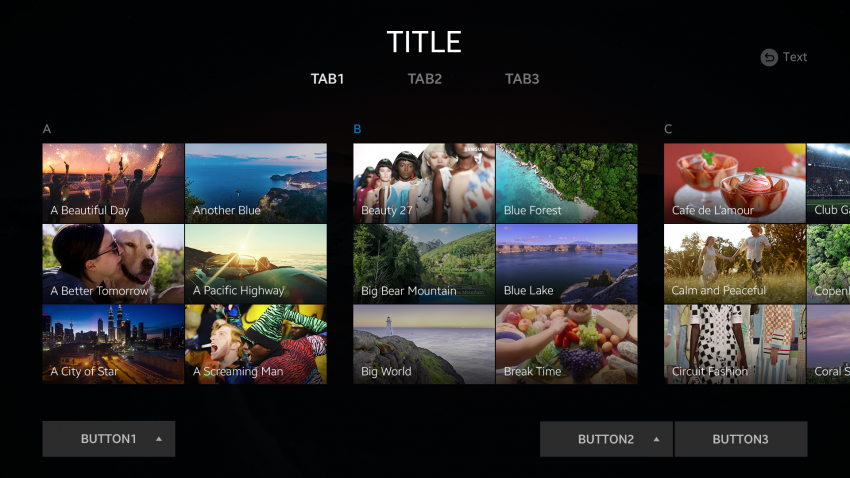

# Index

Indexes allow the user to easily access content within a category. Items in an index are arranged alphabetically.

An index can be either in the normal state or the focused state.

  
*Index items arranged alphabetically*
