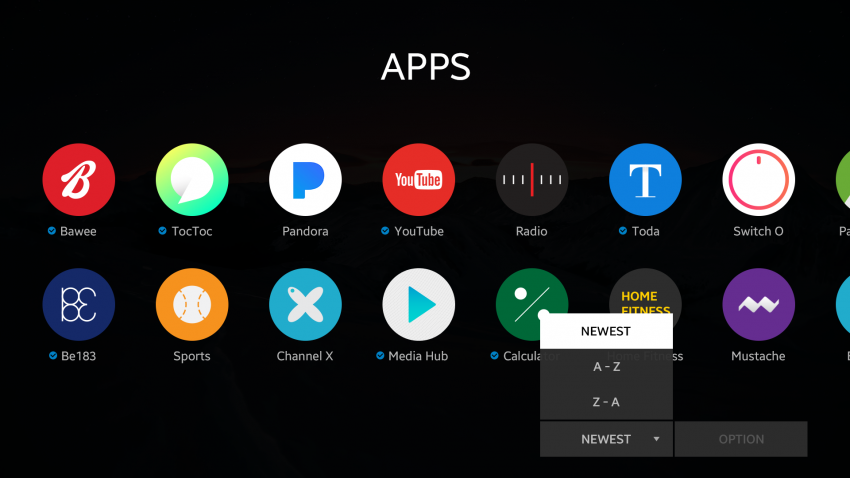

# Drop-down Menu

Drop-down menus allow the user to select 1 option from a list of multiple options within a drop-down popup. A drop-down menu consists of a drop-down button and a drop-down popup. When the user selects the button, the popup appears.

Drop-down menus can indicate the selected option in 2 ways:

- The selected option is marked within the drop-down popup.
- The selected option is shown as the label on the drop-down button.

A drop-down button or popup option can be in either of the following states:

- Normal
- Focused
- Selected
- Disabled

The following guidelines apply to drop-down menus:

- The drop-down menu must provide a default selected option.
- A check mark can appear on the selected option in the popup.

  
*Drop-down menu with selected option as label*
