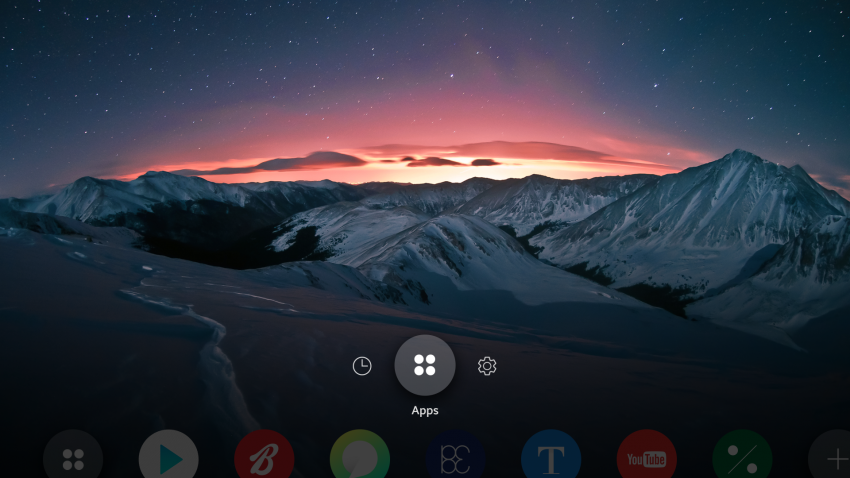

# Content Area

A content area is the basic screen providing the application view. It displays UI components and items used in every application.

  
*Content area example*

The content area is the lowest layer in the layer hierarchy.

  
*Content area layer*
