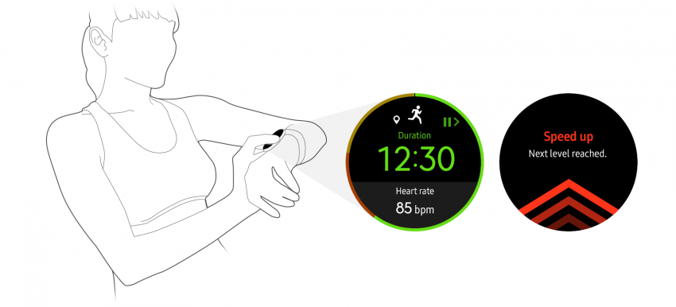
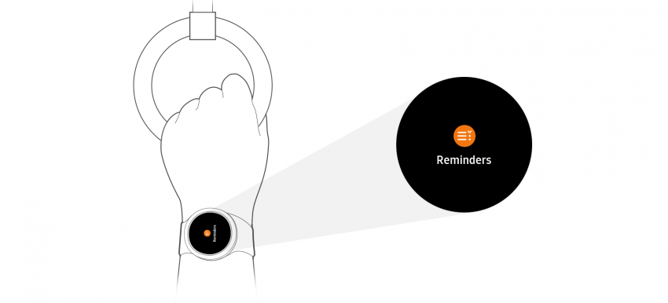

# Design for Wearables

Wearables have created a more intimate and responsive context to user interaction that’s different from other mobile devices such as smartphones and tablets.

## Intimate and Responsive

The Gear responds to movements from a user’s wrist. It automatically reveals the watch face when the user lifts their wrist, as it interprets this gesture as an intention to check the watch. You can also provide diverse haptic responses as the Gear is always connected to the user's body.

  
*When the user starts running, Light Jogging starts in the S Health app.* 
*The Gear provides intimate responses by displaying heart rate or encouraging the user to run faster.*

 
## Timely and Informative

The Gear can provide timely information when users are engaged in an activity and can’t get to their phone or computer. Users can check information at a glance and quickly complete a task.

  
*Gear can provide timely information even when the user is stuck on a crowded bus and unable to use their hands.*
