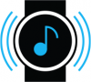
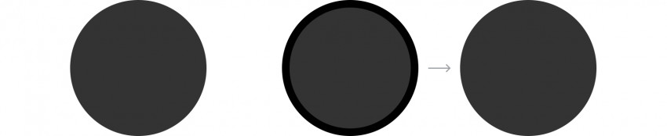

# Feedback

The Gear offers visual, auditory, and haptic feedback. Whichever the type of feedback being used, it should clearly communicate the result of a user’s input. You can combine more than one type of feedback when you need to emphasize user input.

<table>
     <tr>
       <th> Interaction </th>
       <th>   </th>
       <th> Example </th>
     </tr>
     <tr>
       <td> Haptic response </td>
       <td>  </td>
       <td rowspan="3"> Respond to user input </td>
     </tr>
     <tr>
       <td> Visual response </td>
       <td>  </td>
     </tr>
     <tr>
       <td> Sound response </td>
       <td>  </td>
     </tr>
    </table>

## Haptic responses

Haptic responses deliver feedback to users through vibration without requiring them to look at the screen. You can vary the duration and number of vibrations to communicate different meanings to users.

-   **Designing vibration**

    You can design patterns by using a mix of silence and vibrations of varying durations. Since users might have difficulty differentiating between complicated patterns, try to keep them as simple as possible.

-   **Sample vibration Patterns**

<table>
     <tr>
       <th> Examples </th>
       <th>   </th>
       <th> Meaning </th>
     </tr>
     <tr>
       <td> Single short *(e.g. 100 ms)* </td>
       <td>  </td>
       <td> Provides simple information </td>
     </tr>
     <tr>
       <td> Single long *(e.g. 500 ms)* </td>
       <td>  </td>
       <td> Signals a clear status *(e.g. completion of a task)* </td>
     </tr>
     <tr>
       <td> 2-3 times fast </td>
       <td>  </td>
       <td> Provides a warning or an alert </td>
     </tr>
     <tr>
       <td> 2-3 times middle speed </td>
       <td>  </td>
       <td> Provides a general notification </td>
     </tr>
     <tr>
       <td> 2-3 times slow *(e.g. 60 times / min=60 BPM)* </td>
       <td>  </td>
       <td> Provides an alert about an incoming/ongoing event </td>
     </tr>
    </table>

-   **Duration of vibrations**

    Users often find overly-long vibrations annoying. They also drain battery power, which reduces the battery life.

-   **Appropriate feedback**

    Haptic vibration can be created with different intensities. Since the Gear is worn on the wrist, several factors can affect range of vibration that’s detectable, including whether users are moving, whether they are wearing the Gear, or how much they are focusing on the device. Haptic feedback should only be provided in the right place at the right time to avoid tiring out users with unnecessarily frequent feedback.

-   **Feedback on text input**

    Since users generally type to perform a task, they need quick feedback on whether they are typing correctly. Consider ways to minimize latency to ensure instantaneous feedback on typing. Haptic feedback should be as brief as possible, within the range that users can notice the vibration. (e.g. below 30 ms)

## Visual responses

Visual responses inform users of a current state. Provide visual feedback to inform users that they have reached the end of a scrollable page or that a button or icon has been pressed. Refer to [Visual design](../visual-design/animation.md#clear_feedback) for more details.

-   **Overscroll**

    [Overscrolling](../patterns/overscroll.md) effects indicate that the user has reached the end of a scrollable list or page. It appears as a straight line, at the edge of both a linear and circular page.

-   **Button press**

    Button press effects indicate that a button or icon has been pressed by adjusting the color opacity or size of the button.

-   **Adjusting the color opacity**

    You can adjust the color opacity of a button by 40% to indicate that the button has been pressed.

   **Normal                                                                  Pressed**

      
    Opacity 100%                                                 Opacity 40%

    *The opacity of the entire container is adjusted to 40% when users press a colored icon.*  

    **Normal                                                                  Pressed**
      
   Opacity 100%                                                  Opacity 40%        

    *The color opacity of the whole container drops to 40% when users press a text button.*

-   **Adjusting the size**

    You can adjust the size of a button to indicate that the button has been pressed.

    **Normal                                                     Pressed**

      
    Scale 100%                                                              Scale 110%                            
    *When users press a 2D icon without a container, a circle appears around the button and is scaled up to 110% of its original size*

    **Normal                                                                  Pressed**

      
    Scale 100%                                                         Scale 110%                              
    *When users touch the screen itself, the screen is scaled down to 90% and then returns to 100%.*

## Auditory responses

Auditory responses deliver feedback on the user's touch or gestures. Using different stream types, durations, and melodies will help you create sounds that help users take the correct next steps.

 

-   **Stream type**

    Consider which type of stream type is suitable for each auditory response. It could be a ringtone, a notification (message), or a piece of media.

-   **Properties: notes, tones, melodies**

    Consider the meaning of each property when you’re designing your auditory feedback. For instance, touch interaction performs many different actions, so the related sounds typically have a neutral and simple tone. You can use a higher note when values go up, and a lower note one values go down. Likewise, you can use an ascending melody when turning on a function and a descending one when turning it off. These directions should remain consistent throughout your app.

 

The table below shows some examples of the Gear's auditory responses for each type of interaction.

|Touch/mode change        | | |
|--------------------------|--------------------------|--------------------------|
| Nokey (reach limit)      | | |
| Up/down                  | | |
| On/off, Enable/disable   | | |
| Confirm/start/success    | | |
| Error/alert              | | |

> **Tip**  
> Media and system sounds will be automatically muted when users set their sound profile to Mute or Vibration mode.

 

-   **Format**

    Using the open source .ogg format is recommended, and the file compression ratio should be at least 128 kbps (mono/stereo).

-   **Duration**

    Make your sound file at least 100 msec. If the sound lasts for less than 100 msec, the system might not be able to play it.

-   **Volume**

    Design your sounds considering the range of volume levels. Did you make sure that your sound is not too low or high to avoid straying from the peak range? Is the volume of your sound appropriate at the Gear’s default volume level? Does your sound play at all volume levels from 1 to 15?

    Refer to the table below for the default volume of each stream type.  

| Ringtone        | Notification    | Media           | System          |
|-----------------|-----------------|-----------------|-----------------|
| 11              | 11              | 7               | 9               |

-   **Sound and vibration**

    Sync sounds and vibrations when you combine them. It might confuse users if sounds and vibrations occur separately for the same feedback.
