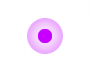
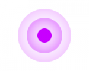
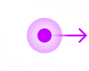
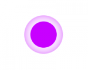

# Touch

Touch is the Gear’s base interaction platform, with taps and swipes widely used to navigate the interface. Ensure components have enough touchable area, and that the space between components is large enough so that touchable areas don’t overlap.

<table>
     <tr>
       <th> Interaction </th>
       <th> </th>
       <th> Example </th>
     </tr>
     <tr>
       <td> Tap </td>
       <td>  </td>
       <td> Action/select </td>
     </tr>
     <tr>
       <td> Double tap </td>
       <td>  </td>
       <td> Zoom in or out </td>
     </tr>
     <tr>
       <td rowspan="2"> Swipe </td>
       <td>  </td>
       <td rowspan="2"> Scroll left, right, up, or down </td>
     </tr>
     <tr>
        <td>  </td>
     </tr>
     <tr>
       <td> Bezel swipe down </td>
       <td>  </td>
       <td> Go back </td>
     </tr>
     <tr>
       <td> Touch and hold </td>
       <td>  </td>
       <td> Go to select mode </td>
     </tr>
</table>

## Tap

A tap is a light touch on the screen with a finger. Users tap to move between pages or to interact with a component on the screen. You can also customize the tap gesture in your app to assign it to other functions.

-   **Move from one screen to another**

    Tap to move to a lower level in the hierarchy or to access a more detailed page.

      

-   **Make a selection**

    Tap to select or deselect a confirm or cancel button, radio button, or checkbox.

    

## Double tap

A double tap is 2 continuous taps on the same target with the same finger. Users double tap to zoom in on the screen. You can also customize the double tap gesture to assign it to other functions.

-   **Zoom**

    Double tap to increase the size of the font or an image temporarily.

    

    
## Swipe and drag

A swipe is the gesture where the user moves a finger across the touch screen. It shifts or scrolls the screen according to the gesture’s velocity. Users can swipe anywhere across the whole screen, with no on-screen target.

A drag is a gesture where the finger moves at a constant speed. It moves an on-screen target as much as the user’s finger indicates. A drag is sustained as long as the user maintains contact with the screen and ends when the finger is lifted.

A swipe is a less precise movement than a drag. You can also customize the swipe gesture to assign it to other functions.

-   **Move from one screen to another**

    Swipe to transition between pages or cards. Screens move in the same direction that the user swipes.

          
    *A swipe to the left takes users to the screen on the right, and a swipe to the right takes users to the screen on the left.*

-   **Scroll**

    Swipe to scroll vertically or horizontally where content does not fit on one screen.

-   **Refresh**

    Swipe down from the top of the screen to refresh content. This interaction is useful if your app deals with content in real-time. A loading indicator at the top of the screen should be shown when a screen is refreshing. Refer to [Update content](../patterns/swipe-refresh.md#update) for more details.

> **Tip**  
> Show an indicator, circular scroll bar, or loading indicator as appropriate when users swipe. These visual cues help users interact smoothly with the Gear.

## Bezel swipe down

A swipe down from the bezel’s top edge returns the user to the previous screen. This gesture is not customizable, and bear in mind that any other swipe down navigation you add to your app may conflict with this, causing users to go back to the previous screen by mistake.

## Touch and hold (Long press)

Users can touch and hold a list or an icon to begin selecting multiple items. You can also customize the touch and hold gesture to assign it to other functions.

-   **Select multiple items**

    In select mode, users can select or deselect multiple items before deleting or sharing them.

    

> **Tip**  
> The number of selected items is displayed at the top of the screen. This visual cue gives users confidence that the system is responding to their input.
