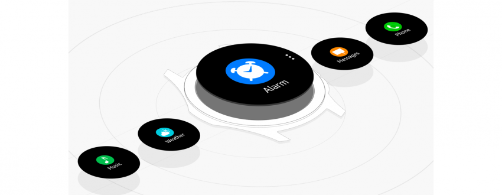
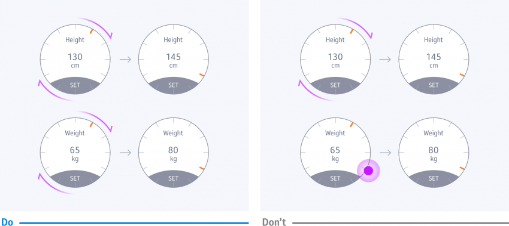

# Navigation

You should design navigation flows and views that best present your app’s content and services.

-   **Highlight key content**

    The primary features of your app should be seen in one simple view. Organize your content so users can immediately access your app’s key features without going deeper into the navigational structure.

      
      *Important content and tasks should be placed in one view based on the amount and priority of information.*

      
    *For content that doesn’t fit into one screen, less important content is moved to the detailed view.*

-   **Keep your navigation flow consistent**

    Screens at the same level in the navigational hierarchy should use the same style and patterns. Similarly, interaction with your app should also be consistent. For example, if you used the rotary action for one screen, use it again on similar screens.

      
    *Screens in the same UI style should be navigated in the same way.*

    *It will confuse users if they need to tap on some screens and rotate the bezel on others.*

-   **Scroll along one axis per screen**

    Each screen should only support navigation along only one axis: vertical, horizontal, or Z-axis. For example, you can't scroll vertically and horizontally on the same screen.

    
    *A screen should scroll either vertically or horizontally, not both.*
