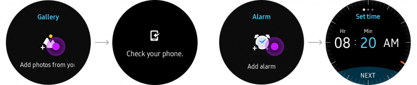

# Empty States

Empty states are displayed when your app can’t show its regular content. Think of the empty list when no alarms are set, an empty gallery when the user has deleted all photos, or an empty device list when the Gear can’t find any Bluetooth device to connect to. To avoid completely blank screens, provide a simple image and text even when there is no content to show.

## Basic empty states

Basic empty states display a non-interactive image and a tagline.

  
*Empty states display an image and a tagline that explain the page’s current state.*

-   **Non-interactive images**

    An empty state image should work with the background. Using your app icon or an image that represents your brand identity is recommended.

-   **Tagline**

    Empty states should be presented with a short text that describes the current status of a page. It can either explain that the app doesn’t have any content to display, or conversely that the user doesn’t have any content for the app.

## Adding items on empty states

Empty states can allow users to add content when there is no content to display. Any action must be initiated by tapping the empty state image.

-   **Interactive image**

    Use a button-type icon so users can add content. Images that can suggest adding content (with a + sign for example) are recommended.

      
    *Empty states can include a button-type icon to add more content.*

-   **Tagline**

    Provide short text to inform users on if and how they can add content.

> **Tip**    
> Title bars for empty states are only provided for apps and not for widgets.
