# Iconography

Icons help users understand information intuitively. When designing an icon, use metaphors that are universally understood.

## App icons

App icons are displayed in the app list. Your app icon should communicate your brand identity and your app's features.

-   **Place your icons in a round container.**

    App icons should be designed in a container to ensure consistency with other apps in the app list. A round container measuring 170x170 pixels is recommended. Icons in other sizes will be automatically resized when applied to the screen.

    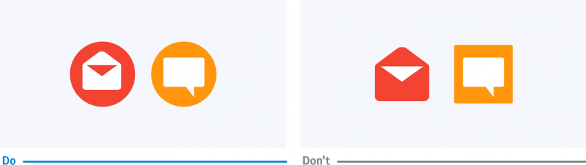  
    *App icons should be placed in a round container for consistency within the app list.*

-   **Converting to round containers**

    Even if an icon is not created with a round container, it will automatically be reshaped. Depending on the dimensions of the icon, it will be cropped or reduced in size and placed in a gray container.

    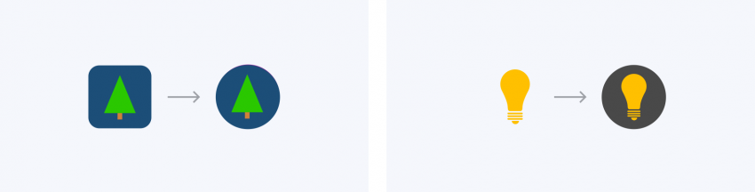
-   **Use the container grid**

    The Gear provides a grid to help you balance the size and position of an icon within the container. You can use it to give your icon a consistent look and feel with other apps. Before designing an icon, determine the area where you will place it based on the grid. Refer to [Resources](http://developer.samsung.com/gear/design/resource/basic-ui) for the grid inside the container.

    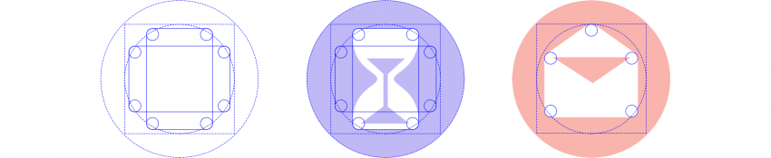  
    *The grid in the container helps create a balanced icon design.*

-   **Use solid colors for the container**

    The container serves as a background so users can easily distinguish icons. Use bold colors and avoid gradation or complicated patterns. For icons, white works well as it stands out against most background colors.

    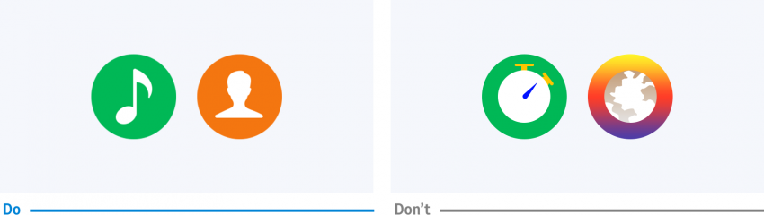  
    *A bold solid color helps users identify your icons.*

-   **Make icons front-facing**

    Icons convey meaning best when they have a simple and clear design. When depicting a shape in your icon, use front-facing shapes that are easier to see from a distance. For line-type icons, avoid making the lines too thin. Flat shapes work better than 3-dimensional shapes, and too much detail may hinder readability.

    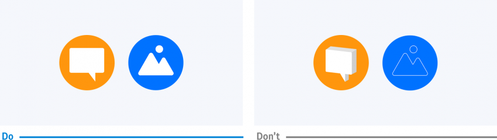  
    *Icons should be simple and front-facing to enhance glanceability.*

-   **Give your icons a simple color**

    Using the same color as the background is recommended if you need to fill your icon with a color for added detail. Adding a new color may obscure the shape as it reduces color contrast in a small icon.

 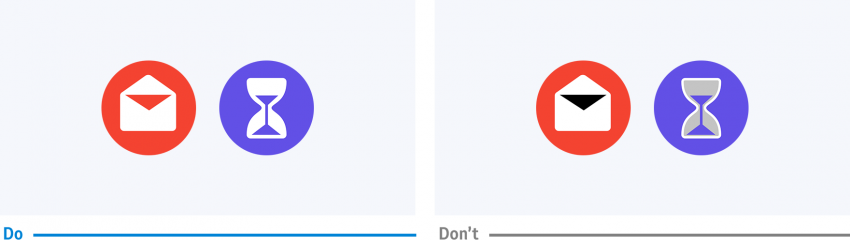  
    *Use of one simple color makes icons stand out.*

## Informative icons

Icons are used for various purposes including lists, More options, pop-ups, and buttons. You don’t necessarily have to use the container if it’s not an app icon. Design your icons in an appropriate style according to where they appear and the purpose they will be used. Refer to [UI Components](../ui-components/index.md) for usage by type.

| 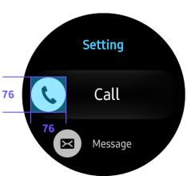 | 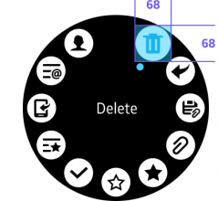 | 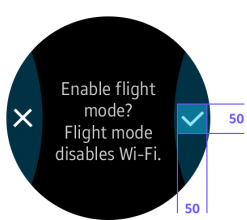 |
| :--: | :--: | :--: |
| *List* *(Icon size: 76x76 pixel)* | *Rotary Selector* *(Icon size: 68x68 pixel)* |  *Dialog Pop-up* *(Icon size: 50x50 pixel)* |

| 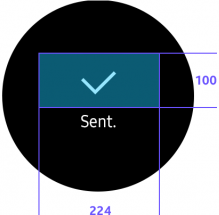 |  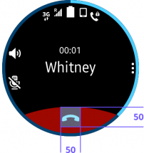 |
| :--: | :--: |
| *Toast Pop-up*  *(Icon size: 224x100 pixel)* | *Bottom  button*  (Icon size: 50x50 pixel) |
