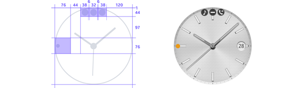

# System Icons

Watch faces can use small system icons that display the status of a particular function or setting at the top of the screen.

Unread notifications are shown with a dot at the 9 o’clock position. Only one indicator is shown regardless of the number of notifications. The dot is colored orange for regular notifications, and red for urgent ones. Make sure that this indicator is clearly visible when you choose a background color for your watch face.

  
*Choose a background color that clearly shows the orange/red notification indicator on the left.*
