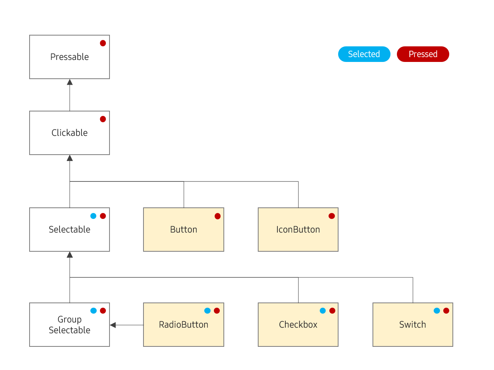

# State Management

## UIState

The table below shows the fundamental states available for a `View`. It is important to note that all states can be combined.

State                  | Target                | Description
--                     | --                    | --
`UIState.Normal`       | All `View`            | Represents the default state (no specific state)
`UIState.Disabled`     | All `View`            | Triggered when `View.IsEnabled` becomes false
`UIState.Focused`      | All `View`            | Triggered when `View.IsFocused` becomes true
`UIState.Pressed`      | `View` implementing `IPressable`   | Triggered when `IPressable.IsPressed` becomes true
`UIState.Selected`     | `View` implementing `ISelectable`  | Triggered when `ISelectable.IsSelected` becomes true

Any View can acquire the `Pressed` or `Selected` states as long as it implements the corresponding interface. The UI components that implement these interfaces are listed below.
 


## State Events

The standard event for handling state changes is provided via `AddStateChangedEventHandler`.

```C#
button.AddStateChangedEventHandler(OnStateChanged);
```

```C#
private void OnStateChanged(object sender, UIStateChangedEventArgs e)
{
    // ...
};
```

For convenience, the `When` method is also available, allowing for a method-chaining style.

```C#
button.When((sender, e) =>
{
    // ...
});
```

A key difference with `When` is that the first argument of the callback (sender) preserves the caller's type, whereas the standard event handler typically passes it as an object.

### UIStateChangedEventArgs

The `UIStateChangedEventArgs`, apped as an event argument, contains details regarding the state change.

```C#
e.Previous; // Focused, Selected
e.Current;  // Focused, Pressed
```

You can easily compare states using `==` operator.

```C#
e.Current == UIState.Focused;  // false
e.Current.Contains(UIState.Focused);  // true
e.Current == (UIState.Focused + UIState.Pressed);  // true
e.Current == (e.Previous - UIState.Selected + UIState.Pressed);  // true
```

Since states are often nested, a `Test` method is provided to evaluate more complex conditions.
For example, given `UIStateChangedEventArgs` containing specific `Previous` and `Current` states, you can perform tests as shown below.

```C#
e.Test(UIState.Focused.Included);  // Returns true if `Focused` in included in the Current state.
e.Test(UIState.Disabled.Excluded); // Returns true if `Disabled` in excluded in the Current state. 
e.Test(UIState.Selected.Removed);  // Returns true if `Selected` state has been removed.
e.Test(UIState.Disabled.Removed);  // Returns false if `Disabled` state has been removed.
e.Test(UIState.Focused.Changed);   // Returns false if `Focused` state has been changed.
```
