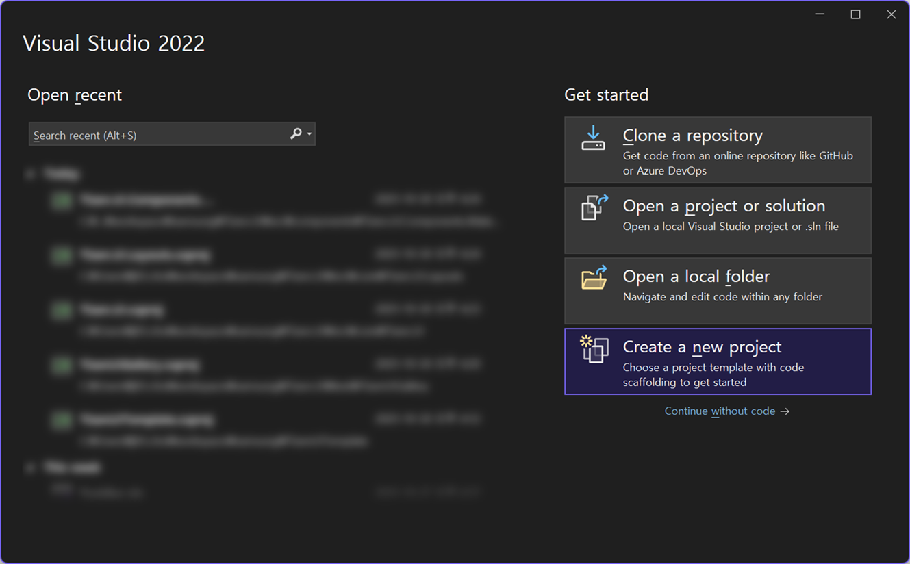
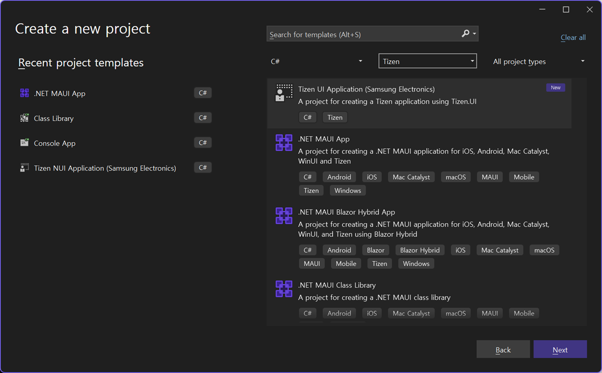
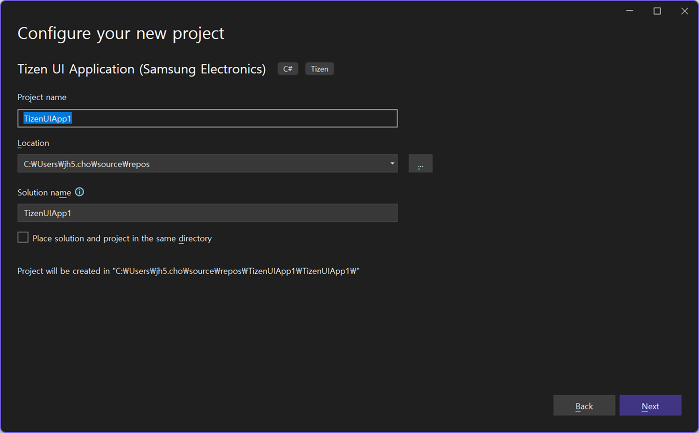
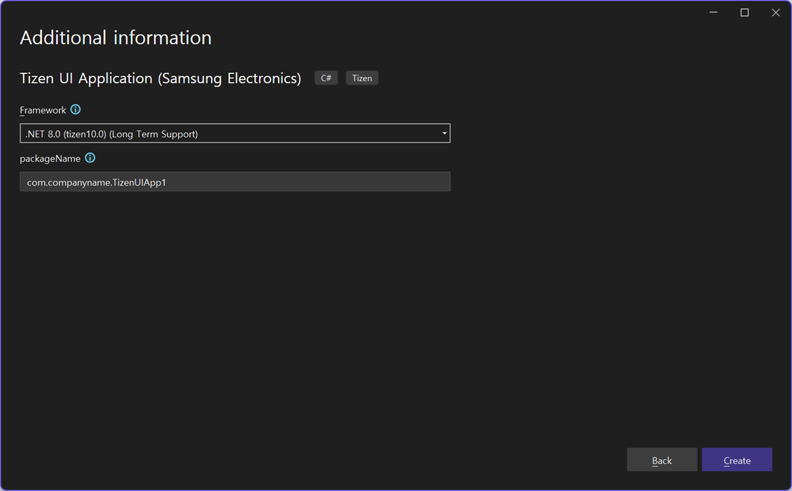
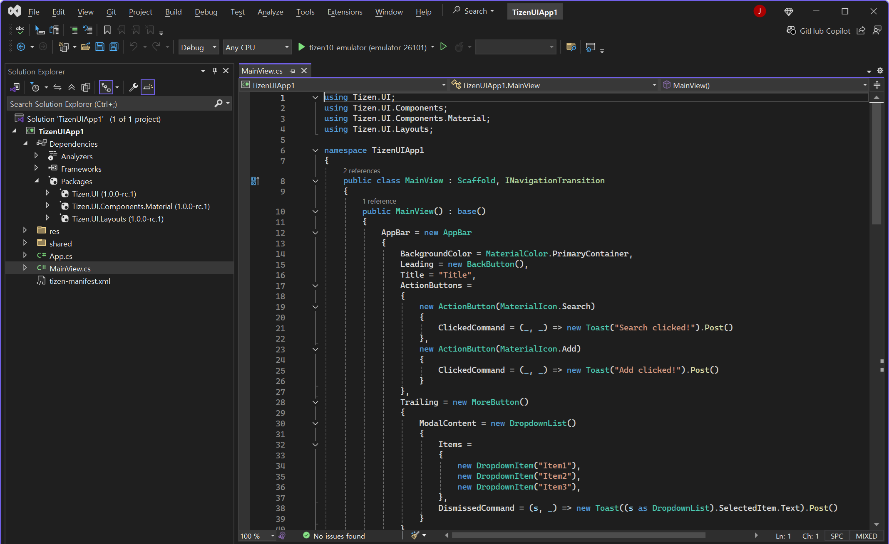
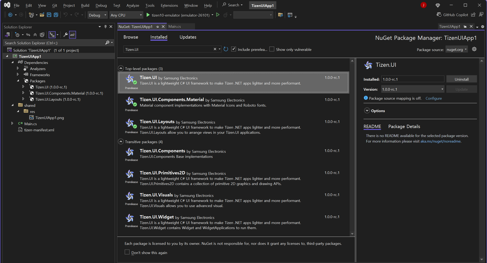
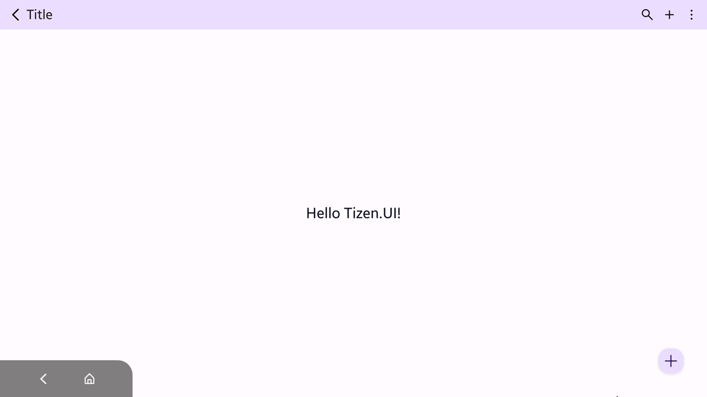

# Create Your First Application

All Tizen Extension Libraries are distributed as individual NuGet packages.
You can browse and add them to your Tizen .NET project directly from the Visual Studio NuGet Package Manager.

## Getting Started: Create Your First Tizen.UI Application

This guide demonstrates how to create your first Tizen .NET application using the **Tizen.UI** template. Tizen.UI, provided as part of the Tizen Extension Library, is a lightweight and high-performance UI framework for building Tizen .NET applications.

This guide uses **Visual Studio 2022** to create and run a basic "Hello, Tizen.UI" project.

## 1. Prerequisites

Before you start, you must set up your Tizen .NET development environment. This includes installing the Tizen SDK and the necessary IDE extensions.

Follow the official installation guides on the Tizen Developers site:

* **Tizen SDK & Visual Studio Tools:** [Learn How to Install](https://samsungtizenos.com/docs/sdktools/?sid=6VEghbxamZ1b1RPs6dXO)

* **Visual Studio Code Extension:** [Learn How to Install](https://samsungtizenos.com/docs/sdktools/?sid=IxbvHeBMNspcp66uVvC)

## 2. Create a New Project

1. Launch Visual Studio. On the start window, select **Create a new project**.

  

2. In the 'Create a new project' dialog, use the search bar to filter for "Tizen".

3. Select the **Tizen UI Application (Samsung Electronics)** template from the list and click **Next**.

  

## 3. Configure Your Project

1. On the 'Configure your new project' screen, enter a **Project name** (e.g., "HelloTizenUI") and choose a **Location** for your project. Click **Create**.

  

1. A 'Tizen Project Wizard' dialog will appear.
2. Under the **Framework** dropdown, select **.NET 8.0 (tizen10.0)**.
3. Verify the **Package Name** is correct (e.g., "org.tizen.HelloTizenUI").
4. Click **OK**.

  

## 4. Review and Build the "Hello Tizen.UI" Project

Visual Studio will generate a minimal "Hello Tizen.UI" solution.

  

1. Once the project loads, right-click the project in the **Solution Explorer**.

2. Select **Build** (or press **Ctrl+B**) to compile the project and ensure there are no errors.

### Tizen.UI Package References

This template is configured to use the **Tizen.UI** framework.

  

You can verify this by right-clicking the project and selecting **Manage NuGet Packages...**. You will see that the project references the `Tizen.UI` packages, which are delivered through the Tizen Extension Libraries. You can use this interface to add or remove other Tizen Extension Library packages as your application requires.

## 5. Run the Application

1. In the Visual Studio toolbar, select a Tizen emulator (e.g., "Tizen Emulator (tizen10.0-x86)") as the debug target.

2. Press the **Start** button (the green play icon) or press **F5** to build, deploy, and launch the application on the selected emulator.

  

3. After a moment, you will see your new "Hello Tizen.UI" application running in the emulator.

---

## Next Steps

Congratulations! You have successfully built and run your first Tizen.UI application. You are now ready to explore the Tizen.UI framework and start building your app's user interface.
