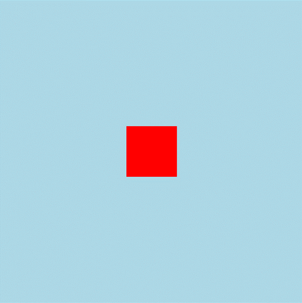
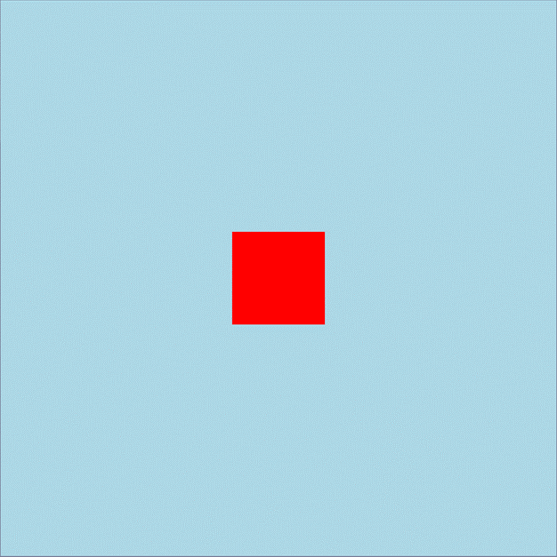
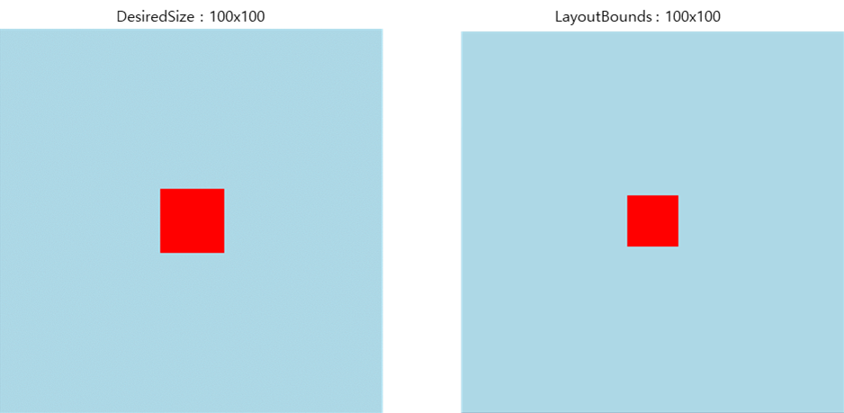

# AbsoluteLayout

## Overview

- A Layout that position View within a fixed space or relative to the available space using proportions.

## Measurement Rules

- If the Layout size is not fixed, the Layout measures its size based on the outermost bounds defined by the position and size specified in each child's AbsoluteParam.

## Layout Options

There options are set on the Child views.

### LayoutBounds

Specifies the position and size where the view is placed.

```csharp
view.LayoutBounds(x, y, width, height);
```

- Values: can be set as absolute values or proportional values.
- Proportional Settings:
  - Position: 0 places the view at the start position, 1 places it at the end position.
  - Size: The size is calculated proportionally to the Layout size. 1 matches the full size of the Layout.
- Auto-sizing: If -1 is specified for the size, the View is automatically laid out using its original measured size.

### LayoutFlags

Specifies whether the values set in LayoutBounds are interpreted as proportional values or absolute values.

```csharp
view.LayoutFlags(flags);
```

- Default: The default value is None, meaning the X/Y/Width/Height in layoutBounds are interpreted as absolute values.

|Flag| Description|
|-|-|
|None|No flags set|
|XProportional|Indicates that the X position of the child element should be proportional to its parent.|
|YProportional|Indicates that the Y position of the child element should be proportional to its parent.|
|WidthProportional|Indicates that the width of the child element should be proportional to its parent.|
|HeightProportional|Indicates that the height of the child element should be proportional to its parent.|
|PositionProportional|Indicates that both the X and Y positions of the child element should be proportional to its parent.|
|SizeProportional|Indicates that both the width and height of the child element should be proportional to its parent.|
|All|Indicates that all properties of the child element should be proportional to its parent.|

- Combination: Individual flags can be combined using bitwise OR operations.

```csharp
// Example: Setting X and Width as proportional.
view.LayoutFlags(AbsoluteLayoutFlags.XProportional | AbsoluteLayoutFlags.WidthProportional);
```

## Usage Examples

### Centering a View

Placing a 100x100 Red view in the center (0.5, 0.5) of a 600x600 AbsoluteLayout using its own measured size (-1, -1).

```csharp
new AbsoluteLayout
{
    DesiredWidth = 600,
    DesiredHeight = 600,
    BackgroundColor = Color.LightBlue,
    Children =
    {
        new View
        {
            BackgroundColor = Color.Red,
            DesiredHeight = 100,
            DesiredWidth = 100,
        }.LayoutBounds(0.5f, 0.5f, -1, -1).LayoutFlags(AbsoluteLayoutFlags.PositionProportional)
    }
}
```



### Direct Sizing with LayoutBound

Positioning a view by directly specifying the size using LayoutBounds.

```csharp
new AbsoluteLayout
{
    DesiredWidth = 600,
    DesiredHeight = 600,
    BackgroundColor = Color.LightBlue,
    Children =
    {
        new View
        {
            BackgroundColor = Color.Red,
        }.LayoutBounds(0.5f, 0.5f, 100, 100).LayoutFlags(AbsoluteLayoutFlags.PositionProportional)
    }
}
```



### Difference between DesiredWidth/Height and LayoutBounds

- DesiredWidth/Height: The size excluding the Margin.
- LayoutBounds: The size calculated including the Margin.

```csharp
new AbsoluteLayout
{
    DesiredWidth = 600,
    DesiredHeight = 600,
    BackgroundColor = Color.LightBlue,
    Children =
    {
        new View
        {
            BackgroundColor = Color.Red,
            DesiredWidth = 100,
            DesiredHeight = 100,
        }.LayoutBounds(0.5f, 0.5f, -1, -1)
         .LayoutFlags(AbsoluteLayoutFlags.PositionProportional)
         .Margin(10)
    }
}
```

```csharp
new AbsoluteLayout
{
    DesiredWidth = 600,
    DesiredHeight = 600,
    BackgroundColor = Color.LightBlue,
    Children =
    {
        new View
        {
            BackgroundColor = Color.Red,
        }.LayoutBounds(0.5f, 0.5f, 100, 100)
         .LayoutFlags(AbsoluteLayoutFlags.PositionProportional)
         .Margin(10)
    }
}
```



### Responsive Layout with Fixed Position

Using PositionProportional and Margin to create a responsive layout, and placing a view at the bottom-right corner regardless of the layout size.

```csharp
new AbsoluteLayout
{
    DesiredWidth = 600,
    DesiredHeight = 600,
    BackgroundColor = Color.LightBlue,
    Children =
    {
        new View
        {
            BackgroundColor = Color.Red,
            DesiredHeight = 100,
            DesiredWidth = 100,
        }.LayoutBounds(1f, 1f, -1, -1)
         .LayoutFlags(AbsoluteLayoutFlags.PositionProportional)
         .Margin(0, 0, 100, 100)
    }
}
```
