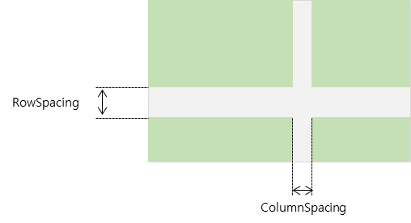
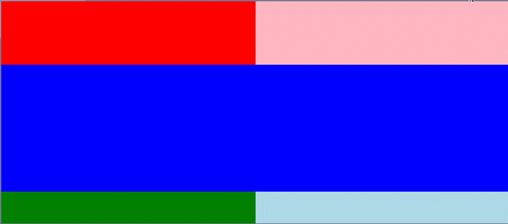
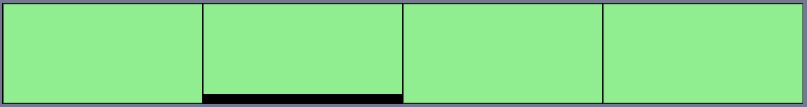

# Grid

## Overview

- A layout that defines rows and columns of specific sizes and positions children within those specific rows and columns.

## Measurement Rules

- The size is determined based on the specifications defined in RowDefinitions and ColumnDefinitions using GridLength.

## Placement Rules

- Children are placed in the specific cell designated by their Row and Column indices.

## Layout Options

### Options set on the Grid

#### RowDefinitions / ColumnDefinitions

Manages the definitions for rows and columns.

```csharp
grid.RowDefinition.Add(length);
grid.ColumnDefinitions.Add(length);
```

- Example: Using object initializer during instantiation.

```csharp
new Grid {
   RowDefinitions = {
       200,
       GridLength.Start,
       GridLength.Auto,
   },
   ColumnDefinitions = {
       GridLength.Start,
   }
}
```

#### GridLength

|GridLength| Description |
|-|-|
|`GridLength.Auto` | Measures the size of the View contained in the Cell and sets the Cell size to match it. |
|`GridLength.Star` | Expands the Cell to fill the remaining space in the Grid. |
|`float`| Sets the Cell size to a fixed numeric value. |

#### ColumnSpacing

Sets the distance between columns.

```csharp
grid.ColumnSpacing = value;
```

#### RowSpacing

Sets the distance between rows.

```csharp
grid.RowSpacing = value;
```



### Options set on the Child

#### Row

Selects the Row index where the child will be placed.

#### Column

Selects the Column index where the child will be placed.

#### RowSpan

Sets the number of Rows the child spans across.

#### ColumnSpan

Sets the number of Columns the child spans across.

### Usage Examples

#### Example 1

The Grid is fixed at 800x350.

- Row Configuration: Set to 100, GridLength.Auto, and GridLength.Star.
  - Row 0: Fixed at 100.
  - Row 1: Set to Auto. Since the Blue View placed here has a height of 200, this row becomes 200.
  - Row 2: Set to Star. It takes the remaining space (350 - 100 - 200), which results in 50.
- Column Configuration: Set to GridLength.Star, GridLength.Star.
  - The total width of 800 is distributed equally, resulting in 400 for each column.
- Blue View: Since ColumnSpan is set to 2, it is placed across both columns.

<table>
<tr>
<td> Code </td>
<td> Behavior </td>
</tr>
<tr>
<td>

```csharp
new Grid
{
    DesiredWidth = 800,
    DesiredHeight = 350,
    BackgroundColor = Color.LightGray,
    RowDefinitions = { 100, GridLength.Auto, GridLength.Star },
    ColumnDefinitions = { GridLength.Star, GridLength.Star },
    Children =
    {
        new View
        {
            BackgroundColor = Color.Red,
        }.Row(0).Column(0),
        new View
        {
            BackgroundColor = Color.LightPink,
        }.Row(0).Column(1),

        new View
        {
            BackgroundColor = Color.Blue,
            DesiredHeight = 200,
        }.Row(1).Column(0).ColumnSpan(2),
        new View
        {
            BackgroundColor = Color.Green,
        }.Row(2).Column(0),

        new View
        {
            BackgroundColor = Color.LightBlue,
        }.Row(2).Column(1),
    }
}
```

</td>
<td>  </td>
</tr>
</table>

#### Example 2

- Row Configuration: Defined as Star and 10.
  - With a total height of 100, two rows are created: one with a fixed height of 10, and the other taking the remaining height (90).
- Column Configuration: Defined as 4 Stars.
  - The total width of 800 is divided by 4, resulting in 4 columns of 200 width each.
- LightGreen Views: RowSpan is set to 2, so they are placed to fill the entire height (spanning both rows).
- Indicator View: Set to Row(1) and Column(1).
  - It is placed in the cell corresponding to the fixed height of 10 (2nd row) and the 2nd column.
  - Since it shares the cell at Row 1, Column 1 with the LightGreen View, they are placed overlapping each other in that space.

<table>
<tr>
<td> Code </td>
<td> Behavior </td>
</tr>
<tr>
<td>

```csharp
new Grid
{
    DesiredWidth = 800,
    DesiredHeight = 100,
    BackgroundColor = Color.LightGray,
    ColumnDefinitions = { 
        GridLength.Star, 
        GridLength.Star,
        GridLength.Star,
        GridLength.Star
    },
    RowDefinitions = {
        GridLength.Star,
        10
    },
    Children =
    {
        new View
        {
            BorderlineColor = Color.Black,
            BorderlineWidth = 1,
            BackgroundColor = Color.LightGreen,
        }.Row(0).Column(0).RowSpan(2),
        new View
        {
            BorderlineColor = Color.Black,
            BorderlineWidth = 1,
            BackgroundColor = Color.LightGreen,
        }.Row(0).Column(1).RowSpan(2),
        new View
        {
            BorderlineColor = Color.Black,
            BorderlineWidth = 1,
            BackgroundColor = Color.LightGreen,
        }.Row(0).Column(2).RowSpan(2),
        new View
        {
            BorderlineColor = Color.Black,
            BorderlineWidth = 1,
            BackgroundColor = Color.LightGreen,
        }.Row(0).Column(3).RowSpan(2),

        // indicator
        new View
        {
            BackgroundColor = Color.Black,
        }.Row(1).Column(1),
    }
}
```

</td>
<td>  </td>
</tr>
</table>