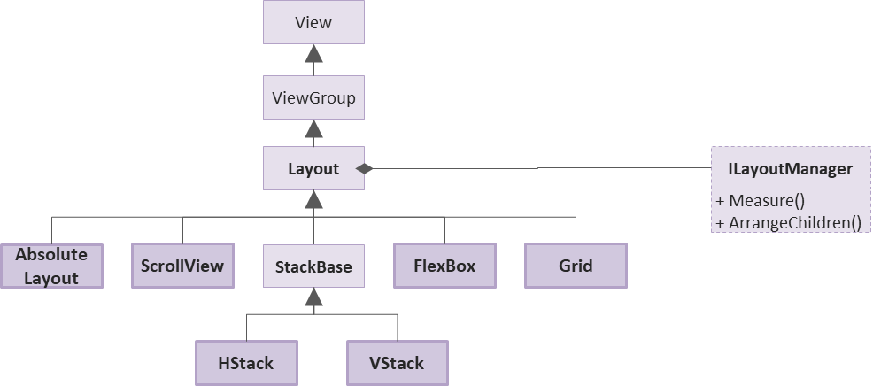
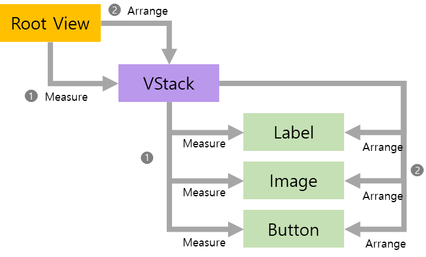
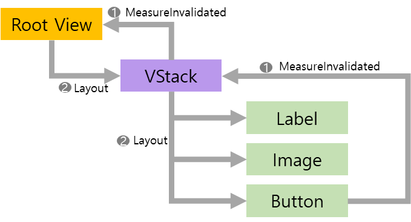

# Tizen.UI.Layout Overview

## OVERVIEW

**Layout** arranges and groups UI components in your application.

- **AbsoluteLayout** is used to position and size using explicit values, or values relative to the size of the layout.
- **ScrollView** is a container capable of scrolling if its content requires.
- **HStack** organizes child views in a one-dimensional horizontal stack.
- **VStack** organizes child views in a one-dimensional vertical stack.
- **FlexBox** brings the similar capabilities of [CSS Flexible Box Layout](https://www.w3.org/TR/css-flexbox-1/).
- **Grid** is used for displaying elements in rows and columns.

**Layout** delegates layout and measurement to a **LayoutManager**.

- Each layout manager class implements the **ILayoutManager** interface.

## Layout Process

**ILayoutManager** works in two phases – **`Measure()`** and **`ArrangeChildren()`**.

  

### Basics

#### Measure-based Layouts

- Every View's size can be determined through the Measure process.
- Layouts themselves can also be measured. Unless a Layout has a fixed size explicitly set, it measures its Children to calculate the most optimal (fitting) size for itself.

#### Properties to Avoid When Using Layouts

When a View is added to a Layout, certain properties should not be used as the Layout system takes control over them.

- `X`, `Y`, `Width`, `Height`

  Since the position and size are calculated and updated by the Layout, any manual values set for these properties will be overwritten by the Layout.

- `WidthResizePolicy`, `HeightResizePolicy`

  These policies are designed to control sizing when a View is added to a standard ViewGroup. They are not applicable and are ignored when the View is added to a Layout.

- `ParentOrigin`, `PivotPoint`, `PositionUsesPivotPoint`

  These properties alter the coordinate system of the View. Using them may cause the View to be rendered at a position different from the one calculated by the Layout. Therefore, they should be avoided to ensure correct placement.

#### What is a RootLayout?

- Conceptually, a RootLayout refers to a Layout whose parent is not another Layout.
- Unlike child layouts, a RootLayout's size is determined by:
  - Manually setting the Width and Height.
  - Automatically resizing via WidthResizePolicy or HeightResizePolicy when it is added to a ViewGroup or a Layer.
- While standard Layouts determine their size based on their children (Measure), a RootLayout's size is primarily defined by the external container (Layer or ViewGroup) it resides in and the applied ResizePolicy.

### Step 1. Measure()

- Calculates and returns the total size of the layout given the constraints.
- The total size of the layout is determined by its children.
- Measures for the layout are propagated in a chain to measures for the children.

### Step2. ArrangeChildren()

- Arranges children according to their measured size and returns the actual size of the layout.
- Unlike `Measure()`, it is not called in a chain. Simply places child view by setting their position or/and size.
- Once arranged, the native DALi engine triggers a Re-layout event to perform the required layout.

## When is layout triggered?

### Case 1. When the root layout is arranged

- Starts the layout in response to a `Relayout` event raised by DALi(`ResizePolicy`) or manual size change.
- In the `Relayout` event handler, the view is measured according to the size assigned to it.
- After measuring all the sub-child views, arrange the child views.

### Case 2. When the size of child view is changed

- Changes in the size of children are notified by `MeasureInvalidated` event.

  

> ℹ️ Even if the size of the child view is generated multiple times in one rendering loop, ensure that the layout can only be performed once per rendering loop.

### Case 3. When the child view is added or removed

- If the size of the layout or the arrangement of child views changes, layout will occurs.

### Case 4. When the `UpdatedLayout()` is called by user

- Call the Layout.UpdateLayout() to perform measure using the current view size and then arrange children.
