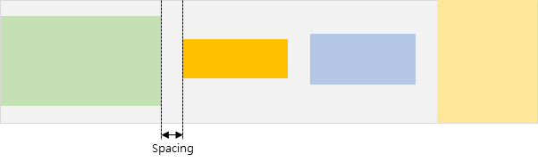
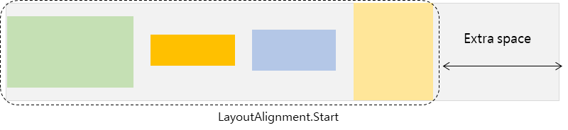
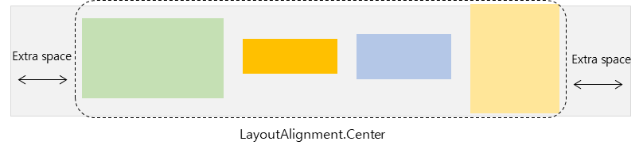
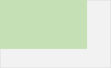
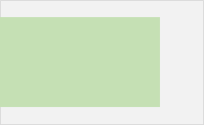
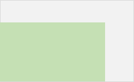
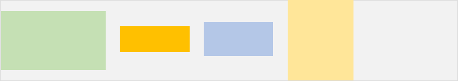
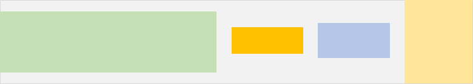
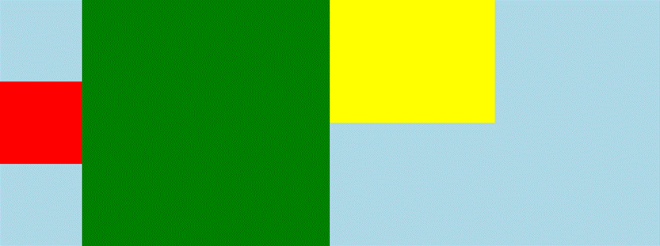

# HStack & VStack

## Overview

- HStack: Arranges children sequentially in a horizontal line.
- VStack: Arranges children sequentially in a vertical line.

## Measurement Rules

- If the Layout size is not Fixed:
  - Main Axis Size (Width for HStack, Height for VStack): Calculated as the sum of the Main Axis sizes of all children.
  - Cross Axis Size (Height for HStack, Width for VStack): Determined by the child with the largest Cross Axis size.

  

## Placement Rules

- The Layout measures the size of each child and places them sequentially along the Main Axis based on their measured size.
- Main Axis: Since space is allocated based on the child's measured size, there is no difference between the allocated spaces and the child's size.
- Cross Axis: Space is allocated based on the largest child in the stack. Therefore, the allocated space may be the larger than an individual child's size. This is where Cross-Axis Alignment is applied.

## Layout Options

### Option set on the Parent (Layout)

#### Spacing

Sets the gap between children.

```csharp
stack.Spacing(value);
```



#### ItemAlignment

Determines how to handle remaining space on the Main Axis.

- Condition: The Layout's size must be fixed, and there must be remaining pace after placing all children.

```csharp
stack.ItemAlignment(align);
```





### Options set on the Child

#### Cross-Axis Alignment

Determine how the child is positioned on the Cross Axis.

- HStack: Uses VerticalLayoutAlignment.
- VStack: Uses HorizontalLayoutAlignment.

```csharp
// For HStack
view.HorizontalLayoutAlignment(align);

// For VStack
view.VerticalLayoutAlignment(align);
```

- Logic: As mentioned in the measurement rules, the stack's cross-axis size is determined by the largest child. Consequently, a child might be smaller than the stack's allocated cross-axis space. This option decides how to position the child within that extra space.
- Default Behavior: The default value is Fill. If not set, the child stretches to match the stack's cross-axis size.
- Exception: If DesiredHeight (for HStack) or DesiredWidth (for VStack) is explicitly set, the Fill option is ignored. The view retains its desired size and defaults to Center alignment.

|Option|Description|Example|
|-|-|-|
|LayoutAlignment.Fill| Fill the entire area if possible. |  |
|LayoutAlignment.Start|Align with the leading edge of the available space, as determined by `View.LayoutDirection`. |  |
|LayoutAlignment.Center|The center of an alignment.|  |
|LayoutAlignment.End|Align with the trailing edge of the available space, as determined by `View.LayoutDirection` | |

#### Expand

An option to expand the child's size to fill the remaining space in the Main axis.

- Conditions: The Stack must have a fixed size, and there must be extra space available after measuring all children.

```csharp
view.Expand(); 
view.Expand(2);
```

|No Expand | Expand first child |
|-|-|
|||

- Behavior: If Expand is set on two or more Views within the stack, the remaining space is distributed proportionally based on the values provided. If called without arguments, the default weight i 1.

## Usage Examples

### Basic Alignment

- Green View: DesiredHeight is not set. The default VerticalLayoutAlignment (Fill) is applied, so it stretches to match the HStask's height.
- Yellow View: DesiredHeight is not set, but VerticalLayoutAlignment is set to Start. Therefore, it is positioned at the top.

<table>
<tr>
 <td> Code </td>
 <td> Behavior </td>
</tr>
<tr>
<td>

```csharp
new HStack
{
    DesiredWidth = 800,
    DesiredHeight = 300,
    BackgroundColor = Color.LightBlue,
    Children =
    {
        new View
        {
            BackgroundColor = Color.Red,
            DesiredHeight = 100,
            DesiredWidth = 100,
        },
        new View
        {
            BackgroundColor = Color.Green,
            DesiredWidth = 300,
        },

        new View
        {
            BackgroundColor = Color.Yellow,
            DesiredHeight = 150,
            DesiredWidth = 200,
        }.VerticalLayoutAlignment(LayoutAlignment.Start),
    }
}
```

</td>
<td>

</td>
</tr>
</table>

### Using Expand

- Green View: Expand is applied.
- Result: After accounting for the Red and Yellow view, all remaining width in the HStack is allocated to the Green View.

<table>
<tr>
 <td> Code </td>
 <td> Behavior </td>
</tr>
<tr>
<td>

```csharp
new HStack
{
    DesiredWidth = 800,
    DesiredHeight = 300,
    BackgroundColor = Color.LightBlue,
    Children =
    {
        new View
        {
            BackgroundColor = Color.Red,
            DesiredWidth = 100,
        },
        new View
        {
            BackgroundColor = Color.Green,
        }.Expand(),
        new View
        {
            BackgroundColor = Color.Yellow,
            DesiredWidth = 200,
        },
    }
}
```
</td>
<td>

</td>
</tr>
</table>

### Expand with DesiredSize & Alignment

This example modifies Example 2 with two changes: the Green View ha DesiredWidth set to 100 and HorizontalLayoutAlignment (Main Axis alignment) set to Start.

- Result: Due to Expand, the Green View is allocated the remaining space of the HStack. However, because a pecific DesiredWidth (100) is set, the View's actual content size creates a discrepancy with the allocated space.
- Alignment: Since the alignment is set to Start, the Green View sits at the beginnig of it allocated slot, leaving the reset of the expanded space as empty margin.
- Summary: Although the view received a large allocation of space (via Expand), it chose to render at its desired size and positioned itself at the start, leaving the rest of the allocated space empty.

<table>
<tr>
 <td> Code </td>
 <td> Behavior </td>
</tr>
<tr>
<td>

```csharp
new HStack
{
    DesiredWidth = 800,
    DesiredHeight = 300,
    BackgroundColor = Color.LightBlue,
    Children =
    {
        new View
        {
            BackgroundColor = Color.Red,
            DesiredWidth = 100,
        },
        new View
        {
            BackgroundColor = Color.Green,
            DesiredWidth = 100,
        }.Expand().HorizontalLayoutAlignment(LayoutAlignment.Start),
        new View
        {
            BackgroundColor = Color.Yellow,
            DesiredWidth = 200,
        },
    }
}
```

</td>
<td>  </td>
</tr>
</table>