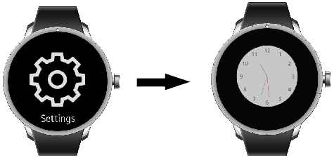

Watch Application
=================

## Dependencies

- Tizen 4.0 and Higher

You can create a watch application and manage its life-cycle to
[retrieve the current date and time](#current) and display it accurately
on the screen.

The main features of the `Tizen.Applications.WatchApplication` class
include:

-   Managing the application life-cycle

    You can control the application execution by [overriding methods
    controlling the application state changes](#lifecycle) during the
    application life-cycle. You can also [react to system
    events](#systemrelated) by overriding applicable methods.

- Managing the time handle and displaying the time

    You can manage the time handle and retrieve the window object for
    the watch UI. With the time handle, you can [draw the
    UI](#timehandle) for your watch application.

- Managing the ambient mode

    On a low-powered wearable device, an ambient mode is available. In
    this mode, the watch application shows a limited UI and receives the
    ambient tick event only once a minute to reduce power consumption.

    To use the ambient mode, the user must enable it in the
    device settings. You can [override methods monitoring when the
    application enters and exits the ambient mode](#ambient).

When a watch application is successfully installed on a device, its UI
is visible in the **Clock** menu of the device **Settings** menu. The
user can use the settings to change between available watch application
UIs.

**Figure: Clock menu**




Prerequisites
-------------

To enable your application to use the watch functionality:

1.  To use the `OnAmbientTick()` method of the
    [Tizen.Applications.WatchApplication](https://developer.tizen.org/dev-guide/csapi/classTizen_1_1Applications_1_1WatchApplication.html)
    class in the ambient mode, the application has to request permission
    by adding the following privilege to the `tizen-manifest.xml` file:

    ``` {.prettyprint}
    <privileges>
       <privilege>http://tizen.org/privilege/alarm.set</privilege>
    </privileges>
    ```

2. To use the method and properties of the
    `Tizen.Applications.WatchApplication` class, include the
    [Tizen.Applications](https://developer.tizen.org/dev-guide/csapi/namespaceTizen_1_1Applications.html)
    namespace in your application:

    ``` {.prettyprint}
    using Tizen.Applications;
    ```

3. Edit the watch application settings in the
    [manifest](../../../../preview/html/tools/manifest_editor.htm) file.


Managing the Application Life-cycle <a id="lifecycle"></a>
-----------------------------------

You can create and initialize a watch application with the
[Tizen.Applications.WatchApplication](https://developer.tizen.org/dev-guide/csapi/classTizen_1_1Applications_1_1WatchApplication.html)
class. To start an event loop, use the class's `Run()` method.

To manage the application state changes, override the following methods
of the `Tizen.Applications.WatchApplication` class:

-   The `OnCreate` method is triggered before the application main
    loop starts. In this method, you can initialize the application
    resources, such as create windows and data structures:

    ``` {.prettyprint}
    protected override void OnCreate()
    {
        /// Hook to take necessary actions before the main event loop starts
        /// This usually means initializing the UI and application data

        base.OnCreate();
    }
    ```

- The `OnAppControlReceived` method is triggered when another
    application sends a launch request to the application:

    ``` {.prettyprint}
    protected override void OnAppControlReceived(AppControlReceivedEventArgs e)
    {
        /// Handle the launch request
        /// Show the user the task requested through the "AppControlReceivedEventArgs" parameter

        base.OnAppControlReceived(e);
    }
    ```

- The `OnPause` method is triggered when the application is completely
    obscured by another application and becomes invisible:

    ``` {.prettyprint}
    protected override void OnPause()
    {
        /// Take necessary actions when application becomes invisible
        /// Release the resources needed to draw the normal watch

        base.OnPause();
    }
    ```

- The `OnResume` method is triggered when the application becomes
    visible:

    ``` {.prettyprint}
    protected override void OnResume()
    {
        /// Take the necessary actions when application becomes visible
        /// Acquire the resources needed to draw the normal watch

        base.OnResume();
    }
    ```

- The `OnTerminate` method is triggered when the application main loop
    exits:

    ``` {.prettyprint}
    protected override void OnTerminate()
    {
        /// Release all resources

        base.OnTerminate();
    }
    ```

- The `OnTick` method is triggered at least once per second. The watch
    application can get the current time from the `watch_time` time
    handle of the
    [Tizen.Applications.WatchTime](https://developer.tizen.org/dev-guide/csapi/classTizen_1_1Applications_1_1WatchTime.html)
    class to draw a normal watch.

    ``` {.prettyprint}
    protected override void OnTick(TimeEventArgs time)
    {
        /// Called at least once per second
        /// Draw a normal watch with the hour, minute, and second info

        base.OnTick(time);
    }
    ```


Managing System-related Events <a id="systemrelated"></a>
------------------------------

To manage events related to system status changes, override the
following methods of the
[Tizen.Applications.WatchApplication](https://developer.tizen.org/dev-guide/csapi/classTizen_1_1Applications_1_1WatchApplication.html)
class:

-   `OnLocaleChanged()`: Triggered when the system language changes and
    the messages are translated.
-   `OnRegionFormatChanged()`: Triggered when the time zone changes.
-   `OnLowMemory()`: Triggered when the system is running low on memory.
    Use the method to save the current work and release resources; if
    this is not enough, the platform frees resources automatically and
    can even kill some applications.
-   `OnLowBattery()`: Triggered when the system is running low on
    battery (less than 5%). Use the method to save the current work and
    avoid battery-draining workloads.

``` {.prettyprint}
protected override void OnLocaleChanged(LocaleChangedEventArgs e)
{
    /// Take the necessary actions when the language setting changes

    base.OnLocaleChanged(e);
}

protected override void OnRegionFormatChanged(RegionFormatChangedEventArgs e)
{
    /// Take the necessary actions when the region setting changes

    base.OnRegionFormatChanged(e);
}

protected override void OnLowBattery(LowBatteryEventArgs e)
{
    /// Take the necessary actions when the system is running low on battery

    base.OnLowBattery(e);
}

protected override void OnLowMemory(LowMemoryEventArgs e)
{
    /// Take the necessary actions when the system is running low on memory

    base.OnLowMemory(e);
}
```


Drawing the Watch UI <a id="timehandle"></a>
--------------------

[Tizen.Applications.WatchApplication](https://developer.tizen.org/dev-guide/csapi/classTizen_1_1Applications_1_1WatchApplication.html)
class getter methods with the
[Tizen.Applications.WatchTime](https://developer.tizen.org/dev-guide/csapi/classTizen_1_1Applications_1_1WatchTime.html)
class. You can get the `Tizen.Applications.WatchTime` instance with the
`GetCurrentTime()` method.

With the `Tizen.Applications.WatchTime` class, you can draw the UI for
your watch application by getting the window object with the `ElmSharp`
methods:

``` {.prettyprint}
private static Label _time;
private static Window _win;
private static Box _mainLayout;
private static Conformant conformant;

protected override void OnCreate()
{
    base.OnCreate();

    _win = this.Window;

    _mainLayout = new Box(_win);

    _time = new Label(_win)
    {
        Text = "Test Time",
        WeightX = 1,
        WeightY = 1
    };

    _mainLayout.PackEnd(_time);

    _mainLayout.Show();
    _time.Show();

    conformant = new Conformant(_win);
    conformant.Show();
    conformant.SetContent(_mainLayout);
```

**Note** To draw the UI, use a single window that is initialized in the
`Tizen.Applications.WatchApplication` class. Do not create additional
windows. A stack of watch application windows gets corrupted, because
the platform handles the watch application window in a special way.


Getting the Current Time <a id="current"></a>
------------------------

You can get the current local time in various formats using the
`GetCurrentTime()` method of the
[Tizen.Applications.WatchApplication](https://developer.tizen.org/dev-guide/csapi/classTizen_1_1Applications_1_1WatchApplication.html)
class and the properties of the
[Tizen.Applications.WatchTime](https://developer.tizen.org/dev-guide/csapi/classTizen_1_1Applications_1_1WatchTime.html)
class.

``` {.prettyprint}
    WatchTime wt = GetCurrentTime();
    int hour = wt.Hour24;
    int min = wt.Minute;
    int sec = wt.Second;

    _time.Text = hour + ":" + min + ":" + sec;
}
```

You can also get the UTC time and time zone, if needed, using the
`UtcTimestamp` and `TimeZone` properties of the
`Tizen.Applications.WatchTime` class.


Using the Ambient Mode <a id="ambient"></a>
----------------------

The details of the limited UI drawn in the ambient mode depend on the
device. In addition, due to the ambient mode being a low power mode,
there are limits to the colors that can be shown on the screen. Usually,
when designing the ambient mode UI, draw it with limited colors (cyan,
magenta, yellow, red, green, blue, black and white), and use less than
15% of the pixels on the screen. If you do not want to draw your own
ambient mode UI, set the `ambient-support` attribute to `false` in the
watch application [manifest
file](../../../../preview/html/tools/manifest_editor.htm) to allow the
platform to show a default ambient mode UI.

Some devices introduce a high color mode for the ambient mode. In the
high color mode, you can use more colors (usually, 24-bit color) for
drawing the ambient mode UI.

Override the ambient mode methods of the
[Tizen.Applications.WatchApplication](https://developer.tizen.org/dev-guide/csapi/classTizen_1_1Applications_1_1WatchApplication.html)
class to use the ambient mode:

-   The `OnAmbientChanged()` method is triggered when the ambient mode
    is enabled or disabled on the device. You can use the method to
    initialize your ambient mode UI.

-   The `OnAmbientTick()` method is triggered when the device enters the
    ambient mode and every minute while the device is in the
    ambient mode. You can use the method to get the current time from
    the
    [Tizen.Applications.WatchTime](https://developer.tizen.org/dev-guide/csapi/classTizen_1_1Applications_1_1WatchTime.html)
    class and draw the ambient mode watch. In this method, do not
    perform time-consuming tasks and always update the UI as quickly
    as possible. The platform can put the device to sleep shortly after
    the ambient tick expires.

``` {.prettyprint}
protected override void OnAmbientTick(TimeEventArgs time)
{
    base.OnAmbientTick(time);

    /// Update information
}

protected override void OnAmbientChanged(AmbientEventArgs mode)
{
    base.OnAmbientChanged(mode);

    if (mode.Enabled)
        /// Prepare to enter the ambient mode
    else
        /// Prepare to exit the ambient mode
}
```
