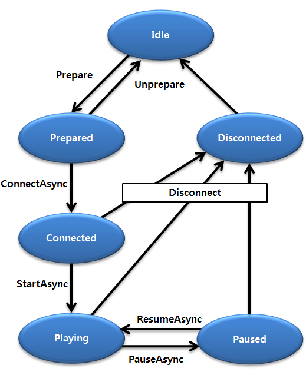

Screen Mirroring
================

## Dependencies

- Tizen 4.0 and Higher

You can mirror the device screen and sound to another device wirelessly
using the screen mirroring feature. Tizen follows the Wi-Fi Display
Technical Specification and supports the feature as a sink which
receives shared data from a source device that supports the Wi-Fi
Display, and displays it. Remember to prepare your application to use
the screen mirroring sink functionality and set up the necessary
callbacks before you start, and release the resources when you are done.

The main features of the `Tizen.Multimedia.Remoting.ScreenMirroring`
class include:

-   Preparing for screen mirroring

    You can [prepare for screen mirroring](#prepare) by registering an
    event handler to track screen mirroring state changes.

- Managing the connection to the screen mirroring source

    You can [connect to a screen mirroring source](#connect), and start,
    pause, and resume the screen mirroring sink.

- Monitoring state changes in the screen mirroring sink

    To track state changes, you can register an event handler for the
    `StateChanged` event of the
    `Tizen.Multimedia.Remoting.ScreenMirroring` class.

    You can also [handle any errors](#handle) with the
    `ErrorOccurred` event.

The following figure illustrates the screen mirroring states.

**Figure: Screen mirroring state diagram**




Prerequisites
-------------

To use the methods and properties of the
[Tizen.Multimedia.Remoting.ScreenMirroring](https://developer.tizen.org/dev-guide/csapi/classTizen_1_1Multimedia_1_1Remoting_1_1ScreenMirroring.html)
class, include the
[Tizen.Multimedia.Remoting](https://developer.tizen.org/dev-guide/csapi/namespaceTizen_1_1Multimedia_1_1Remoting.html)
namespace in your application:

``` {.prettyprint}
using Tizen.Multimedia.Remoting;
```


Preparing for Screen Mirroring <a id="prepare"></a>
------------------------------

To prepare for screen mirroring:

1.  Define and register an event handler for the `StateChanged` event of
    the
    [Tizen.Multimedia.Remoting.ScreenMirroring](https://developer.tizen.org/dev-guide/csapi/classTizen_1_1Multimedia_1_1Remoting_1_1ScreenMirroring.html)
    class:

    ``` {.prettyprint}
    void OnStateChanged(object sender, ScreenMirroringStateChangedEventArgs args)
    {
        Tizen.Log.Info(LOG_TAG, $"Current state = {args.State}");
    }

    screenMirroring.StateChanged += OnStateChanged;
    ```

2. Prepare the screen mirroring sink using the `Prepare()` method with
    an instance of the
    [Tizen.Multimedia.Display](https://developer.tizen.org/dev-guide/csapi/classTizen_1_1Multimedia_1_1Display.html)
    class as a parameter:

    ``` {.prettyprint}
    screenMirroring.Prepare(new Display(mediaView));
    ```

    The screen mirroring state changes to `Prepared`.


Connecting and Starting Screen Mirroring <a id="connect"></a>
----------------------------------------

To connect to a source and start screen mirroring:

1.  Connect to the screen mirroring source using the `ConnectAsync()`
    method of the
    [Tizen.Multimedia.Remoting.ScreenMirroring](https://developer.tizen.org/dev-guide/csapi/classTizen_1_1Multimedia_1_1Remoting_1_1ScreenMirroring.html)
    class with the source IP address as a parameter:

    ``` {.prettyprint}
    await screenMirroring.ConnectAsync(ipAddress);
    ```

    The screen mirroring state changes to `Connected`.

2. Start the screen mirroring using the `StartAsync()` method:

    ``` {.prettyprint}
    await screenMirroring.StartAsync();
    ```

    The screen mirroring state changes from `Connected` to `Playing`.


Handling Screen Mirroring Errors <a id="handle"></a>
--------------------------------

You can receive notifications of errors caused by internal screen
mirroring issues or by the source device disconnecting the session.
Define and register an event handler for the `ErrorOccurred` event of
the
[Tizen.Multimedia.Remoting.ScreenMirroring](https://developer.tizen.org/dev-guide/csapi/classTizen_1_1Multimedia_1_1Remoting_1_1ScreenMirroring.html)
class:

``` {.prettyprint}
void OnErrorOccurred(object sender, ScreenMirroringErrorOccurredEventArgs args)
{
    Tizen.Log.Info(LOG_TAG, $"Error = {args.Error}");
}

screenMirroring.ErrorOccurred += OnStateChanged;
```
