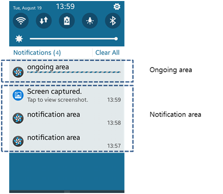
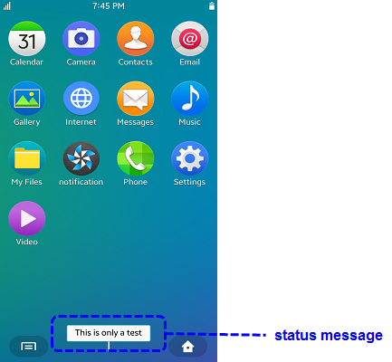

Notifications
=============

## Dependencies

- Tizen 4.0 and Higher

An application can use notifications to keep the user informed of
important information.

The main features of the Tizen.Applications.Notifications namespace
include:

-   Creating a notification

    You can [create a notification](#create).

- Configuring the notification
    -   You can [set notification attributes](#attribute), such as the
        notification title, content, timestamp, and various
        property options.
    -   You can [set accessory options](#accessory) for a notification
        to control how the device sound, vibration, and LED feedback
        respond to the notification.
    -   You can [set styles](#style) for a notification, changing its
        [display type](#type) and adding features, such as icons and
        background images.
- Posting a notification

    You can [post a notification](#post) using the `Post()` method of
    the
    [Tizen.Applications.Notifications.NotificationManager](https://developer.tizen.org/dev-guide/csapi/classTizen_1_1Applications_1_1Notifications_1_1NotificationManager.html) class.

    The posted notification has a default notification icon and the
    application name as the title.

- Updating notification content

    You can [update the content of an ongoing notification](#update)
    using the `Update()` method of the
    `Tizen.Applications.Notifications.NotificationManager` class.

- Deleting a notification

    You can [delete notifications](#delete) when no longer needed.

- Using advanced notification features
    -   You can [display and update the progress bar](#progress) for an
        ongoing notification.
    -   You can [create a template](#template) that can be reused in
        multiple notifications.


Notification Display Types {#type}
--------------------------

Tizen provides notifications by using a combination of any of the
following notification display types:

-   Quick panel
-   Active notification
-   Indicator
-   Lock screen
-   Status message

The notification display type determines where and how the notification
message is displayed.

### Quick Panel Notifications {#quick_panel}

The display area for quick panel notifications can be one of the
following:

-   Notification area

    The notification area is the reserved space for displaying all
    notifications, except the on-going notifications.

- On-going area

    The on-going area is the application screen area and is only used to
    display notifications for the currently-running application.

**Figure: Notification and on-going areas**



### Active Notifications {#active_notification}

An active notification is displayed on the upper side of the screen. You
can add several buttons for user interaction.

**Figure: Active notification**


### Indicator Notifications {#indicator}

The indicator type notification is displayed for a few seconds in the
indicator area. Only a simple string and icon can be displayed.

**Figure: Notification on the ticker and the indicator**


### Lock Screen Notifications {#lockscreen}

You can display a notification on the lock screen. The notification
content can be displayed or hidden.

**Figure: Notification on the lock screen**


### Status Message Notifications {#status_message}

A status message type notification can be used like a pop-up. It is
displayed for a few seconds and then disappears.

**Figure: Status message**




Prerequisites
-------------

To enable your application to use the notification functionality:

1.  To use notifications, the application has to request permission by
    adding the following privilege to the `tizen-manifest.xml` file:

    ``` {.prettyprint}
    <privileges>
       <privilege>http://tizen.org/privilege/notification</privilege>
    </privileges>
    ```

2. To use the methods and properties of the
    [Tizen.Applications.Notifications](https://developer.tizen.org/dev-guide/csapi/namespaceTizen_1_1Applications_1_1Notifications.html)
    namespace, include it in your application:

    ``` {.prettyprint}
    using Tizen.Applications.Notifications;
    ```

3. To follow this guide, place an image file in, for example, your
    application's shared resource directory. The following variables are
    used in the code:

    ``` {.prettyprint}
    DirectoryInfo info = Application.Current.DirectoryInfo;
    String imagePath;
    String sharedPath = info.SharedData;

    imagePath = sharedPath + "imageName.png";
    ```


Creating a Notification <a id="create"></a>
-----------------------

To create a notification, create a new instance of the
[Tizen.Applications.Notifications.Notification](https://developer.tizen.org/dev-guide/csapi/classTizen_1_1Applications_1_1Notifications_1_1Notification.html)
class:

``` {.prettyprint}
Notification noti = new Notification();
```


Setting Notification Attributes <a id="attribute"></a>
-------------------------------

To set notification attributes, such as title, content, icon, and
timestamp, set the corresponding properties of the
[Tizen.Applications.Notifications.Notification](https://developer.tizen.org/dev-guide/csapi/classTizen_1_1Applications_1_1Notifications_1_1Notification.html)
class instance:

``` {.prettyprint}
Notification noti = new Notification
{
    Title = "Title",
    Content = "Content",
    Icon = imagePath,
    Count = 2,
    Tag = "tag",
    TimeStamp = time,
    Property = DisableAppLaunch
};
```


Setting Accessory Options <a id="accessory"></a>
-------------------------

You can set accessory options for a notification to control how the
device sound, vibration, and LED react to the notification being
activated. Any options you do not set use the default values instead.

To set accessory options:

1.  Create an accessory set for the notification as a new instance of
    the
    [Tizen.Applications.Notifications.Notification.AccessorySet](https://developer.tizen.org/dev-guide/csapi/classTizen_1_1Applications_1_1Notifications_1_1Notification_1_1AccessorySet.html)
    class:

    ``` {.prettyprint}
    Notification.AccessorySet accessory = new Notification.AccessorySet();
    ```

2. Set the properties of the
    `Tizen.Applications.Notifications.Notification.AccessorySet` instance.

    The available `SoundOption` and `LedOption` property values are
    defined in the
    [Tizen.Applications.Notifications.AccessoryOption](https://developer.tizen.org/dev-guide/csapi/namespaceTizen_1_1Applications_1_1Notifications.html#a8382d0e9399a416b8a4064c6c5c2ad3e) enumeration.

    ``` {.prettyprint}
    accessory.SoundOption = Notifications.AccessoryOption.Custom;
    accessory.SoundPath = soundPath;
    accessory.CanVibrate = true;
    accessory.LedOption = Notifications.AccessoryOption.On;
    accessory.LedOnMillisecond = 100;
    accessory.LedOffMillisecond = 100;
    ```

3. To have your notification use the modified values, set the
    `Tizen.Applications.Notifications.Notification.AccessorySet`
    instance as the `Accessory` property of the
    [Tizen.Applications.Notifications.Notification](https://developer.tizen.org/dev-guide/csapi/classTizen_1_1Applications_1_1Notifications_1_1Notification.html)
    class instance:

    ``` {.prettyprint}
    noti.Accessory = accessory;
    ```


Setting Notification Styles <a id="style"></a>
---------------------------

You can set a style for your notification to change how the notification
is displayed, including changing the display type or icon. A single
notification can only have 1 style set for it.

To add styles to your notification:

-   To create an active notification:
    1.  Create a new instance of the
        [Tizen.Applications.Notifications.Notification.ActiveStyle](https://developer.tizen.org/dev-guide/csapi/classTizen_1_1Applications_1_1Notifications_1_1Notification_1_1ActiveStyle.html)
        class and set its properties:

        ``` {.prettyprint}
        Notification.ActiveStyle style = new Notification.ActiveStyle();
        style.IsAutoRemove = false;
        style.BackgroundImage = backgroundImage;
        ```

    2. Optionally, you can add buttons or a reply field to an
        active notification.
        -   To add buttons:
            1.  To add a button, create a new instance of the
                [Tizen.Applications.Notifications.Notification.ButtonAction](https://developer.tizen.org/dev-guide/csapi/classTizen_1_1Applications_1_1Notifications_1_1Notification_1_1ButtonAction.html) class.
                You can add up to 3 buttons into a single
                active notification.

                ``` {.prettyprint}
                Notification.ButtonAction button = new Notification.ButtonAction();
                button.Index = Notifications.ButtonIndex.First;
                button.Text = "Reply";
                button.ImagePath = imagePath;
                ```

            2. To create an application control to handle the results
                of clicking a button, create an instance of the
                [Tizen.Applications.AppControl](https://developer.tizen.org/dev-guide/csapi/classTizen_1_1Applications_1_1AppControl.html)
                class and link it to the button by setting it as the
                `Action` property of the
                `Tizen.Applications.Notifications.Notification.ButtonAction`
                class instance:

                ``` {.prettyprint}
                AppControl appcontrol = new AppControl();
                appcontrol.ApplicationId = "org.tizen.test.tpk";

                button.Action = appcontrol;
                ```

            3. To add the button to the
                `Tizen.Applications.Notifications.Notification.ActiveStyle`
                instance, use the `AddButtonAction()` method:

                ``` {.prettyprint}
                style.AddButtonAction(button);
                ```

        - To add a reply field and button:
            1.  To add a reply field for the user to reply to a
                notification, create a new instance of the
                [Tizen.Applications.Notifications.Notification.ReplyAction](https://developer.tizen.org/dev-guide/csapi/classTizen_1_1Applications_1_1Notifications_1_1Notification_1_1ReplyAction.html)
                class and set its properties:

                ``` {.prettyprint}
                Notification.ReplyAction action = new Notification.ReplyAction();
                action.ParentIndex = Notifications.ButtonIndex.First;
                action.ReplyMax = 160;
                action.PlaceHolderText = "Send";
                ```

            2. The reply field requires a button for the user to send
                the completed reply with, and the button in turn
                requires an application control to handle the results of
                clicking the button. Create the application control as
                an instance of the `Tizen.Applications.AppControl`
                class, and the button as an instance of the
                `Tizen.Applications.Notifications.Notification.ButtonAction`
                class:

                ``` {.prettyprint}
                AppControl appcontrol = new AppControl();
                appcontrol.ApplicationId = "org.tizen.test.tpk";

                Notification.ButtonAction button = new Notification.ButtonAction();
                button.Index = Notifications.ButtonIndex.First;
                button.Text = "Reply";
                button.ImagePath = imagePath;
                button.Action = appcontrol;
                ```

            3. To link the button with the reply field, add it as the
                `Button` property of the
                `Tizen.Applications.Notifications.Notification.ReplyAction`
                class instance:

                ``` {.prettyprint}
                action.Button = button;
                ```

            4. To add the reply field to the style instance, add it as
                the `ReplyAction` property of the
                `Tizen.Applications.Notifications.Notification.ActiveStyle`
                class instance:

                ``` {.prettyprint}
                style.ReplyAction = action;
                ```

    3. Apply the new style to your notification by using the
        `AddStyle()` method of the
        [Tizen.Applications.Notifications.Notification](https://developer.tizen.org/dev-guide/csapi/classTizen_1_1Applications_1_1Notifications_1_1Notification.html)
        class:

        ``` {.prettyprint}
        noti.AddStyle(style);
        ```

- To create an indicator type notification:
    1.  Create a new instance of the
        [Tizen.Applications.Notifications.Notification.IndicatorStyle](https://developer.tizen.org/dev-guide/csapi/classTizen_1_1Applications_1_1Notifications_1_1Notification_1_1IndicatorStyle.html)
        class and set its properties:

        ``` {.prettyprint}
        Notification.IndicatorStyle style = new Notification.IndicatorStyle();
        style.IconPath = iconPath;
        style.SubText = "SubText";
        ```

    2. Apply the new style to your notification by using the
        `AddStyle()` method of the
        `Tizen.Applications.Notifications.Notification` class:

        ``` {.prettyprint}
        noti.AddStyle(style);
        ```

- To create a lock screen notification:
    1.  Create a new instance of the
        [Tizen.Applications.Notifications.Notification.LockStyle](https://developer.tizen.org/dev-guide/csapi/classTizen_1_1Applications_1_1Notifications_1_1Notification_1_1LockStyle.html)
        class and set its properties:

        ``` {.prettyprint}
        Notification.LockStyle style = new Notification.LockStyle();
        style.IconPath = iconPath;
        style.ThumbnailPath = thumbnailPath;
        ```

    2. Apply the new style to your notification by using the
        `AddStyle()` method of the
        `Tizen.Applications.Notifications.Notification` class:

        ``` {.prettyprint}
        noti.AddStyle(style);
        ```


Posting a Notification <a id="post"></a>
----------------------

To post a notification to the database, use the `Post()` method of the
[Tizen.Applications.Notifications.NotificationManager](https://developer.tizen.org/dev-guide/csapi/classTizen_1_1Applications_1_1Notifications_1_1NotificationManager.html)
class:

``` {.prettyprint}
NotificationManager.Post(noti);
```


Updating Notification Content <a id="update"></a>
-----------------------------

To update the content of a notification, use the `Update()` method of
the
[Tizen.Applications.Notifications.NotificationManager](https://developer.tizen.org/dev-guide/csapi/classTizen_1_1Applications_1_1Notifications_1_1NotificationManager.html)
class. The method works for ongoing notifications only.

``` {.prettyprint}
NotificationManager.Update(noti);
```


Deleting a Notification <a id="delete"></a>
-----------------------

To delete a notification from the database, use the `Delete()` method of
the
[Tizen.Applications.Notifications.NotificationManager](https://developer.tizen.org/dev-guide/csapi/classTizen_1_1Applications_1_1Notifications_1_1NotificationManager.html)
class:

``` {.prettyprint}
NotificationManager.Delete(noti);
```


Displaying the Progress Bar <a id="progress"></a>
---------------------------

To display the progress bar and update the progress data:

1.  To create a notification with a progress bar, create a new instance
    of the
    [Tizen.Applications.Notifications.Notification.ProgressType](https://developer.tizen.org/dev-guide/csapi/classTizen_1_1Applications_1_1Notifications_1_1Notification_1_1ProgressType.html) class.
    To be able to retrieve the notification handle and update the
    progress data later, set a notification tag with the `Tag` property
    of the
    [Tizen.Applications.Notifications.Notification](https://developer.tizen.org/dev-guide/csapi/classTizen_1_1Applications_1_1Notifications_1_1Notification.html) class.

    ``` {.prettyprint}
    Notification.ProgressType progress = new Notification.ProgressType(Notifications.ProgressCategory.Percent, 0.0, 100.0);
    noti.Progress = progress;
    noti.Tag = "tag";
    ```

2. To update the progress bar, retrieve the notification with its tag
    by using the `Load()` method of the
    [Tizen.Applications.Notifications.NotificationManager](https://developer.tizen.org/dev-guide/csapi/classTizen_1_1Applications_1_1Notifications_1_1NotificationManager.html)
    class, and update the notification:

    ``` {.prettyprint}
    Notification noti = NotificationManager.Load("tag");
    noti.Progress.ProgressCurrent = 10.0;
    ```


Using a Notification Template <a id="template"></a>
-----------------------------

To create a template from an existing notification, and reuse that
template later to quickly create other notifications with the same
pattern:

-   To create a template:
    1.  Create a notification as usual.

        The following example creates an active notification with 2
        buttons (**Accept** and **Cancel**), a background image, and
        sound, LED, and vibration feedback:

        ``` {.prettyprint}
        Notification noti = new Notification
        {
            Title = "Notification",
            Content = "Content",
            Icon = imagePath
        };

        Notification.AccessorySet accessory = new Notification.AccessorySet
        {
            SoundOption = Notifications.AccessoryOption.Custom,
            SoundPath = soundPath,
            CanVibrate = true,
            LedOption = Notifications.AccessoryOption.On,
            LedOnMillisecond = 100,
            LedOffMillisecond = 100
        };
        noti.Accessory = accessory;

        Notification.ActiveStyle style = new Notification.ActiveStyle
        {
            IsAutoRemove = true,
            BackgroundImage = backgroundImagePath
        };

        AppControl firstAppControl = new AppControl
        {
            ApplicationId = "org.tizen.test.tpk"
        };

        Notification.ButtonAction button1 = new Notification.ButtonAction
        {
            Index = Notifications.ButtonIndex.First,
            Text = "Accept",
            ImagePath = imagePath,
            Action = firstAppControl
        };

        AppControl secondAppControl = new AppControl
        {
            ApplicationId = "org.tizen.test.tpk"
        };

        Notification.ButtonAction button2 = new Notification.ButtonAction
        {
            Index = Notifications.ButtonIndex.Second,
            Text = "Cancel",
            ImagePath = imagePath,
            Action = secondAppControl
        };

        style.AddButtonAction(button1);
        style.AddButtonAction(button2);

        noti.AddStyle(style);
        ```

    2. Save the notification instance as a template and define a name
        for the template, using the `SaveTemplate()` method of the
        [Tizen.Applications.Notifications.NotificationManager](https://developer.tizen.org/dev-guide/csapi/classTizen_1_1Applications_1_1Notifications_1_1NotificationManager.html)
        class:

        ``` {.prettyprint}
        NotificationManager.SaveTemplate(noti, "CALL_ACCEPT");
        ```

- To use the template when creating a new notification, call the
    `LoadTemplate()` method:

    ``` {.prettyprint}
    Notification loadNotification = NotificationManager.LoadTemplate("CALL_ACCEPT");
    ```
