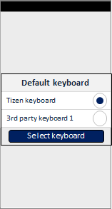

Input Method Manager {#manager}
====================

## Dependencies

- Tizen 4.0 and Higher

You can manage the input method editors (IMEs) installed on the device.
After your IME application is installed, you can use the input method
manager to open a list of installed IMEs, allow the user to enable an
installed IME, and show an IME selector, in which the user can see the
enabled IMEs and select one as a default keyboard.

The main features of the Tizen.Uix.InputMethodManager namespace include:

-   Showing the IME list

    You can [open the installed IME list menu](#list). If a new IME has
    been installed, the user can see its name in the IME list, and can
    use the toggle button to enable the keyboard they want. All
    keyboards enabled in the IME list are shown in the IME selector to
    allow the user to select them as the default keyboard.

    **Figure: IME list**

    

- Showing the IME selector

    You can [open the IME selector menu](#selector). When the user opens
    the IME selector menu, it shows all the keyboards enabled in the
    IME list. The user can change the default keyboard by selecting a
    new one. By clicking **Select keyboard**, the user can return to the
    IME list menu to enable a new IME.

    **Figure: IME selector**

    

- Checking the IME status

    You can [check whether a specific IME is enabled or
    disabled](#enable) in the system keyboard setting. You can also
    check which IME is currently selected as the default keyboard, or
    how many IMEs are enabled (usable). These features are useful when
    the user installs a new keyboard.


Prerequisites
-------------

To enable your application to use the input method manager
functionality:

1.  To use the
    [Tizen.Uix.InputMethodManager](https://developer.tizen.org/dev-guide/csapi/namespaceTizen_1_1Uix_1_1InputMethodManager.html)
    namespace, the application has to request permission by adding the
    following privilege to the `tizen-manifest.xml` file:

    ``` {.prettyprint}
    <privileges>
       <privilege>http://tizen.org/privilege/imemanager</privilege>
    </privileges>
    ```

2. To use the methods and properties of the
    Tizen.Uix.InputMethodManager namespace, include it in your
    application:

    ``` {.prettyprint}
    using Tizen.Uix.InputMethodManager;
    ```


Showing the IME List <a id="list"></a>
--------------------

To launch the IME list menu to show the installed IMEs, use the
`ShowIMEList()` method of the
[Tizen.Uix.InputMethodManager.Manager](https://developer.tizen.org/dev-guide/csapi/classTizen_1_1Uix_1_1InputMethodManager_1_1Manager.html)
class:

``` {.prettyprint}
void show_ime_list()
{
    try
    {
        Manager.ShowIMEList();
    }
    catch (Exception e)
    {
        /// Error handling
    }
}
```


Showing the IME Selector <a id="selector"></a>
------------------------

To launch the IME selector menu to allow the user to select the default
keyboard, use the `ShowIMESelector()` method of the
[Tizen.Uix.InputMethodManager.Manager](https://developer.tizen.org/dev-guide/csapi/classTizen_1_1Uix_1_1InputMethodManager_1_1Manager.html)
class:

``` {.prettyprint}
void show_ime_selector()
{
    try
    {
        Manager.ShowIMESelector();
    }
    catch (Exception e)
    {
        /// Error handling
    }
}
```


Checking the IME State <a id="enable"></a>
----------------------

To check whether a specific IME is enabled, to check the current default
keyboard, or to get the number of enabled (usable) IMEs:

-   To check whether a specific IME is enabled, use the `IsIMEEnabled()`
    method of the
    [Tizen.Uix.InputMethodManager.Manager](https://developer.tizen.org/dev-guide/csapi/classTizen_1_1Uix_1_1InputMethodManager_1_1Manager.html) class.
    As a parameter, use the application ID of the IME whose status you
    want to check.

    ``` {.prettyprint}
    bool is_ime_enabled(string appId)
    {
        try
        {
            bool result = Manager.IsIMEEnabled(appId);
        }
        catch (Exception e)
        {
            /// Error handling
        }

        return result;
    }
    ```

    If the IME is enabled, the method returns `true`.

- To check which IME is currently selected as the default keyboard,
    use the `GetActiveIME()` method, which returns the application ID of
    the currently selected IME as a string:

    ``` {.prettyprint}
    string get_active_ime()
    {
        string app_id = null;
        try
        {
            app_id = Manager.GetActiveIME();
        }
        catch (Exception e)
        {
            /// Error handling
        }

        return app_id;
    }
    ```

- To get the number of enabled (usable) IMEs, use the
    `GetEnabledIMECount()` method:

    ``` {.prettyprint}
    int get_enabled_ime_count()
    {
        int count = Manager.GetEnabledIMECount();

        return count;
    }
    ```
