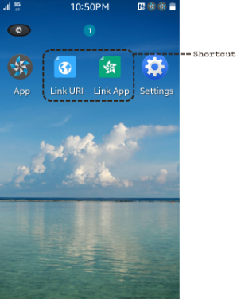
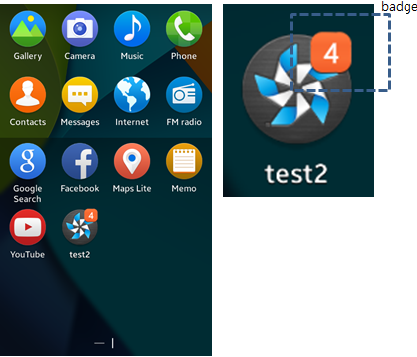

# Application Icons
## Dependencies
- Tizen 2.4 and Higher for Mobile
- Tizen 2.3.1 and Higher for Wearable

You can show the mobile application icon as a shortcut on the home screen to allow the user to easily launch the application. In the device application list, you can show a badge with the application icon to provide additional information about the application state or notifications to the user.

The main features of the Badge and Shortcut API include:

- Creating and removing a badge

  You can use badges in your application to inform the user about notifications and events. A badge is an image displayed on the application icon.

  You can [create a badge for an application](#create) and remove it.

- Managing the badge

  You can [get and set the count and display attributes for the badge](#manage).

- Adding a shortcut **in mobile applications only**You can [add a shortcut](#add) to the home screen to launch an application.

- Adding a widget **in mobile applications only**If you have created a widget application, you can [add the widget](#add_widget) to the home screen.

**Figure: Badges and shortcuts**

 

## Prerequisites

To enable your application to use the application icon functionality:

- To handle badges:

  1. To use the Badge API (in [mobile](../../../../org.tizen.native.mobile.apireference/group__BADGE__MODULE.html) and [wearable](../../../../org.tizen.native.wearable.apireference/group__BADGE__MODULE.html) applications), the application has to request permission by adding the following privilege to the `tizen-manifest.xml` file:

     ```
     <privileges>
        <privilege>http://tizen.org/privilege/notification</privilege>
     </privileges>
     ```

  2. To use the functions and data types of the Badge API, include the `<badge.h>` header file in your application:

     ```
     #include <stdio.h>
     #include <stdlib.h>
     #include <string.h>
     #include <unistd.h>
     #include <badge.h>
     ```

     To ensure that a Badge function has been executed properly, make sure that the return is equal to `BADGE_ERROR_NONE`.

  3. Declare the variables for the return value and application (package name):

     ```
     static int ret = 0;

     #define TEST_PKG "org.tizen.badgeapp"
     ```

- To handle shortcuts:

  1. To use the [Shortcut](../../../../org.tizen.native.mobile.apireference/group__SHORTCUT__MODULE.html) API, the application has to request permission by adding the following privilege to the `tizen-manifest.xml` file:
  ```
  <privileges>   <privilege>http://tizen.org/privilege/shortcut</privilege></privileges>
  ```
  
  2. To use the functions and data types of the Shortcut API, include the `<shortcut_manager.h>` header file in your application:
  ```
  #include <shortcut_manager.h>
  ```

## Creating and Removing a Badge

To create and remove badges:

- To create a badge for an application, call the `badge_add()` function. The parameter defines the application for which the badge is added. If the application is adding a badge for itself, the parameter can be null.

  ```
  ret = badge_add(TEST_PKG);
  if (ret != BADGE_ERROR_NONE)
      /* Error handling */
  ```

  The application that creates the badge can also update and remove it. When applications are signed with the same certificate, they can control each other's badges.

  If an application not signed with the same certificate must be allowed to [manage a badge](#manage), use the `badge_add()` function with a writable application ID. The writable application ID enables another application to control your application to manage the badge. You can also configure your application to handle the badge itself.

- To remove the badge from the application, call the `badge_remove()` function. The only parameter is the ID of the application whose badge to remove.

  ```
  ret = badge_remove(TEST_PKG);
  if (ret != BADGE_ERROR_NONE)
      /* Error handling */
  ```

## Managing the Badge

To manage the badge:

- Get the count attribute with the `badge_get_count()` function. The count attribute is displayed in the upper-right corner of the badge and its value must be an integer.The parameters are the name of the application whose badge count is retrieved, and the current badge count.
```
unsigned int count = 0;
ret = badge_get_count(TEST_PKG, &count);
if (ret != BADGE_ERROR_NONE)
    /* Error handling */
```
- Set the count attribute with the `badge_set_count()` function.The parameters are the name of the application whose badge count is updated, and the new badge count.
```
ret = badge_set_count(TEST_PKG, count + 1);
if (ret != BADGE_ERROR_NONE)
    /* Error handling */
```
- Get the display attribute and check whether the badge is visible with the `badge_get_display()` function.The parameters are the application which owns the badge, and the value of the display attribute (1 = badge is visible, 0 = badge is hidden).
```
unsigned int is_displayed = false;
ret = badge_get_display(TEST_PKG, &is_displayed);
if (ret != BADGE_ERROR_NONE)
    /* Error handling */
```
- Set the display attribute with the `badge_set_display()` function to hide or show the badge.The parameters are the application which owns the badge, and the display attribute (1 = badge is visible, 0 = badge is hidden).
```
ret = badge_set_display(TEST_PKG, 1);
if (ret != BADGE_ERROR_NONE)
    /* Error handling */
```

## Adding a Shortcut in Mobile Applications

To add a shortcut to the home screen:

1. Add a shortcut using the `shortcut_add_to_home()` function:

   ```
   shortcut_add_to_home("Music Player", LAUNCH_BY_APP, NULL, "/path/to/icon", 1, result_cb, NULL);
   ```

   The third parameter can be set to `NULL` to add a default icon for the application.

   The shortcut type is defined in the second parameter:

   - `LAUNCH_BY_APP`: Creates a shortcut to launch an application by a given application ID.
   - `LAUNCH_BY_URI`: Creates a shortcut to launch an application by a given URI. The URI is passed to the `app_control_set_uri()` function. For example, if you want to create a shortcut to open an image file, set the URI as `file:///home/myhome/Photos/1_photo.jpg`.

2. Define a callback function to track possible errors:

   ```
   static int
   result_cb(int ret, void *data)
   {
       if (ret < 0)
           /* Error handling */
       else
           /* No error detected */
   }
   ```

## Adding a Widget in Mobile Applications

To add a widget to the home screen:

1. Before adding a widget on the home screen, a widget application must be prepared. For more information on creating a widget application, see the [Widget Application](widget-app-n.md) guide.

2. Add a widget with the `shortcut_add_to_home_widget()` function:

   ```
   shortcut_add_to_home_widget("alter_name", WIDGET_SIZE_1x1, "org.tizen.testwidget",
                               "/opt/media/Pictures/alter_icon.png", -1.0f, 0, result_cb, NULL);
   ```

   To add a widget, you have to know the widget ID and supported sizes. The alter name and icon are shown when the widget is not available.

3. Define a callback function to track possible errors:

   ```
   static int
   result_cb(int ret, void *data)
   {
       if (ret < 0)
           /* Error handling */
       else
           /* No error detected */
   }
   ```