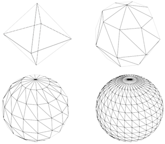
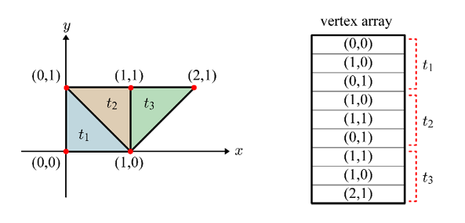
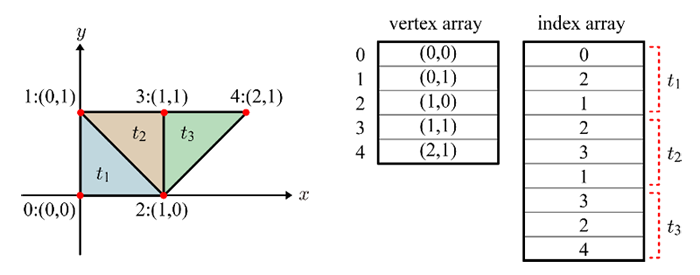
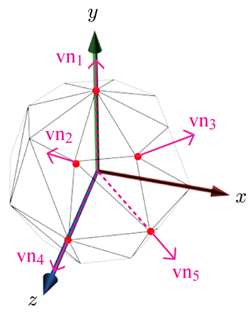
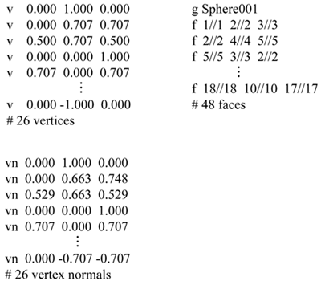
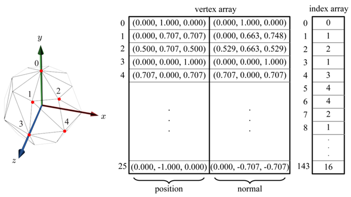

# Polygon Mesh in OpenGL® ES
## Dependencies
- Tizen 2.4 and Higher for Mobile
- Tizen 2.3.1 and Higher for Wearable

In real-time applications, such as games, an object is usually represented as a **polygon mesh**. The only polygon that OpenGL® ES supports is a triangle and because of this, a polygon mesh in OpenGL® ES implies a **triangle mesh**. Given an object, its polygon mesh can have different resolutions, as shown in the following figure.

As the resolution is increased or the number of vertices increased, the polygon mesh samples the original smooth surface more accurately. However, rendering the mesh requires more time.

**Figure: Sphere surface is sampled in different resolutions**

An intuitive way to represent a triangle mesh is to enumerate the vertices of the triangles and read 3 vertices at a time in linear order. The memory space storing the vertices is called a **vertex** array. The following figure shows an example of a simple 2D mesh.

**Figure: Vertex array**

The above representation is intuitive but inefficient. It is because the vertex array contains redundant data. For example, the vertex (1,0) appears 3 times in the vertex array. A better representation is using a separate **index array** in addition to the vertex array, as shown in the following figure:

- Each vertex appears only once in the vertex array.
- 3 indices per triangle are stored in the index array.

**Figure: Vertex array and index array**

In general, each cell of the vertex array contains not only the vertex position, but also the vertex normal, texture coordinates, and other attributes. Therefore, the vertex array storage saved by removing the duplicate data outweighs the additional storage needed for the index array.

## Vertex Normals

The vertex normals are indispensable for computing illumination, as is presented in Fragment Shader. A vertex normal is typically computed by averaging the normals of all polygons sharing the vertex, as illustrated in the following figure. On the left is a cross-section view, where a vertex is shared by 2 triangles.

Vertex normals are automatically computed by graphics packages, such as 3ds Max.

**Figure: Computation of the vertex normals**

## Polygon Mesh Export and Import

Game objects created using off-line graphics packages are exported into files and then imported to the runtime application. In 3ds Max, for example, many file formats are supported for export. Among the popular are OBJ and FBX.

The mesh shown in the following figure is a low-resolution mesh of a unit sphere. The spherical coordinates are uniformly sampled at every 45 degrees so that the mesh is composed of 26 vertices in total. 5 vertex normals are illustrated for visualization purpose.

**Figure: Low-resolution mesh of a unit sphere**

The following figure shows some fractions of the OBJ file, where v stands for vertex position, vn stands for vertex normal, and f stands for face/triangle. The first v is indexed by 1 and so is the first vn. A triangle is defined by 3 instances of v//vn.

**Figure: Fractions of an OBJ file**

The triangle mesh stored in the OBJ file is imported into the OpenGL® ES program to fill the vertex and index arrays. As the example mesh is composed of 48 triangles, the index array has 144 (48 times 3) elements, as shown in the following figure.

**Figure: Vertex and index arrays of a low-resolution sphere mesh**

