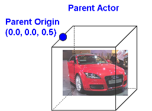
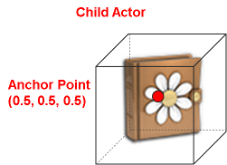
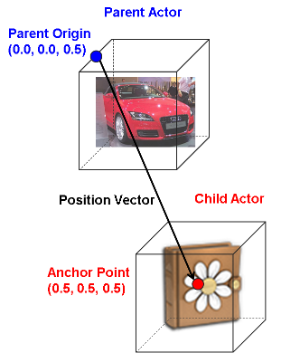

# Actors
## Dependencies
- Tizen 2.4 and Higher for Mobile
- Tizen 3.0 and Higher for Wearable

An actor is the basic component that composes the entire scene. It can have visible (for example, UI components) or invisible (for example, a camera actor or layer) forms.

An actor is also the primary object with which DALi applications interact. Multiple types of event signals provided by actors can be handled in an application through user-defined callback functions.

For additional actor usage examples, see [Actor Layout Examples](layout-n.md#example).

## Actor Types

**Figure: Actor types**


An actor has the following concrete types:

- **UI Components** are used to organize the application appearance. For more information, see [UI Components](ui-components-n.md).
- **Camera actor** determines which view of the whole virtual 3D world is rendered on the screen. By default, it is best suited for 2D applications, so you do not need to care about it in this case. For more information, see the `Dali::CameraActor` class (in [mobile](../../../../../org.tizen.native.mobile.apireference/classDali_1_1CameraActor.html) and [wearable](../../../../../org.tizen.native.wearable.apireference/classDali_1_1CameraActor.html) applications).
- **Layer** provides a mechanism for overlaying groups of actors on top of each other. For more information, see the `Dali::Layer` class (in [mobile](../../../../../org.tizen.native.mobile.apireference/classDali_1_1Layer.html) and [wearable](../../../../../org.tizen.native.wearable.apireference/classDali_1_1Layer.html) applications).

## Actors and Stage

Stage is a top-level object that represents the entire screen. It is used for displaying a hierarchy of actors managed by the [scene graph](http://en.wikipedia.org/wiki/Scene_graph) structure, which means an actor inherits a position relative to its parent, and can be moved in relation to this point.

The stage instance is a singleton object (the only instance of its class during the lifetime of the program). You can get it using a static function.

To display the contents of an actor, it must be added to a stage. The following example shows how to connect a new actor to the stage:

```
Actor actor = Actor::New();
Stage::GetCurrent().Add( actor );
```

## Positioning Actors

An actor inherits its parent's position. The relative position between the actor and parent is determined by the following properties:

- **Parent origin**This Vector3 property defines a point within the parent actor's area.**Figure: Parent origin**The default is top left (`Dali::ParentOrigin::TOP_LEFT`), which can be visualized in 2D as (0, 0), but is actually Vector3 (0, 0, 0.5) in the 3D DALi world. The actor position is relative to this point.For more information, see the `Dali::Actor::SetParentOrigin()` function.
- **Anchor point**This Vector3 property defines a point within the child actor area.**Figure: Anchor point**The default is center (`Dali::AnchorPoint::CENTER`), which can be visualized in 2D as (0.5, 0.5), but is actually Vector3 (0.5, 0.5, 0.5) in the 3D DALi world. The actor position is also relative to this point.For more information, see the `Dali::Actor::SetAnchorPoint()` function.
- **Position**This is the position vector between the parent origin and anchor point.**Figure: Position**Therefore by default, an actor's position indicates the vector to its center from the top-left corner of its parent.For example (with the default camera):An actor added directly to the stage with position (X = stageWidth*0.5, Y = stageHeight*0.5) appears in the center of the screen.An actor with the position (X = actorWidth*0.5, Y = actorWidth*0.5) appears at the top-left corner of the screen.For more information, see the `Dali::Actor::SetPosition()` function.

## Event Handling for Actors

The `Dali::Actor` class provides following event signals:

**Table: Event signals**

| Event signal         | Description                              |
| -------------------- | ---------------------------------------- |
| `TouchedSignal()`    | This signal is emitted when a touch input is received. |
| `HoveredSignal()`    | This signal is emitted when a hover input is received. |
| `WheelEventSignal()` | This signal is emitted when a wheel event is received. |
| `OnStageSignal()`    | This signal is emitted after the actor has been connected to the stage. |
| `OffStageSignal()`   | This signal is emitted after the actor has been disconnected from the stage. |
| `OnRelayoutSignal()` | This signal is emitted after the size has been set on the actor during relayout. |

For example, a touch event can be handled as follows:

```
// This sample code is for the HelloWorldExample class
// in Creating a DALi Application
void HelloWorldExample::Create( Application& application )
{
  // Control is one of the simplest types of Actor which is visible
  Control control = Control::New();
  control.SetParentOrigin( ParentOrigin::CENTER );
  control.SetSize( 100.0f, 100.0f );
  control.SetBackgroundColor( Color::WHITE );
  Stage::GetCurrent().Add( control );

  // Connect to a touch signal emitted by the control
  control.TouchedSignal().Connect( this, &HelloWorldExample::OnTouch );
}

bool HelloWorldExample::OnTouch( Actor actor, const TouchEvent& event )
{
  bool handled = false;
  unsigned int pointCount = event.GetPointCount();
  if( pointCount == 1 )
  {
    if( event.GetPoint( 0 ).state == TouchPoint::Down )
    {
      // Act on the first touch on screen
      handled = true;
    }
  }
  else if( pointCount > 1 )
  {
    if( event.GetPoint( pointCount-1 ).state == TouchPoint::Down )
    {
      // Act on a multi-touch on screen
      handled = true;
    }
  }
  // true if you have handled the touch, false otherwise
  return handled;
}
```

For more information, see [Event Handling](event-handling-n.md).