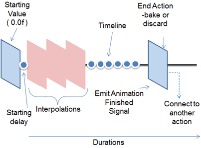

# Animation
## Dependencies
- Tizen 2.4 and Higher for Mobile
- Tizen 3.0 and Higher for Wearable

You can use animation to allow your objects to move around and change their properties for a specified duration.

DALi provides a rich and easy to use animation framework which allows you to create visually rich applications. The `Dali::Animation` class can be used to animate the [animatable properties](properties-n.md#attributes) of any number of objects.

DALi animations [occur in a dedicated thread](multi-threaded-n.md#animations). This allows animations to run smoothly, regardless of the time taken to process the input, events, and other factors in the application code.

The following figure illustrates the animation components.

**Figure: DALi animation components**



To implement a basic animation, create an animation object that takes place over 3 seconds:

```
Animation animation = Animation::New( 3.0f );
```

For more information on Animation, see [Animation Types](animation-types-n.md) and [Constraints](constraints-n.md).

## Animating Properties

To animate the properties within DALi, you can use 2 distinct functions:

- `AnimateTo()`: Property animates TO the value in the given time.
- `AnimateBy()`: Property animates BY the value in the given time (which means that it animates to a value that is the sum of the starting position and the given value).

In the following example, the `actor1` and `actor2` instances are at the position 10.0f, 10.0f, 0.0f at the start of the animation.

```
// Animate the actor1 position TO 10.0f, 50.0f, 0.0f
animation.AnimateTo( Property( actor1, Dali::Actor::Property::POSITION ), Vector3( 10.0f, 50.0f, 0.0f ) );
// End Position: 10.0f, 50.0f, 0.0f

// Animate the actor2 position BY 10.0f, 50.0f, 0.0f
animation.AnimateBy( Property( actor2, Dali::Actor::Property::POSITION ), Vector3( 10.0f, 50.0f, 0.0f ) );
// End Position: 20.0f, 60.0f, 0.0f
```

## Controlling Playback

After the animation is created, you can play it:

- To play the animation, use the `Play()` function:

    ```
    animation.Play();
    ```

	The `Play()` function is not a synchronous function. It returns after sending a message. After the message is processed in a separate thread, the animation starts. Blocking the application thread does not stop the animation from playing.

- To pause or stop the animation:

  ```
  animation.Pause();
  animation.Stop();
  ```

- To loop the animation to play multiple times:

  ```
  animation.SetLooping( true );
  ```

- By default, when the animation ends, the properties that it was animating are baked (saved). To discard the property changes when the animation ends or is stopped:

  ```
  animation.SetEndAction( Animation::Discard );
  ```

## Using Notifications

Using DALi's signal framework, the application can be notified when the animation finishes. The `Dali::Animation` class supports "fire and forget" behavior, which means that the animation continues to play even if the handle is discarded. In the following example, the finished signal is emitted after 2 seconds:

```
// This sample code is for the HelloWorldExample class
// in Creating a DALi Application
void HelloWorldExample::Create( Application& application )
{
  // Create a button
  PushButton button = PushButton::New();
  Stage::GetCurrent().Add( button );

  // Create an animation for the button
  Animation animation = Animation::New( 2.0f ); // Duration 2 seconds
  animation.AnimateTo( Property( button, Actor::Property::POSITION ), Vector3( 100.0f, 100.0f, 0.0f ) );
  animation.FinishedSignal().Connect( this, &HelloWorldExample::OnFinished );
  animation.Play(); // Fire the animation and forget about it
} // At this point the animation handle has gone out of scope

void HelloWorldExample::OnFinished( Animation& animation )
{
  // Do something when the animation is finished
}
```

## Using Alpha Functions

Alpha functions are used in animations to specify the rate of change of the animation parameter over time. This allows the animation to be, for example, accelerated, decelerated, repeated, or bounced. The built-in supported functions can be viewed in the `Dali::AlphaFunction::BuiltinFunction` enumeration (in [mobile](../../../../../org.tizen.native.mobile.apireference/classDali_1_1AlphaFunction.html#aacf7780cdb2077166a3cd20a8a9faf4b) and [wearable](../../../../../org.tizen.native.wearable.apireference/classDali_1_1AlphaFunction.html#aacf7780cdb2077166a3cd20a8a9faf4b) applications).

```
animation.SetDefaultAlphaFunction( Dali::AlphaFunction::EASE_IN );
```

You can also create your own alpha function:

```
float MyAlphaFunction( float progress )
{
  return progress;
}

AlphaFunction alphaFunction( &MyAlphaFunction );
animation.SetDefaultAlphaFunction( alphaFunction );
```

You can specify a different alpha function for each animate call within the `Animation` object:

```
animation.AnimateTo( Property( actor1, Dali::Actor::Property::POSITION ),
                     Vector3( 10.0f, 50.0f, 0.0f ), Dali::AlphaFunction::EASE_IN );
```