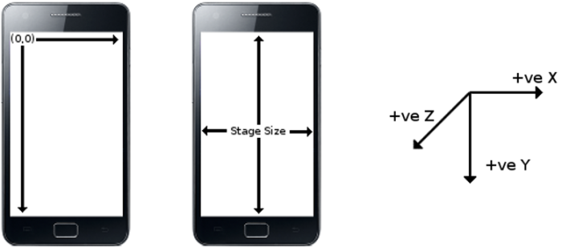
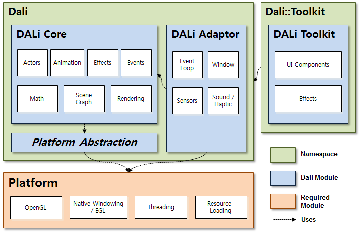
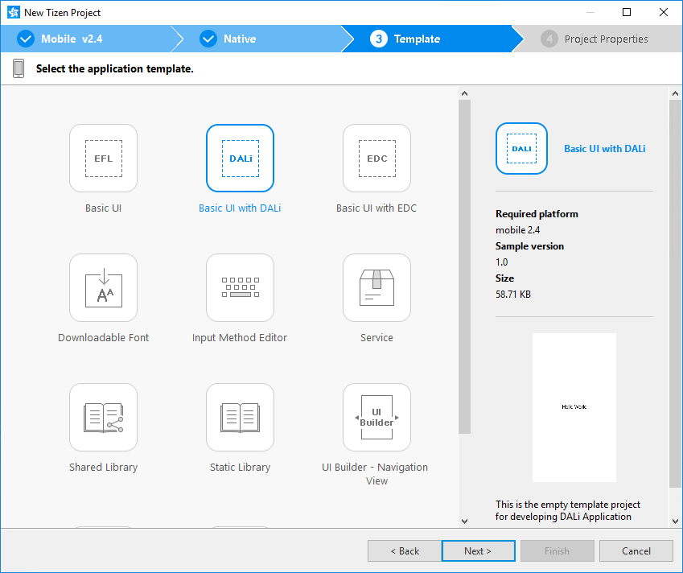
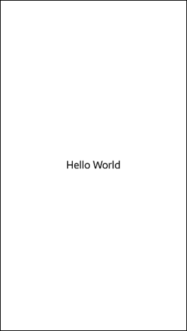

# DALi Overview
## Dependencies
- Tizen 2.4 and Higher for Mobile
- Tizen 3.0 and Higher for Wearable

Dynamic Animation Library (DALi) internally defines a virtual 3D world (space) and maintains hierarchical objects in the 3D world. The hierarchical object tree is known as the [scene graph](http://en.wikipedia.org/wiki/Scene_graph). A node in the scene graph can have several children but often only a single parent, with the effect of a parent applied to all its child nodes; an operation performed on a group automatically propagates its effect to all of its members.

There are various types of nodes, such as image, text, and buttons.

## DALi Fundamentals

Before starting UI programming with DALi, familiarize yourself with the basic concepts.

### Actor and Stage

Actor is the primary object for interaction in DALi applications. Actors are effective nodes that receive input (such as touch events) and act as a container for drawable elements and other actors. A DALi application uses a hierarchy of actor objects to position visible content. An actor inherits a position relative to its parent, and can be moved relative to this point. UI components can be built by combining multiple actors.

Stage is a top-level node of the scene graph used for displaying a tree of actors. To display an actor, add it to the stage.

### Signal and Slot

In DALi applications, a [signal and slot](https://en.wikipedia.org/wiki/Signals_and_slots) mechanism is used for communication between objects. This means that, in the DALi event system, objects can send signals containing event information, which can be received by other objects using special functions known as slots.

Signal events are emitted when a certain action or event occurs. The application can connect to these signals. Standard C-style functions can be used to connect to these signals if no local data needs to be accessed, otherwise a class function can also be connected.

Applications can manually disconnect from signals when required. However, DALi also provides safe signal disconnection. This means that when the connecting object is deleted, the signal is automatically disconnected.

### Coordinate System

DALi uses a left-handed coordinate system with the origin at the top-left corner, with positive X to right, positive Y going downwards, and positive Z going outside the screen with the default camera. This is convenient when creating 2D views.

The stage has a 2D size that matches the size of the application window. The default unit 1 is 1 pixel with the default camera.

**Figure: DALi coordinate system**



### Camera

DALi has a concept of a camera to display its virtual 3D world to a 2D screen. There are 2 ways of using the camera in DALi:

- For **2D** applications, you do not need to care about the camera at all. The default camera is already best suited for 2D applications (configured to have the origin of the coordinate system at the top-left corner of the screen, and unit 1 as 1 pixel of the screen). This is a typical way.
- For **3D** applications, you can change the view by manipulating the camera. You can translate or rotate the camera in this case. Note that the top-left corner of the screen and unit 1 no longer are (0,0,0) and 1 pixel after manipulating the camera.

### DALi Modules

DALi consists of the following modules:

- **DALi Core**
This module provides core functionalities, such as scene graph-based rendering, animation, and event handling. It is a base module and forms the biggest part of DALi.
- **DALi Adaptor**
This module is a platform adaptation layer. It initializes and sets up DALi appropriately and provides many platform-related services with its internal module, platform abstraction. Several signals can be connected to it to keep you informed when certain platform-related activities occur.
- **DALi Toolkit**
This module provides UI components and various effects on top of the DALi core.

**Figure: Layer diagram for DALi modules**



## Creating a DALi Application

To create a 'Hello World' application with Dali:

1. Create a DALi project:

   1. In the Tizen Studio menu, go to **File > New > Tizen Project**.
   2. In the Project Wizard, select **Template > Mobile or Wearable > Native Application > Basic UI with DALi**.
   3. Click **Finish**, and your project is created at the default location. If you want to change the location, uncheck **Use default location** and set a new location. For more information, see [Creating the Application Project](../../../../../org.tizen.training/html/native/process/app_dev_process_n.htm#creating).
   4. The new project is shown in the **Project Explorer** view of the Tizen Studio. If you open the `src/basicuiwithdali.cpp` file, you can see the source code of the basic DALi application:

    ```
    #include <dali-toolkit/dali-toolkit.h>

    using namespace Dali;
    using namespace Dali::Toolkit;

    // This example shows how to create and display Hello World
    // using a simple TextLabel

    class HelloWorldExample : public ConnectionTracker
    {
      public:
        HelloWorldExample( Application& application )
          : mApplication( application )
        {
          // Connect to the application's init signal
          mApplication.InitSignal().Connect( this, &HelloWorldExample::Create );
        }

        ~HelloWorldExample()
        {
          // Nothing to do here
        }

        // Init signal is received once (only) during the application lifetime
        void Create( Application& application )
        {
          // Get a handle to the stage
          Stage stage = Stage::GetCurrent();
          stage.SetBackgroundColor( Color::WHITE );

          TextLabel textLabel = TextLabel::New( "Hello World" );
          textLabel.SetSize( stage.GetSize() );
          textLabel.SetAnchorPoint( AnchorPoint::TOP_LEFT );
          textLabel.SetProperty( TextLabel::Property::HORIZONTAL_ALIGNMENT, "CENTER" );
          textLabel.SetProperty( TextLabel::Property::VERTICAL_ALIGNMENT, "CENTER" );
          stage.Add( textLabel );

          // Connect to touch and key event signals
          stage.GetRootLayer().TouchSignal().Connect( this, &HelloWorldExample::OnTouch );
          stage.KeyEventSignal().Connect( this, &HelloWorldExample::OnKeyEvent );
        }

        bool OnTouch( Actor actor, const TouchData& touch )
        {
          // Quit the application
          mApplication.Quit();

          return true;
        }

        void OnKeyEvent( const KeyEvent& event )
        {
          if( event.state == KeyEvent::Down )
          {
            if( IsKey( event, DALI_KEY_ESCAPE ) || IsKey( event, DALI_KEY_BACK ) )
            {
              mApplication.Quit();
            }
          }
        }

      private:
        Application& mApplication;
    };

    // Entry point for DALi applications
    int main( int argc, char **argv )
    {
      Application application = Application::New( &argc, &argv );
      HelloWorldExample test( application );
      application.MainLoop();

      return 0;
    }
    ```

2. Initialize the DALi application:

   - To use the DALi APIs, you only need to include the `dali-toolkit.h` file. It includes the header files of DALi Core and DALi Adaptor as well as DALi Toolkit.

     ```
     #include <dali-toolkit/dali-toolkit.h>
     ```

     Using the following 2 using-directives can be convenient, because all DALi APIs are contained in either the `Dali` or `Dali::Toolkit` namespace:

     ```
     using namespace Dali;
     using namespace Dali::Toolkit;
     ```

     Other code samples in the Tizen DALi documentation assume they already have those directives.

   - The `Dali::Application` class (in [mobile](../../../../../org.tizen.native.mobile.apireference/classDali_1_1Application.html) and [wearable](../../../../../org.tizen.native.wearable.apireference/classDali_1_1Application.html) applications) initializes and sets up DALi.

     Create a `Dali::Application` instance:

     ```
     Application application = Application::New( &argc, &argv );
     ```

   - Several signals can be connected to keep you informed when certain platform-related activities occur, and ensure that, upon system events, DALi is called in a thread-safe manner.

     To manage signal connection safely, DALi provides the `Dali::ConnectionTracker` class (in [mobile](../../../../../org.tizen.native.mobile.apireference/classDali_1_1ConnectionTracker.html) and [wearable](../../../../../org.tizen.native.wearable.apireference/classDali_1_1ConnectionTracker.html) applications). A typical way for starting a DALi application is to create a class derived from the `Dali::ConnectionTracker` class and use its member functions as callback functions for DALi signals (for more information, see [Automatic Connection Management](event-handling-n.md#automatic)). The `HelloWorldExample` class is used in other code samples in the Tizen DALi documentation.

     After getting the initialized signal from the `Dali::Application` instance, you can use the DALi APIs for building the scene graph. Connect the `HelloWorldExample::Create()` callback to the `DALi::Application::InitSignal()` function:

     ```
     mApplication.InitSignal().Connect( this, &HelloWorldExample::Create );
     ```

3. Create an actor and add it to the stage:

   The `Dali::Toolkit::TextLabel` UI component (in [mobile](../../../../../org.tizen.native.mobile.apireference/classDali_1_1Toolkit_1_1TextLabel.html) and [wearable](../../../../../org.tizen.native.wearable.apireference/classDali_1_1Toolkit_1_1TextLabel.html) applications) renders a short text string. To display the `TextLabel` component, add it to a stage. The `stage` instance is a singleton object (the only instance of its class during the lifetime of the program), so you can get it using a static function.

   ```
   Stage stage = Stage::GetCurrent();
   stage.SetBackgroundColor( Color::WHITE );

   TextLabel textLabel = TextLabel::New( "Hello World" );
   textLabel.SetSize( stage.GetSize() );
   textLabel.SetAnchorPoint( AnchorPoint::TOP_LEFT );
   textLabel.SetProperty( TextLabel::Property::HORIZONTAL_ALIGNMENT, "CENTER" );
   textLabel.SetProperty( TextLabel::Property::VERTICAL_ALIGNMENT, "CENTER" );
   stage.Add( textLabel );
   ```

   The above code additionally sets the background color of the `stage` and the anchor point, a point defining a position of a child actor from its parent, of the `textLabel`. The application stores the actor and resource handles. DALi objects are reference-counted, which makes sure they exist only as long as they are needed. Even if the `TextLabel` component is removed from the stage, it remains alive through the reference.

4. Connect to input signals:

   The application can handle touch and key event signals as follows:

   ```
   stage.GetRootLayer().TouchSignal().Connect( this, &HelloWorldExample::OnTouch );
   stage.KeyEventSignal().Connect( this, &HelloWorldExample::OnKeyEvent );
   ```

   Any key inputs and touches on the stage are handled by 2 callback functions, `HelloWorldExample::OnKeyEvent` and `HelloWorldExample::OnTouch`.

   Note that the first parameter of the `HelloWorldExample::OnTouch` callback (`actor`) is passed by a value, not by a reference or a pointer. You can simply pass instances of most DALi classes by value, when the class inherits from the `Dali::BaseHandle` class (in [mobile](../../../../../org.tizen.native.mobile.apireference/classDali_1_1BaseHandle.html) and [wearable](../../../../../org.tizen.native.wearable.apireference/classDali_1_1BaseHandle.html) applications). This is due to the [handle/body pattern](handle-n.md) widely used in DALi.

   ```
   bool OnTouch( Actor actor, const TouchData& touch )
   ```

5. Start the application main loop:

   To run the application, start its main loop. This ensures that images are displayed, and events as well as signals are dispatched and captured.

   ```
   application.MainLoop();
   ```

6. Build the DALi application:

   To build your application, select **Project > Build Project** or press **F10** in the Tizen Studio.

   The Tizen Studio automatically packages the project after building. Note that you need to register your certificate when building for the first time. For more information, see [Working with the Certificate Profile](../../../../../org.tizen.studio/html/common_tools/certificate_registration.htm) and [Building Applications](../../../../../org.tizen.training/html/native/process/building_app_n.htm).

7. Run the DALi application:

   To run your application, select **Run > Run** or press **Ctrl + F11** in the Tizen Studio.

   For more information, see [Running Applications](../../../../../org.tizen.training/html/native/process/running_app_n.htm).

The following figure illustrates the basic DALi application running on a Tizen emulator.

**Figure: Basic DALi application**

