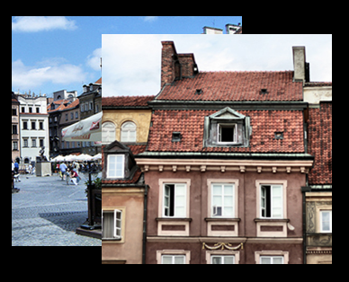

# ImageView
## Dependencies
- Tizen 2.4 and Higher for Mobile
- Tizen 3.0 and Higher for Wearable

The `Dali::Toolkit::ImageView` component displays an image.

**Figure: ImageView**



## Creating an ImageView

The image view is constructed by passing a `Dali::Image` object. The `Dali::Image` is an abstract base class with multiple derived classes, and the `Dali::ResourceImage` class is used for [loading an image from a file or URL](resources-n.md). The following example shows how to create an `ImageView` object:

```
ImageView imageView = ImageView::New( myImageURL );
// Or
Image image = ResourceImage::New( myImageURL );
ImageView imageView = ImageView::New( image );
```

## Changing the Image

The image object can be changed later by calling the `ImageView::SetImage()` function:

```
imageView.SetImage( newImage );
```