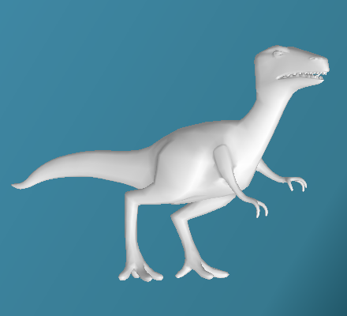
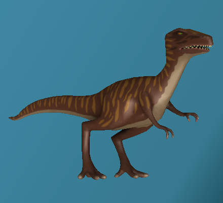
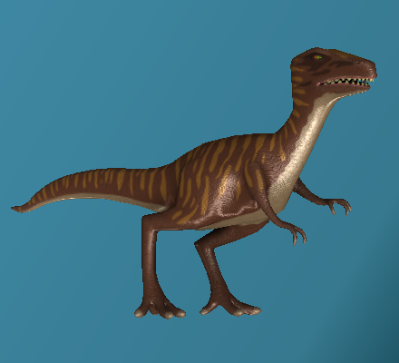

# Model3dView
## Dependencies
- Tizen 3.0 and Higher for Mobile
- Tizen 3.0 and Higher for Wearable

The `Dali::Toolkit::Model3dView` is a control for displaying static 3D content. It is capable of reading `.obj` and `.mtl` files, and up to 3 textures, with a single light and 3 simple illumination types.

The OBJ or `.obj` (object) file is a geometry definition file format and the MTL or `.mtl` (material) file contains 1 or more material definitions, each of which includes the color, texture, and reflection map of individual materials.

The `Model3dView` control automatically scales the loaded geometry to fit within its size boundary.

## Creating a Model3dView

The following basic example shows how to create a `Dali::Toolkit::Model3dView` object:

```
// You must define the path to the geometry and
// material files, and the images directory
Model3dView model3dView = Model3dView::New( MODEL_FILE, MATERIAL_FILE, IMAGE_PATH );
model3dView.SetParentOrigin( ParentOrigin::CENTER );
model3dView.SetAnchorPoint( AnchorPoint::CENTER );
model3dView.SetResizePolicy( ResizePolicy::FILL_TO_PARENT, Dimension::ALL_DIMENSIONS );
Stage::GetCurrent().Add( model3dView );
```

## Modifying Model3dView Properties

You can modify the `Model3dView` appearance and behavior through its properties. To change a property from its default value, use the `SetProperty()` function.

**Note**
The resource properties require absolute references as their paths. However, the root resource path for your application can be obtained through the `app_get_resource_path()` function of the App Common API (in [mobile](../../../../../org.tizen.native.mobile.apireference/group__CAPI__APP__COMMON__MODULE.html) and [wearable](../../../../../org.tizen.native.wearable.apireference/group__CAPI__APP__COMMON__MODULE.html) applications), and relative paths can be appended to that root path. If you want to use relative paths, you must specify them in your build files.

The following table lists the available `Model3dView` properties.

**Table: Model3dView properties**

| Property            | Type      | Descriptions                             |
| ------------------- | --------- | ---------------------------------------- |
| `GEOMETRY_URL`      | `String`  | Location of the geometry resource (the OBJ file) |
| `MATERIAL_URL`      | `String`  | Location of the material resource (the MTL file) to render the object with a material |
| `IMAGES_URL`        | `String`  | Location of the images directory         |
| `ILLUMINATION_TYPE` | `Integer` | Type of illumination                     |
| `TEXTURE0_URL`      | `String`  | Path to the first texture (diffuse texture) |
| `TEXTURE1_URL`      | `String`  | Path to the second texture (normal map)  |
| `TEXTURE2_URL`      | `String`  | Path to the third texture (gloss texture) |
| `LIGHT_POSITION`    | `Vector3` | Coordinates of the light                 |

The MTL material file references the texture files using a relative path. The `IMAGES_URL` property is used to define the location of the root of this path. The textures are set automatically when the material URL is loaded.

## Specifying the Illumination Model

Illumination models are used to calculate the intensity of light that is reflected at a given point on a surface. The diffuse reflection is the reflection of light from a surface such that an incident ray is reflected at many angles rather than at only one angle, as in specular reflection.

The following table illustrates the available illumination models.

**Table: Available illumination models**

| Illumination type         | Description                              |
| ------------------------- | ---------------------------------------- |
| `DIFFUSE`                 | Render the model with simple lighting using the actor color |
| `DIFFUSE_WITH_TEXTURE`    | Render the model with specular highlighting on the supplied diffuse and gloss textures |
| `DIFFUSE_WITH_NORMAL_MAP` | Render the model with specular highlighting with the supplied diffuse, gloss, and normal map textures |

Each of the illumination models takes account of the light position, which can be specified using the `Model3dView::Property::LIGHT_POSITION` property. To position the light in front of the 3D model, give it a positive Z value.

The following figure illustrates the illumination models: `DIFFUSE` (top left), `DIFFUSE_WITH_TEXTURE` (top right), and `DIFFUSE_WITH_NORMAL_MAP` (bottom).

**Figure: Illumination models**

 

