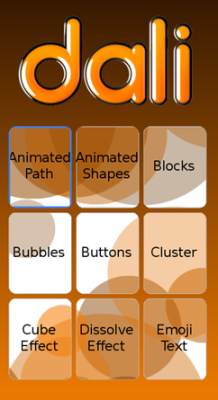

# TableView

## Dependencies

- Tizen 2.4 and Higher for Mobile
- Tizen 3.0 and Higher for Wearable

The `Dali::Toolkit::TableView` class is a layout container for aligning child actors in a grid like layout. `TableView` constraints the x and y position and width and height of the child actors.

**Figure: TableView**



## Creating a TableView

The following example shows how to create a `TableView` object:

```
// This sample code is for the HelloWorldExample class
// in Creating a DALi Application
void HelloWorldExample::Create( Application& application )
{
  TableView tableView = TableView::New( 4, 4 );
  tableView.SetKeyboardFocusable( true );
  tableView.SetParentOrigin( ParentOrigin::CENTER );
  tableView.SetSize( 300, 300 );

  for( int row = 0; row < 4; ++row )
  {
    for( int col = 0; col < 4; ++col )
    {
      std::ostringstream str;
      str << row << "-" << col;
      TextLabel textLabel = TextLabel::New( str.str() );
      textLabel.SetKeyboardFocusable( true );
      textLabel.SetBackgroundColor( Color::WHITE );
      tableView.AddChild( textLabel, TableView::CellPosition( row, col ) );
    }
  }
  Stage::GetCurrent().Add( tableView );
}
```