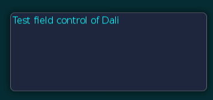

# TextField

## Dependencies

- Tizen 2.4 and Higher for Mobile
- Tizen 3.0 and Higher for Wearable

The `Dali::Toolkit::TextField` class is a control providing a single-line editable text field.

**Figure: TextField**



## Creating a TextField

Before text has been entered, the `Dali::Toolkit::TextField` class can display a placeholder text. An alternative placeholder can be displayed when the `TextField` has keyboard focus. For example, a `TextField` used to enter a username can initially show the text `Unknown Name`, and the text `Enter Name.` when the cursor is visible.

```
TextField field = TextField::New();
field.SetProperty( TextField::Property::PLACEHOLDER_TEXT, "Unnamed Name" );
field.SetProperty( TextField::Property::PLACEHOLDER_TEXT_FOCUSED, "Enter Name." );
Stage::GetCurrent().Add( field );
```

When the `TextField` is tapped, it automatically gets the keyboard focus. Key events enter the text, and the placeholder text is removed. After text has been entered, it can be retrieved from the `TEXT` property.

```
Property::Value fieldText = field.GetProperty( TextField::Property::TEXT );
std::string fieldTextString = fieldText.Get< std::string >();
```

## Aligning Text

The `Dali::Toolkit::TextField` class displays a single-line of text, which scrolls if there is not enough space for the text displayed. If there is enough space, the text can be aligned horizontally to the beginning, end, or center of the available area:

```
// "CENTER" or "END"
field.SetProperty( TextField::Property::HORIZONTAL_ALIGNMENT, "BEGIN" );
```

## Using Decorations

For text decorations, the following `TextLabel` class properties are available.

**Table: TextField properties**

| Property                               | Type      | Writable | Animatable |
| -------------------------------------- | --------- | -------- | ---------- |
| `RENDERING_BACKEND`                    | Integer   | Yes      | No         |
| `TEXT`                                 | String    | Yes      | No         |
| `PLACEHOLDER_TEXT`                     | String    | Yes      | No         |
| `PLACEHOLDER_TEXT_FOCUSED`             | String    | Yes      | No         |
| `FONT_FAMILY`                          | String    | Yes      | No         |
| `FONT_STYLE`                           | String    | Yes      | No         |
| `POINT_SIZE`                           | Float     | Yes      | No         |
| `MAX_LENGTH`                           | Integer   | Yes      | No         |
| `EXCEED_POLICY`                        | Integer   | Yes      | No         |
| `HORIZONTAL_ALIGNMENT`                 | String    | Yes      | No         |
| `VERTICAL_ALIGNMENT`                   | String    | Yes      | No         |
| `COLOR`                                | Vector4   | Yes      | No         |
| `SHADOW_OFFSET`                        | Vector2   | Yes      | No         |
| `SHADOW_COLOR`                         | Vector4   | Yes      | No         |
| `PRIMARY_CURSOR_COLOR`                 | Vector4   | Yes      | No         |
| `SECONDARY_CURSOR_COLOR`               | Vector4   | Yes      | No         |
| `ENABLE_CURSOR_BLINK`                  | Boolean   | Yes      | No         |
| `CURSOR_BLINK_INTERVAL`                | Float     | Yes      | No         |
| `CURSOR_BLINK_DURATION`                | Float     | Yes      | No         |
| `GRAB_HANDLE_IMAGE`                    | String    | Yes      | No         |
| `GRAB_HANDLE_PRESSED_IMAGE`            | String    | Yes      | No         |
| `SCROLL_THRESHOLD`                     | Float     | Yes      | No         |
| `SCROLL_SPEED`                         | Float     | Yes      | No         |
| `SELECTION_HANDLE_IMAGE_RIGHT`         | String    | Yes      | No         |
| `SELECTION_HANDLE_PRESSED_IMAGE_LEFT`  | String    | Yes      | No         |
| `SELECTION_HANDLE_PRESSED_IMAGE_RIGHT` | String    | Yes      | No         |
| `SELECTION_HIGHLIGHT_COLOR`            | Vector4   | Yes      | No         |
| `DECORATION_BOUNDING_BOX`              | Rectangle | Yes      | No         |
| `INPUT_METHOD_SETTINGS`                | Map       | Yes      | No         |

To change the color of the text, use the `TEXT_COLOR` property. An alternative color can be used for placeholder text by setting the `PLACEHOLDER_TEXT_COLOR` property. Unlike the `Actor::COLOR` property, these properties do not affect child actors added to the `TextField`.

```
field.SetProperty( TextField::Property::TEXT_COLOR, Color::CYAN );
field.SetProperty( TextField::Property::PLACEHOLDER_TEXT_COLOR, Color::BLACK );
```