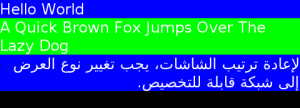

# TextLabel

## Dependencies

- Tizen 2.4 and Higher for Mobile
- Tizen 3.0 and Higher for Wearable

The `Dali::Toolkit::TextLabel` class provides a control that renders a short text string. The text labels are lightweight, non-editable, and do not respond to user input.

**Figure: TextLabel**



## Creating a TextLabel

The following example shows how to create a `TextLabel` instance:

```
TextLabel label = TextLabel::New();
label.SetProperty( TextLabel::Property::TEXT, "Hello World" );
Stage::GetCurrent().Add( label );
```

## Selecting Fonts

By default, the `TextLabel` automatically selects a suitable font from the platform. Note that the selected font may not support all characters in your input text. For example, Latin fonts often do not provide Arabic glyphs.

Alternatively, you can request a font using the `FONT_FAMILY`, `FONT_STYLE`, and `POINT_SIZE` properties:

```
label.SetProperty( TextLabel::Property::FONT_FAMILY, "HelveticaNue" );
label.SetProperty( TextLabel::Property::FONT_STYLE, "Regular" );
label.SetProperty( TextLabel::Property::POINT_SIZE, 12.0f );
```

The `TextLabel` falls back to using the default font if the requested font does not support the required scripts.

## Aligning Text

Wrapping can be enabled using the `MULTI_LINE` property:

```
label.SetProperty( TextLabel::Property::MULTI_LINE, true );
```

The text can be aligned horizontally to the beginning, end, or center of the available area:

```
// "CENTER" or "END"
label.SetProperty( TextLabel::Property::HORIZONTAL_ALIGNMENT, "BEGIN" );
```

## Managing the Layout

There are several resize policies commonly used with `TextLabels`.The following examples show the actual size by setting a colored background, whilst the black area represents the size of the parent control.

### Natural Size Policy

In its natural size, the `TextLabel` is large enough to display the text without wrapping, and does not have extra space to align the text within. In the following example, the same result is displayed regardless of the alignment or multi-line properties:

```
TextLabel label = TextLabel::New( "Hello World" );
label.SetAnchorPoint( AnchorPoint::TOP_LEFT );
label.SetResizePolicy( ResizePolicy::USE_NATURAL_SIZE, Dimension::ALL_DIMENSIONS );
label.SetBackgroundColor( Color::BLUE );
Stage::GetCurrent().Add( label );
```

### Height-for-width Policy

To lay out text labels vertically, a fixed (maximum) width must be provided by the parent control. Each `TextLabel` reports the desired height for the given width. The following example uses `TableView` as the parent:

```
TableView parent = TableView::New( 3, 1 );
parent.SetResizePolicy( ResizePolicy::FILL_TO_PARENT, Dimension::WIDTH );
parent.SetResizePolicy( ResizePolicy::USE_NATURAL_SIZE, Dimension::HEIGHT );
parent.SetAnchorPoint( AnchorPoint::TOP_LEFT );

Stage::GetCurrent().Add( parent );

TextLabel label = TextLabel::New( "Hello World" );
label.SetAnchorPoint( AnchorPoint::TOP_LEFT );
label.SetResizePolicy( ResizePolicy::FILL_TO_PARENT, Dimension::WIDTH );
label.SetResizePolicy( ResizePolicy::DIMENSION_DEPENDENCY, Dimension::HEIGHT );
label.SetBackgroundColor( Color::BLUE );

parent.AddChild( label, TableView::CellPosition( 0, 0 ) );
parent.SetFitHeight( 0 );

label = TextLabel::New( "A Quick Brown Fox Jumps Over The Lazy Dog" );
label.SetAnchorPoint( AnchorPoint::TOP_LEFT );
label.SetResizePolicy( ResizePolicy::FILL_TO_PARENT, Dimension::WIDTH );
label.SetResizePolicy( ResizePolicy::DIMENSION_DEPENDENCY, Dimension::HEIGHT );
label.SetBackgroundColor( Color::GREEN );
label.SetProperty( TextLabel::Property::MULTI_LINE, true );

parent.AddChild( label, TableView::CellPosition( 1, 0 ) );
parent.SetFitHeight( 1 );

label = TextLabel::New( "لإعادة ترتيب الشاشات، يجب تغيير نوع العرض إلى شبكة قابلة للتخصيص" );
label.SetAnchorPoint( AnchorPoint::TOP_LEFT );
label.SetResizePolicy( ResizePolicy::FILL_TO_PARENT, Dimension::WIDTH );
label.SetResizePolicy( ResizePolicy::DIMENSION_DEPENDENCY, Dimension::HEIGHT );
label.SetBackgroundColor( Color::BLUE );
label.SetProperty( TextLabel::Property::MULTI_LINE, true );

parent.AddChild( label, TableView::CellPosition( 2, 0 ) );
parent.SetFitHeight( 2 );
```

In the example, the "Hello World" text label has been given the full width, not the natural width.

## Using Decorations

For text decorations, `TextLabel` provides several properties.

**Table: TextLabel properties**

| Property               | Type    | Writable | Animatable |
| ---------------------- | ------- | -------- | ---------- |
| `RENDERING_BACKEND`    | Integer | Yes      | No         |
| `TEXT`                 | String  | Yes      | No         |
| `FONT_FAMILY`          | String  | Yes      | No         |
| `FONT_STYLE`           | String  | Yes      | No         |
| `POINT_SIZE`           | Float   | Yes      | No         |
| `MULTI_LINE`           | Boolean | Yes      | No         |
| `HORIZONTAL_ALIGNMENT` | String  | Yes      | No         |
| `VERTICAL_ALIGNMENT`   | String  | Yes      | No         |
| `TEXT_COLOR`           | Vector4 | Yes      | No         |
| `SHADOW_OFFSET`        | Vector2 | Yes      | No         |
| `SHADOW_COLOR`         | Vector4 | Yes      | No         |
| `UNDERLINE_ENABLED`    | Boolean | Yes      | No         |
| `UNDERLINE_COLOR`      | Vector4 | Yes      | No         |
| `UNDERLINE_HEIGHT`     | Float   | Yes      | No         |

### Color

To change the color of the text, use the `TEXT_COLOR` property. Unlike the `Actor::COLOR` property, this does not affect child actors added to the `TextLabel`.

```
label.SetProperty( TextLabel::Property::TEXT, "Red Text" );
label.SetProperty( TextLabel::Property::TEXT_COLOR, Color::RED );
```

### Drop Shadow

To add a drop shadow to the text, set the `SHADOW_OFFSET` property with a non-zero values. The color can also be selected using the `SHADOW_COLOR` property.

```
stage.SetBackgroundColor( Color::BLUE );
label1.SetProperty( TextLabel::Property::TEXT, "Plain Text" );
label2.SetProperty( TextLabel::Property::TEXT, "Text with Shadow" );
label2.SetProperty( TextLabel::Property::SHADOW_OFFSET, Vector2( 1.0f, 1.0f ) );
label2.SetProperty( TextLabel::Property::SHADOW_COLOR, Color::BLACK );
label3.SetProperty( TextLabel::Property::TEXT, "Text with Bigger Shadow" );
label3.SetProperty( TextLabel::Property::SHADOW_OFFSET, Vector2( 2.0f, 2.0f ) );
label3.SetProperty( TextLabel::Property::SHADOW_COLOR, Color::BLACK );
label4.SetProperty( TextLabel::Property::TEXT, "Text with Color Shadow" );
label4.SetProperty( TextLabel::Property::SHADOW_OFFSET, Vector2( 1.0f, 1.0f ) );
label4.SetProperty( TextLabel::Property::SHADOW_COLOR, Color::RED );
```

### Underlining

The text can be underlined by setting the `UNDERLINE_ENABLED` property. The color can also be selected using the `UNDERLINE_COLOR` property.

```
label1.SetProperty( TextLabel::Property::TEXT, "Text with Underline" );
label1.SetProperty( TextLabel::Property::UNDERLINE_ENABLED, true );
label2.SetProperty( TextLabel::Property::TEXT, "Text with Color Underline" );
label2.SetProperty( TextLabel::Property::UNDERLINE_ENABLED, true );
label2.SetProperty( TextLabel::Property::UNDERLINE_COLOR, Color::GREEN );
```

By default, the underline height is based on the font metrics. This can be overridden using the `UNDERLINE_HEIGHT` property:

```
label1.SetProperty( TextLabel::Property::UNDERLINE_HEIGHT, 1.0f );
```