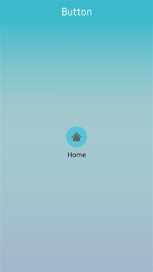

# Button

## Dependencies

- Tizen 2.4 and Higher for Mobile

The button UI component works as a clickable input element to trigger events. For more information, see the [Button](../../../../../org.tizen.native.mobile.apireference/group__Button.html) API.

This feature is supported in mobile applications only.

## Basic Usage

To use a button component in your application:

1. Add a button with the `elm_button_add()` function:

   ```
   Evas_Object *button;

   button = elm_button_add(parent);
   ```

2. Set a [style](#style) and fill the button with a text or an image according to the style:f

   - Set a style to the button with the `elm_object_style_set()` function. If you use the default style, you can skip this step.

     ```
     elm_object_style_set(button, "circle");
     ```

   - Set a label to the button with the `elm_object_text_set()` function, if the style supports a text part.

     ```
     elm_object_text_set(button, "Home");
     ```

   - Set an image object to the button with the `elm_object_part_content_set()` function, if the style supports a swallow part.

     ```
     Evas_Object *icon;

     elm_object_part_content_set(button, "icon", icon);
     ```

3. Register the [callback](#callback) functions.The following example shows how to define and register a callback for the `clicked` signal:

   ```
   evas_object_smart_callback_add(button, "clicked", clicked_cb, data);

   void
   clicked_cb(void *data, Evas_Object *obj, void *event_info)
   {
       dlog_print(DLOG_INFO, LOG_TAG, "Button clicked\n");
   }
   ```

The following example shows a simple use case of the button component.

**Example: Button use case**

|  |
| -------------------------------------- |
|                                        |

```
Evas_Object *win;
Evas_Object *conf;
Evas_Object *nf;
Evas_Object *box;
Evas_Object *button;
Evas_Object *icon;

/* Starting right after the basic EFL UI layout code */
/* (win - conformant - naviframe) */

/* Add a box to contain a button and push the box into the naviframe */
box = elm_box_add(nf);
evas_object_show(box);
elm_naviframe_item_push(nf, "Button", NULL, NULL, box, NULL);

/* Add a button and set a style */
button = elm_button_add(box);
elm_object_style_set(button, "circle");

/* Set a text to the button */
elm_object_text_set(button, "Home");

/* Add an icon and set it as a content */
icon = elm_icon_add(button);
elm_icon_standard_set(icon, "home");
elm_object_part_content_set(button, "icon", icon);

evas_object_show(button);
elm_box_pack_end(box, button);
```

## Features

You can use the autorepeat feature in your application. Once a button is pressed, a `repeated` signal is emitted repeatedly until the button is released.

- To disable the autorepeat feature:

  ```
  elm_button_autorepeat_set(button, EINA_FALSE);
  ```

- To set the initial timeout before the `repeated` signal is emitted:

  ```
  elm_button_autorepeat_initial_timeout_set(button, 5.0);
  ```

- To set the interval between 2 `repeated` signals:

  ```
  elm_button_autorepeat_gap_timeout_set(button, 0.5);
  ```

## Styles

The following table lists the available component styles.

**Table: Button styles**

| Style                                    | Sample                                   | Text part | Swallow part |
| ---------------------------------------- | ---------------------------------------- | --------- | ------------ |
| `default`                                |  | `default` | `icon`       |
| `circle`                                 |  | `default` | `icon`       |
| `editfield_clear`                        |  | N/A       | `icon`       |
| `bottom`                                 |  | `default` | `icon`       |
| `icon_reorder`                           |                                          | N/A       | N/A          |
| `icon_expand_add`                        |                                          | N/A       | N/A          |
| `icon_expand_delete`                     |  | N/A       | N/A          |
| `naviframe/title_left`                   |  | `default` | N/A          |
| `naviframe/title_right`                  |  | `default` | N/A          |
| `naviframe/back_btn/default`             |  | N/A       | N/A          |
| `dropdown`                               |  | `default` | N/A          |
| `contacts` (Tizen 2.3 only style)        |                                          | `default` | N/A          |
| `naviframe/title_done` (Tizen 2.3 only style) |  | N/A       | N/A          |
| `naviframe/title_cancel` (Tizen 2.3 only style) |  | N/A       | N/A          |
| `naviframe/drawers` (Tizen 2.3 only style) |                                          | N/A       | N/A          |
| `option` (Tizen-2.3 only style)          |                                          | N/A       | N/A          |

## Callbacks

You can register callback functions connected to the following signals for a button object.

**Table: Button callback signals**

| Signal      | Description                              | `event_info` |
| ----------- | ---------------------------------------- | ------------ |
| `clicked`   | The button is clicked (press and release). | `NULL`       |
| `repeated`  | The button is pressed without releasing it. | `NULL`       |
| `pressed`   | The button is pressed.                   | `NULL`       |
| `unpressed` | The button is released after being pressed. | `NULL`       |

**Note**

The signal list in the API reference can be more extensive, but only the above signals are actually supported in Tizen.

**Note**

Except as noted, this content is licensed under [LGPLv2.1+](http://opensource.org/licenses/LGPL-2.1).

