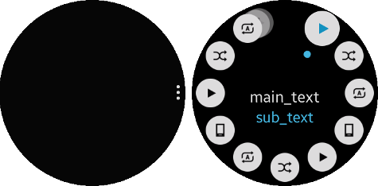
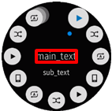
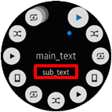
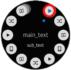

# More Option

## Dependencies

- Tizen 2.3.1 and Higher for Wearable

This feature is supported in wearable applications only.

The more option component is a wearable circular UI component. The more option handle can use the `elm_layout` functions, because the more option handle is an `elm_layout` object.

The basic view of the more option contains a cue button (shown on the left in the following figure). When the cue button is clicked, the selector view opens from the cue location (shown on the right in the figure). When the back motion is done in the selector view, the selector view disappears.

The selector view can emit events when an item or the selector are clicked, and it can receive a rotary event. However, you do not need to call the `eext_rotary_object_event_activated_set()` function to activate the rotary event, since the function is called automatically according to the `elm_panel` state.

**Figure: More option component**



## Adding a More Option Component

To create a more option component, use the `eext_more_option_add()` function:

```
Evas_Object *more_option = NULL;

more_option = eext_more_option_add(parent);
```

## Adding More Option Items

To add an item:

1. Append the new item with the `eext_more_option_item_append()` function:

   ```
   {
       Evas_Object *img = NULL;

       /* Append item */
       Eext_Object_Item *item = eext_more_option_item_append(parent);
   ```

2. Configure the item (for more information, see [Configuring the More Option and Items](#configure)).In the following example, the main and sub text are set for the item, and an icon is added as the item content:

   ```
       /* Set the text in the rotary_selector */
       eext_more_option_item_part_text_set(item, "selector,main_text", "test1");
       eext_more_option_item_part_text_set(item, "selector,sub_text", "test1");
       /* Set the content icon */
       img = elm_image_add(parent);
       eext_more_option_item_part_content_set(item, "item,icon", img);
       elm_image_file_set(img, "/music_controller_btn_play.png", NULL);
   }
   ```

## Configuring the More Option and Items

To configure the more option cue button direction, and the text and content of various more option parts:

- Configure the direction of the cue button with the `eext_more_option_direction_set()` function. The second parameter defines the cue button direction, which can be one of the following values:`EEXT_MORE_OPTION_DIRECTION_TOP`: Cue button is at the top.`EEXT_MORE_OPTION_DIRECTION_BOTTOM`: Cue button is at the bottom.`EEXT_MORE_OPTION_DIRECTION_LEFT`: Cue button is on the left.`EEXT_MORE_OPTION_DIRECTION_RIGHT`: Cue button is on the right (default value).To set the cue button on the right:

  ```
  eext_more_option_direction_set(more_option, EEXT_MORE_OPTION_DIRECTION_RIGHT);
  ```

- For each more option item, configure the main and sub text, and the item icon. The main and sub texts are shown in the selector when the item is selected.

  The following table shows the configurable more option parts.

  **Table: Configurable more option parts**

  | Part                 | Setting function                         | View                                     |
  | -------------------- | ---------------------------------------- | ---------------------------------------- |
  | `selector,main_text` | `eext_more_option_item_part_text_set()``eext_more_option_item_domain_translatable_part_text_set()` |  |
  | `selector,sub_text`  | `eext_more_option_item_part_text_set()``eext_more_option_item_domain_translatable_part_text_set()` |  |
  | `item,icon`          | `eext_more_option_item_part_content_set()` |  |

## Using the More Option Callbacks

To receive notifications about the more option events, listen for the following signals:

- `item,selected`: The item is selected.
- `item,clicked`: An already selected item is selected again or a selector has been selected.
- `more,option,opened`: The layout with the rotary selector is shown.
- `more,option,closed`: The layout with the rotary selector is hidden.

**Note**

The signal list in the API reference can be more extensive, but only the above signals are actually supported in Tizen.

In all these signals, the `event_info` callback parameter is `NULL`.

To register and define a callback for the `more,option,opened` signal:

```
{
    evas_object_smart_callback_add(more_option, "more,option,opened", _opened_cb, data);
}

/* Callback for the "more,option,opened" signal */
/* Called when the rotary selector is shown */
void
_opened_cb(void *data, Evas_Object *obj, void *event_info)
{
    dlog_print(DLOG_INFO, LOG_TAG, "Open the More Option\n");
}
```