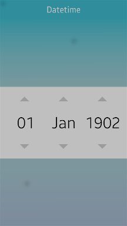
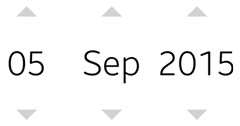
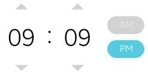
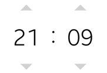

# Datetime

## Dependencies

- Tizen 2.4 and Higher for Mobile

The datetime UI component displays date and time values. For more information, see the [Datetime](../../../../../org.tizen.native.mobile.apireference/group__Datetime.html) API.

This feature is supported in mobile applications only.

## Basic Usage

To use a datetime component in your application:

1. Add a datetime component with the `elm_datetime_add()` function:

   ```
   Evas_Object *datetime;

   datetime = elm_datetime_add(parent);
   ```

2. Set a [style](#style) and format. The datetime format is a combination of LIBC standard characters, such as "%d %b %Y %I : %M %M". For more information on the format characters, see the [Datetime](../../../../../org.tizen.native.mobile.apireference/group__Datetime.html) API.

   - Set a style to the datetime component with the `elm_object_style_set()` function. If you use the default style, you can skip this step.

     ```
     elm_object_style_set(datetime, "date_layout");
     ```

   - Set a format using the `elm_datetime_format_set()` function:

     ```
     elm_datetime_format_set(datetime, "%d%b%Y");
     ```

3. Set datetime component [options](#feature).

4. Register the [callback](#callback) functions.The following example shows how to define and register a callback for the `changed` signal:

   ```
   evas_object_smart_callback_add(datetime, "changed", changed_cb, data);

   void
   changed_cb(void *data, Evas_Object *obj, void *event_info)
   {
       dlog_print(DLOG_INFO, LOG_TAG, "Datetime value changed\n");
   }
   ```

The following example shows a simple use case of the datetime component.

**Example: Datetime use case**

|  |
| ---------------------------------------- |
|                                          |

```
Evas_Object *win;
Evas_Object *conf;
Evas_Object *nf;
Evas_Object *box;
Evas_Object *datetime;
time_t local_time;
struct tm *time_info;

/* Starting right after the basic EFL UI layout code */
/* (win - conformant - naviframe) */

/* Add a box to contain a datetime and push the box into the naviframe */
box = elm_box_add(nf);
evas_object_show(box);
elm_naviframe_item_push(nf, "Datetime", NULL, NULL, box, NULL);

/* Add a datetime and set a style */
datetime = elm_datetime_add(box);
evas_object_size_hint_align_set(datetime, EVAS_HINT_FILL, EVAS_HINT_FILL);
elm_object_style_set(datetime, "date_layout");

/* Set a format for datetime */
elm_datetime_format_set(datetime, "%d/%b/%Y");

/* Get a current local time to set as datetime value */
time(NULL);
time_info = localtime(&local_time);
elm_datetime_value_set(datetime, time_info);

evas_object_show(datetime);
elm_box_pack_end(box, datetime);
```

## Options

You can set value ranges for the datetime component:

- Set minimum and maximum values.

  The datetime component provides a way to decide a range of the value.

  Keep in mind the following ranges when you set up the time structure:

  - `Year`: Years since 1900. Negative value represents a year below 1900 (year value -30 represents 1870). Year default range is from 70 to 137.
  - `Month`: Default value range is from 0 to 11.
  - `Date`: Default value range is from 1 to 31 according to the month value.
  - `Hour`: Default value is in 24-hour format (0~23).
  - `Minute`: Default value range is from 0 to 59.

  To set the maximum time for the datetime component:

  ```
  elm_datetime_value_max_set(datetime, tm);
  ```

  To set the minimum time for the datetime component:

  ```
  elm_datetime_value_min_set(datetime, tm);
  ```

- Set limits to the field values.

  The datetime component has the following fields:

  - `ELM_DATETIME_YEAR`: Indicates the year field.
  - `ELM_DATETIME_MONTH`: Indicates the month field.
  - `ELM_DATETIME_DATE`: Indicates the date field.
  - `ELM_DATETIME_HOUR`: Indicates the hour field.
  - `ELM_DATETIME_MINUTE`: Indicates the minute field.
  - `ELM_DATETIME_AMPM`: Indicates the AM/PM field.

  To set a value range for a specific field:

  ```
  elm_datetime_field_limit_set(datetime, ELM_DATETIME_DATE, 10, 20);
  ```

## Styles

The following table lists the available component styles.

**Table: Datetime styles**

| Style                  | Sample                                   |
| ---------------------- | ---------------------------------------- |
| `default``date_layout` |  |
| `time_layout`          |  |
| `time_layout_24hr`     |  |

**Note**

Pay attention to the following UX issue since Tizen 2.3:The `time_layout` and `time_layout_24hr` styles need a full-length format that includes the year, month, day, hour, minute, and AM/PM. Each style shows specific fields from the format, limited by the UX concept:`date_layout` (default): Year, month, day`time_layout`: Hour, minute, AM/PM button`time_layout_24hr`: Hour, minuteIf you call the `elm_datetime_field_visible_set()` function for a field that is not supported in the current style, the function does not work.

## Callbacks

You can register callback functions connected to the following signals for a datetime object.

**Table: Datetime callback signals**

| Signal             | Description                       | `event_info` |
| ------------------ | --------------------------------- | ------------ |
| `changed`          | The datetime field values change. | `NULL`       |
| `language,changed` | The system locale changes.        | `NULL`       |

**Note**

The signal list in the API reference can be more extensive, but only the above signals are actually supported in Tizen.

**Note**

Except as noted, this content is licensed under [LGPLv2.1+](http://opensource.org/licenses/LGPL-2.1).