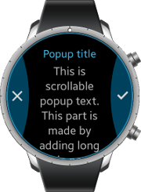

# Popup

## Dependencies

- Tizen 2.3.1 and Higher for Wearable

This feature is supported in wearable applications only.

The popup component shows a popup area that can contain:

- Title area with an icon and text (optional)
- Content area
- Action area with up to 3 buttons (optional)

For more information, see the [Popup](../../../../../org.tizen.native.wearable.apireference/group__Popup.html) API.

**Figure: Popup component**



**Figure: Popup hierarchy**


## Adding a Popup Component

To create a popup component, use the `elm_popup_add()` function:

```
Evas_Object *popup;
Evas_Object *parent;

/* Create a popup */
popup = elm_popup_add(parent);
```

## Using the Popup Styles

The popup has a separate style for the layout and items:

- The following item styles are available for the rectangular screen:
  - `popup`
  - `toast`
- The following item styles are available for the circular screen:
  - `circle`
  - `toast/circle`
- The following layout styles are available for the circular screen:
  - `content/circle`
  - `content/circle/buttons1`
  - `content/circle/buttons2`

To set the style to, for example, `toast`:

```
elm_object_style_set(popup, "toast");
```

## Setting the Popup Content

To set the popup content for the rectangular screen:

1. Configure the title area:

   - Set the icon object using the `title,icon` part name.
   - Set the title text as `Test popup` using the `title,text` part name.

   ```
   elm_object_part_text_set(popup, "title,text", "Test popup");
   ```

2. Set the content of the popup as:

   - Simple text:

     ```
     elm_object_text_set(popup, "simple text");
     ```

   - Evas object:

     ```
     Evas_Object *content;

     elm_object_content_set(popup, content);
     ```

3. Set the action area buttons.

   In the following example, the **OK** and **Cancel** buttons are created:

   ```
   Evas_Object *button1;
   Evas_Object *button2;

   /* Create the 2 buttons */
   button1 = elm_button_add(popup);
   elm_object_style_set(button1, "popup");
   evas_object_size_hint_weight_set(button1, EVAS_HINT_EXPAND, EVAS_HINT_EXPAND);
   elm_object_text_set(button1, "Cancel");

   button2 = elm_button_add(popup)
   elm_object_style_set(button2, "popup");
   evas_object_size_hint_weight_set(button2, EVAS_HINT_EXPAND, EVAS_HINT_EXPAND);
   elm_object_text_set(button2, "OK");

   evas_object_show(popup);

   /* Set the buttons to the action area */
   elm_object_part_content_set(popup, "button1", button1);
   elm_object_part_content_set(popup, "button2", button2);
   ```

To set the popup content for the circular screen:

1. Set the circular popup item and layout style:

   ```
   /* Set the item style */
   elm_object_style_set(popup, "circle");

   /* Set the layout style */
   layout = elm_layout_add(popup);
   elm_layout_theme_set(layout, "layout", "popup", "content/circle/buttons2");
   ```

2. Configure the title area.

   Set the title text to `Test popup` using the `elm.text.title` part name:

   ```
   /* Set the title text */
   elm_object_part_text_set(layout, "elm.text.title", "Text popup");
   ```

3. Set the content to the layout as:

   - Simple text:

     ```
     elm_object_part_text_set(layout, "elm.text", "Test popup");
     ```

   - Evas object:

     ```
     Evas_Object *content;

     elm_object_content_set(layout, content);
     ```

4. Set the layout content to the popup:

   ```
   elm_object_content_set(popup, layout);
   ```

5. Set the action area buttons.

   In the following example, 2 icon buttons are created:

   ```
   Evas_Object *button1;
   Evas_Object *button2;
   Evas_Object *icon;

   /* Create the 2 buttons */

   button1 = elm_button_add(popup);
   elm_object_style_set(button1, "popup/circle/left");
   icon = elm_image_add(button1);
   elm_image_file_set(icon, ICON_DIR"/b_option_list_icon_share.png", NULL);
   evas_object_size_hint_weight_set(icon, EVAS_HINT_EXPAND, EVAS_HINT_EXPAND);
   elm_object_part_content_set(button1, "elm.swallow.content", icon);
   evas_object_show(icon);

   button2 = elm_button_add(popup);
   elm_object_style_set(button2, "popup/circle/right");
   icon = elm_image_add(button2);
   elm_image_file_set(icon, ICON_DIR"/b_option_list_icon_delete.png", NULL);
   evas_object_size_hint_weight_set(icon, EVAS_HINT_EXPAND, EVAS_HINT_EXPAND);
   elm_object_part_content_set(button2, "elm.swallow.content", icon);
   evas_object_show(icon);

   /* Set the buttons to the action area */
   elm_object_part_content_set(popup, "button1", button1);
   elm_object_part_content_set(popup, "button2", button2);
   ```

## Hiding the Popup

You can hide the popup after a set time with the `elm_popup_timeout_set()` function.

To set the timeout to 5 seconds, after which the popup is hidden:

```
elm_popup_timeout_set(popup, 5.0);
```

## Using the Popup Callbacks

To receive notifications about the popup events, listen for the following signals:

- `timeout`: The popup is closed as a result of the timeout.
- `block,clicked`: The user clicks on the blocked event area.The blocked event area is the translucent region around the visible popup region.

**Note**

The signal list in the API reference can be more extensive, but only the above signals are actually supported in Tizen.

To register and define a callback for the `timeout` signal:

```
{
    evas_object_smart_callback_add(popup, "timeout", _timeout_cb, data);
}

static void
_timeout_cb(void *data, Evas_Object *obj, void *event_info)
{
    dlog_print(DLOG_INFO, LOG_TAG, "Timeout \n");
}
```

**Note**

Except as noted, this content is licensed under [LGPLv2.1+](http://opensource.org/licenses/LGPL-2.1).