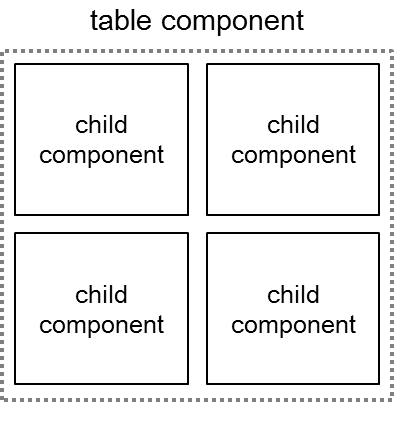
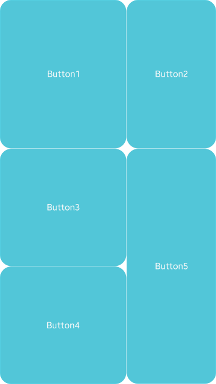

# Table

## Dependencies

- Tizen 2.4 and Higher for Mobile
- Tizen 2.3.1 and Higher for Wearable

The table container acts like a box container, but with 2 dimensions. It provides the same kind of APIs as a box. An item inside a table can span multiple columns and rows, and even overlap with other items. For more information, see the Table API (in [mobile](http://org.tizen.native.mobile.apireference/group__Table.html) and [wearable](http://org.tizen.native.wearable.apireference/group__Table.html)applications).

**Figure: Table component structure**



## Basic Usage

To build a layout with a table:

1. Add a table with the `elm_table_add()` function:

   ```
   Evas_Object *table;

   table = elm_table_add(parent);

   ```

2. Add an object to the table using the `elm_table_pack()` function.The function takes as parameters the table, the item to add to the table, and the position where to add the item: column, row, and the size of the item in number of rows and columns (colspan and rowspan).

   ```
   Evas_Object *btn;

   btn = elm_button_add(table);
   elm_table_pack(table, btn, 0, 0, 1, 1);
   ```

The following example shows a simple use case of the table component, where 5 button objects are packed into a table. The `elm_table_pack()` function is used to add each button to the table. 1 button takes 2 rows and 1 column, and 4 buttons take only 1 row and column.

**Example: Table use case**

|  |
| ---------------------------------------- |
|                                          |

```
Evas_Object *win;
Evas_Object *conf;
Evas_Object *table;
Evas_Object *btn;

/* Starting right after the basic EFL UI layout code */
/* (win - conformant - naviframe) */

table = elm_table_add(ad->conform);
elm_object_content_set(ad->conform, table);
evas_object_size_hint_weight_set(table, EVAS_HINT_EXPAND, EVAS_HINT_EXPAND);
evas_object_size_hint_align_set(table, EVAS_HINT_FILL, EVAS_HINT_FILL);
elm_table_padding_set(table, 1, 1);
evas_object_show(table);

btn = elm_button_add(table);
elm_object_text_set(btn, "Button1");
evas_object_size_hint_weight_set(btn, EVAS_HINT_EXPAND, EVAS_HINT_EXPAND);
evas_object_size_hint_align_set(btn, EVAS_HINT_FILL, EVAS_HINT_FILL);
elm_table_pack(table, btn, 0, 0, 1, 1);
evas_object_show(btn);

btn = elm_button_add(table);
elm_object_text_set(btn, "Button2");
evas_object_size_hint_weight_set(btn, EVAS_HINT_EXPAND, EVAS_HINT_EXPAND);
evas_object_size_hint_align_set(btn, EVAS_HINT_FILL, EVAS_HINT_FILL);
elm_table_pack(table, btn, 1, 0, 1, 1);
evas_object_show(btn);

btn = elm_button_add(table);
elm_object_text_set(btn, "Button3");
evas_object_size_hint_weight_set(btn, EVAS_HINT_EXPAND, EVAS_HINT_EXPAND);
evas_object_size_hint_align_set(btn, EVAS_HINT_FILL, EVAS_HINT_FILL);
elm_table_pack(table, btn, 0, 1, 1, 1);
evas_object_show(btn);

btn = elm_button_add(table);
elm_object_text_set(btn, "Button4");
evas_object_size_hint_weight_set(btn, EVAS_HINT_EXPAND, EVAS_HINT_EXPAND);
evas_object_size_hint_align_set(btn, EVAS_HINT_FILL, EVAS_HINT_FILL);
elm_table_pack(table, btn, 0, 2, 1, 1);
evas_object_show(btn);

btn = elm_button_add(table);
elm_object_text_set(btn, "Button5");
evas_object_size_hint_weight_set(btn, EVAS_HINT_EXPAND, EVAS_HINT_EXPAND);
evas_object_size_hint_align_set(btn, EVAS_HINT_FILL, EVAS_HINT_FILL);
elm_table_pack(table, btn, 1, 1, 1, 2);
evas_object_show(btn);
```

The components can be arranged in the table so that they span multiple columns or rows, or even overlap (then they can be raised or lowered accordingly to adjust stacking if they do overlap). The row and column count is not fixed. The table component adjusts itself when subobjects are added to it dynamically.

## Features

To manage the table items:

- To change the position of the item after adding it, use the `elm_table_pack_set()` function. This function takes as parameters the item whose position to change, the new column, the new row, and the size of the item in number of rows and columns (colspan and rowspan).

- To add padding around the item, use the `elm_table_padding_set()` function. The second parameter is the padding between columns, and the third parameter is the padding between rows.

  ```
  elm_table_padding_set(table, 10, 10);

  ```

- To change the alignment and size of an item, use the `evas_object_size_hint_XXX()` functions. They are used in the same way as with boxes. You can set the same size and weight to each item by using the homogeneous parameter:

  ```
  elm_table_homogeneous_set(table, EINA_TRUE);

  ```

- To clear all table items, use the `elm_table_clear()` function. If the clear parameter is `EINA_TRUE`, the table items are deleted as the `evas_object_del()` function is called on each item.

**Note**

Except as noted, this content is licensed under [LGPLv2.1+](http://opensource.org/licenses/LGPL-2.1).