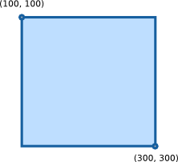
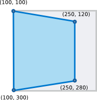
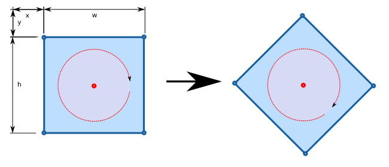
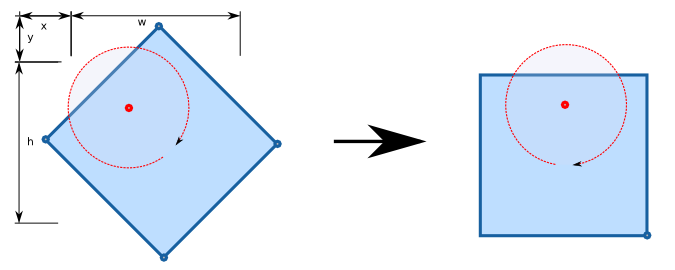
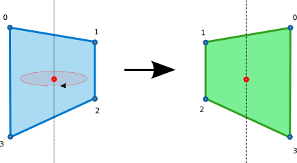
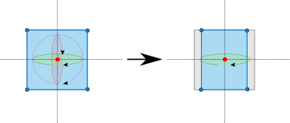
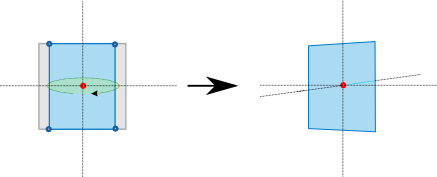
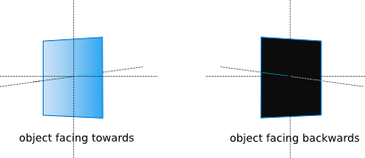
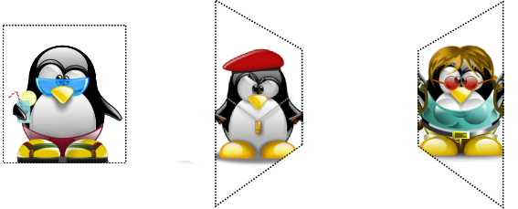
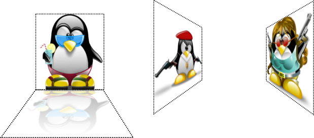

# Transformation with Evas Map

Evas map effects allow you to apply transformations to all object types through UV mapping.

In UV mapping, you map points in the 2D source object to 3D space positions in the target object. Depending on the map, you can use rotation, perspective, scale, and other transformation effects. In addition, each map point can carry a multiplier color, which can be used to apply 3D shading effects on the target object.

To create Evas map effects:

1. Define an Evas object and a map (usually a rectangular area).
2. Modify the map location and shape in a 3D space as needed, and can also add effects, such as rotation, zoom, or lighting, to the map.
3. Set the map on the Evas object.

In the application, the original Evas object is displayed in the map location using the map shape and any effects defined for the map.

Evas provides both raw and easy-to-use functions for UV mapping:

- The raw functions allow you to create UV maps outside Evas and import them into your application, for example, by loading them from an external file.
- The easy-to-use functions allow you to create UV maps directly in Evas by calculating the map points based on high-level parameters, such as the rotation angle and ambient light.

## Creating the Map

A map consists of a set of points (currently, up to 4 points are supported). Each point contains X and Y canvas coordinates that can be used to alter the geometry of the mapped object, and a Z coordinate that indicates the depth of the point. The Z coordinate does not normally affect the map, but several utility functions use it to calculate the right position of the point given in the other parameters.

The map is an `Evas_Map` object, and you can create it using the `evas_map_new()` function with the number of map points as a parameter:

```
Evas_Map *m = evas_map_new(4);
```

In the created map, each point is empty and ready to be modified with `Evas_Map` functions:

- To get the size (number of points) of an existing map, or the actual coordinates of a specific map point, use the `evas_map_count_get()` and `evas_map_point_coord_set()` functions.

- To define the map points, use one of the following methods. They all define the same square map shown in the following figure.

  **Figure: Square map**

  

  - To set the map point coordinates one by one, use the `evas_map_point_coord_set()` function.The following example defines the points of a map that matches the geometry of a rectangle (a square in this case):

    ```
    /* Map point 0 located in 100 x 100 */
    evas_map_point_coord_set(m, 0, 100, 100, 0);
    /* Map point 1 located in 300 x 100 */
    evas_map_point_coord_set(m, 1, 300, 100, 0);
    /* Map point 2 located in 300 x 300 */
    evas_map_point_coord_set(m, 2, 300, 300, 0);
    /* Map point 3 located in 100 x 300 */
    evas_map_point_coord_set(m, 3, 100, 300, 0);
    ```

  - To set the map points by defining the starting X and Y coordinates combined with width and height, use the `evas_map_util_points_populate_from_geometry()` function:

    ```
    evas_map_util_points_populate_from_geometry(m, 100, 100, 200, 200, 0);
    ```

  - To set the map points based on the geometry of a given object, use the `evas_map_util_points_populate_from_object()` or `evas_map_util_points_populate_from_object_full()` function:

    ```
    Evas_Object *o;
    evas_object_move(o, 100, 100);
    evas_object_resize(o, 200, 200);
    /* Set Z coordinate of all points to 0 */
    evas_map_util_points_populate_from_object(m, o);
    /* OR */
    /* Set Z coordinate of all points to the same custom value */
    evas_map_util_points_populate_from_object_full(m, o, 0);
    ```

- To apply effects to an object, modify the map point coordinates appropriately. The following example shows how to create a simulated perspective:

  ```
  evas_map_point_coord_set(m, 0, 100, 100, 0);
  evas_map_point_coord_set(m, 1, 250, 120, 0);
  evas_map_point_coord_set(m, 2, 250, 280, 0);
  evas_map_point_coord_set(m, 0, 100, 300, 0);
  ```

  In this example, the Z coordinate is unused, because it is irrelevant when setting points by hand.

  **Figure: Simulated perspective**

  

- After you have defined the map points, set them to your Evas object for transformation, and enable the map for use:

  ```
  evas_object_map_set(o, m);
  evas_object_map_enable_set(o, EINA_TRUE);
  ```

  If you define a map and set it to an Evas object, but do not enable it for use, the Evas object is displayed on the screen according to its own original location and shape.

When the map is no longer needed, release the memory allocated to it using the `evas_map_free()` function:

```
evas_map_free(m);
```

## Modifying a Map with Utility Functions

You can modify an already configured map with various utility functions to produce specific effects:

- To rotate an object, you can use the `evas_map_util_rotate()` function, which rotates the map based on an angle and the center coordinates of the rotation (the rotation point). A positive angle rotates the map clockwise, while a negative angle rotates the map counter-clockwise.

  - To rotate around the object center, you need the rotation angle and the coordinates of each corner of the object to perform the math required to get the new set of coordinates that needs to be set for the map.The following example shows how to rotate an object around its center point by 45 degrees clockwise.

  ```
  evas_object_geometry_get(o, &x, &y, &w, &h);
  /* Create a map and set the map points from geometry */
  m = evas_map_new(4);
  evas_map_util_points_populate_from_object(m, o);
  /* Rotate the map 45 degrees around the center point */
  evas_map_util_rotate(m, 45, x + (w / 2), y + (h / 2));
  evas_object_map_set(o, m);
  evas_object_map_enable_set(o, EINA_TRUE);
  evas_map_free(m);
  ```

  The following figure shows the rotating object with the red dot as the center point.

  **Figure: Rotating around the center point**

  - To rotate around a point other than the center of the object, set the last 2 parameters of the `evas_map_util_rotate()` function to the appropriate values:

    ```
    evas_map_util_rotate(m, 45, x + w - 20, y + h - 20);
    ```

    The following figure shows the object rotating around a point that is not in the center of the object.

  **Figure: Rotating around other points**

  - To set the center of the window as the rotation point, use the appropriate coordinates of the Evas canvas:

    ```
    /* Get the Evas canvas size */
    evas_output_size_get(evas, &w, &h);
    m = evas_map_new(4);
    evas_map_util_points_populate_from_object(m, o);
    evas_map_util_rotate(m, 45, w, h);
    evas_object_map_set(o, m);
    evas_object_map_enable_set(o, EINA_TRUE);
    evas_map_free(m);
    ```

- To zoom an object, you can use the `evas_map_util_zoom()` function, which zooms the points of the map from a center point, defined by the last 2 parameters. The second and third parameters specify how much to zoom in on the X and Y axes. For example, a value of 1.0 means no zoom, 2.0 means double the size, and 0.5 means half the size. All the coordinates are global canvas coordinates.The following example shows how to zoom in with value 2.0 on both X and Y axes with the canvas center as the zoom center point:

  ```
  evas_output_size_get(evas, &w, &h);
  /* Create a map and set the map points from geometry */
  m = evas_map_new(4);
  evas_map_util_points_populate_from_object(m, o);
  /* Zoom in the map */
  evas_map_util_zoom(m, 2.0, 2.0, w/2, h/2);
  evas_object_map_set(o, m);
  evas_object_map_enable_set(o, EINA_TRUE);

  evas_map_free(m);
  ```

## Using 3D Rotation and Perspective

You can create 3D effects with maps using the Z coordinate: the higher the Z value, the further back the point is located. Smaller, usually negative, values mean that the point is closer to the user.

When handling 3D effects, you must also be familiar with the concept of the object **back face**. An object is said to be facing the user when all its points are placed in a clockwise formation. Rotating the map around its Y axis swaps the order of the points into a counter-clockwise formation, making the object face away from the user and revealing the object back face. The back face concept is especially relevant in lighting.

The following figure shows an object rotating around the Y axis. On the left, the object is facing the user, and on the right the face is away from the user, and you can only see the object back face.

**Figure: Rotating around the Y axis**



To handle the 3D effects:

- To determine whether a map is facing the user, use the `evas_map_util_clockwise_get()` function. The function returns `EINA_TRUE` if the map is facing the user, and `EINA_FALSE` if the map is facing away from the user. Check the face orientation after applying all other operations to the map.

- To transform a map and apply a 3D rotation to the mapped object, use the `evas_map_util_3d_rotate()` function. You can apply the rotation around any point on the canvas (including a Z coordinate). You can also apply the rotation around any of the 3 axes.The following figure shows the result of starting from this simple setup, and setting the map so that the blue square rotates around the Y axis.**Figure: 3D rotation**

- A simple overlay over the image shows the original geometry of each object and the axis around which they are being rotated. The Z axis is not shown, since it is orthogonal to the screen.

  To show the Z axis, that is, to add 3D perspective to the transformation, use the `evas_map_util_3d_perspective()` function on the map after its position has been set.

  The result makes the vanishing point the center of each object.

**Figure: Adding 3D perspective**



## Defining Color and Lighting

Each point in a map can be set to a color, which is multiplied with the object's own color and linearly interpolated between adjacent points:

- To set the color separately for each point, use the `evas_map_point_color_set()` function.
- To set the same color for every point, use the `evas_map_util_points_color_set()` function.

When using a 3D effect, colors can be used to improve the effect by simulating a light source and ambient light, both with their own colors. The `evas_map_util_3d_lighting()` function makes this task easier by taking the coordinates of the light source and its color, along with the color of the ambient light. Evas then sets the color of each point based on its distance to the light source, the angle at which the object is facing the light source, and the ambient light.

When applying 3D lighting, the face orientation of each point is important. If the map points are defined counter-clockwise, the object faces away from the user. In this case, the object is obscured, and no light reflects back from it, as illustrated in the following figure.

**Figure: Effect of the face orientation on lighting**



The `evas_map_util_3d_lighting()` function is used to apply lighting calculations from a single light source to a given map. The red, green, and blue values of each vertex are modified to reflect the lighting based on the light source coordinates, its color, the ambient color, and the angle at which the map faces the light source. The points of a surface must be defined in a clockwise formation if the surface is facing the user, since faces have a logical side for lighting.

To get the gradient reflections in the shadow of the previous example, you have to define a source of light close enough to the user and a very bright ambient light, like in the following example.

```
evas_map_util_3d_lighting(m, /* Evas_Map object */
                          250/2, 150/2, -100, /* Spot light coordinates */
                          255, 255, 255, /* Spot light color */
                          200, 200, 200); /* Ambient light color */
```

## Mapping Images

Images need special handling when mapped. While Evas can easily handle objects, it is completely oblivious to the content of an image object. This means that if you only map the Evas object, and not the image within the object, only the Evas object is modified according to the mapping. To ensure that the image within the Evas object is also modified as expected, you must map the image UV points separately in addition to the basic map points.

To map image UV points to avoid unexpected problems:

1. At first, create 3 Evas image objects.

   In this example, there are 3 Tux images, each sized at 200 x 200 pixels:

   

2. If you only define the map points of the Evas object without setting separate image UV mapping, the result does not work. The following images illustrate the case where the Evas objects themselves are mapped properly to their new geometries, but the images are not displayed correctly within the mapped objects:

   - In the left image, the size of the Evas object has been changed. However, the size change is only applied to the object, not to the actual Tux image.
   - In the middle and right image, a simulated perspective has been added to the Evas object. However, the perspective is only applied to the object, not the actual image, and parts of the image get cropped unintentionally.

   

3. To transform an image correctly, Evas needs to know how to handle the image within the map. Basically, each point in the map needs to be mapped to a specific pixel in the source image.

   You can map a given point in a map to a given pixel in a source image using the `evas_map_point_image_uv_set()` function.

   To match the example images to the object maps, you need the size of each image, which you can get using the `evas_object_image_size_get()` function.

   The following code shows how to set the image UV points to fix the above problems:

   - In the left image, the image UV points are defined so that the white space at the top is cropped and Tux is stretched to fill the entire image. An inverted texture is also added for a shadow.
   - In the middle image, the image UV points are defined so that Tux is fitted to the simulated perspective without cropping.
   - In the right image, the image UV points are defined so that Tux is fitted to the simulated perspective and zoomed to fill the entire image.

   ```
   /* Left image: some cropping and stretch up */
   evas_map_point_image_uv_set(m, 0, 0, 20);
   evas_map_point_image_uv_set(m, 1, 200, 20);
   evas_map_point_image_uv_set(m, 2, 200, 180);
   evas_map_point_image_uv_set(m, 3, 0, 180);
   evas_object_map_set(tux1, m);
   evas_object_map_enable_set(tux1, EINA_TRUE);

   /* Left image: inverted texture for the shadow */
   evas_map_point_image_uv_set(m, 0, 0, 180);
   evas_map_point_image_uv_set(m, 1, 200, 180);
   evas_map_point_image_uv_set(m, 2, 200, 20);
   evas_map_point_image_uv_set(m, 3, 0, 20);
   evas_object_map_set(tux1_shadow, m);
   evas_object_map_enable_set(tux1_shadow, EINA_TRUE);

   /* Middle image: fit to the map without cropping */
   evas_map_point_image_uv_set(m, 0, 0, 0);
   evas_map_point_image_uv_set(m, 1, 200, 0);
   evas_map_point_image_uv_set(m, 2, 200, 200);
   evas_map_point_image_uv_set(m, 3, 0, 200);
   evas_object_map_set(tux2, m);
   evas_object_map_enable_set(tux2, EINA_TRUE);

   /* Right image: zoom and fit relatively to image size */
   evas_object_image_size_get(evas_object_image_source_get(tux3), &w, &h);
   evas_map_point_image_uv_set(m, 0, 0.1 * w, 0.1 * h);
   evas_map_point_image_uv_set(m, 1, 0.9 * w, 0.1 * h);
   evas_map_point_image_uv_set(m, 2, 0.9 * w, 0.9 * h);
   evas_map_point_image_uv_set(m, 3, 0.1 * w, 0.9 * h);
   evas_object_map_set(tux3, m);
   evas_object_map_enable_set(tux3, EINA_TRUE);
   ```

   

You can set a map to use only a part of an image, or you can even map the points in an inverted order. Combined with the `evas_object_image_source_set()` function, you can achieve even more interesting results, such as a reflection of the original object.

## Managing Transparency

To manage transparency:

1. To use an alpha channel on your map, enable the alpha channel feature with the `evas_map_alpha_set()` function.
2. Set the alpha value:
   - Separately for each map point with the `evas_map_point_color_set()` function.
   - Together to all map points with the `evas_map_util_points_color_set()` function.

The following code sets the shadow transparency for the left Tux image in the previous section example:

```
evas_map_alpha_set(m, EINA_TRUE);

/* Set object transparency to 50% */
evas_map_util_points_color_set(m, 255, 255, 255, 127);

/* Set the head in the image shadow to be almost invisible */
evas_map_point_color_set(m, 3, 255, 255, 255, 15);
evas_map_point_color_set(m, 4, 255, 255, 255, 15);
```

## Smoothing a Map

Map smoothing is enabled by default. To check whether map smoothing is enabled, use the `evas_map_smooth_get()` function.

If the object is of a type that has its own smoothing settings, the smoothing settings must be disabled for both the object and the map.

To disable smoothing when rendering a map, use the `evas_map_smooth_set()` function with the second parameter set to `EINA_FALSE`:

```
evas_map_smooth_set(m, EINA_FALSE);
```

**Note**

Except as noted, this content is licensed under [LGPLv2.1+](http://opensource.org/licenses/LGPL-2.1).